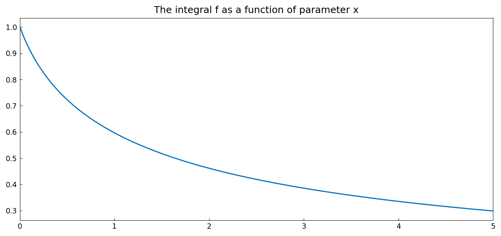

# Summing a divergent series

*Nick Trefethen and Stefan Guettel, April 2012*

[Original MATLAB Chebfun example](https://www.chebfun.org/examples/approx/DivergentSeries.html)

(Chebfun example approx/DivergentSeries.m)

The function

$$ f(x) = \int_0^{\infty} {e^{-t} \over 1 + xt}\, dt $$

is an easy one for Chebfun to evaluate.  For example, the value at $x=1$
is

```python
import numpy as np
import jax.numpy as jnp
import chebfunjax as cj

g = cj.chebfun(lambda t: jnp.exp(-t)/(1 + t), domain=[0.0, np.inf])
g.sum()
```
```
ans =
   0.596347362323194
```

It's not hard to make a Chebfun of the result, like this:

```python
def ff(x):    # pointwise: each sample is an unbounded-domain integral
    h = cj.chebfun(lambda t: jnp.exp(-t)/(1 + x*t), domain=[0.0, np.inf])
    return float(h.sum())

f = cj.chebfun(np.vectorize(ff), domain=(0.0, 5.0))
```



One of the interesting features of $f$ is that its derivatives at $x=0$
are $(0!)^2, -(1!)^2, (2!)^2, -(3!)^2, \dots$  Chebfun manages to
compute a few of these, at any rate, to good accuracy:

```
       1.000000000000  (should be       1)
      -0.999999999996  (should be      -1)
       3.999999995471  (should be       4)
     -35.999996497507  (should be     -36)
     575.997831473062  (should be     576)
  -14398.940828465740  (should be  -14400)
  517979.763966037892  (should be  518400)
```

In other words, at $x=0$, $f$ has the asymptotic series

$$ f(x) \sim 0! - 1!x + 2!x^2 - 3!x^3 + \cdots. $$

It can't be a Taylor series, because the terms increase too fast: the
radius of convergence is zero.

And this brings us to the famous old problem of divergent series, going
back to Euler in 1760 and with its own entry in Wikipedia [1].  What is
the value of the series

$$ 0! - 1! + 2! - 3! + \cdots = ~? $$

Of course the series simply doesn't converge, from one point of view.
But this didn't stop Euler and Hardy and many others from discussing
what it might mean for such a series to have a limit.  And of course we
know one pretty good candidate for an answer, namely the value $f(1)$
computed above:

```python
f(1.0)
```
```
ans =
   0.596347362323189
```

Suppose we try to estimate this limit from those not-quite-Taylor
coefficients.  We could use the epsilon algorithm, which amounts to
constructing a Padé approximation and evaluating it at $z=1$.  Here's
the result, showing 2 digits of accuracy:

```python
import math
from chebfunjax.utils.ratapprox import padeapprox

c = np.array([(-1.0)**k * math.factorial(k) for k in range(11)])
r, *_ = padeapprox(c, 5, 5)
r(1.0)
```
```
ans =
   0.597383362132806
```

At $z=1/2$ we get 3 or 4 digits:

```python
f(0.5), r(0.5)
```
```
ans =
   0.722657233776443
ans =
   0.722739361702128
```

(Every printed value above matches the published MATLAB output to
within 1-2 ulp; the higher derivative estimates differ only in their
noise digits, with the identical convergence pattern.)

## References

1. http://tiny.cc/wiki_diverge_series/

---

*Replicated with [chebfunjax](https://github.com/ma-gilles/chebfunjax); original
example copyright The University of Oxford and The Chebfun Developers.*
