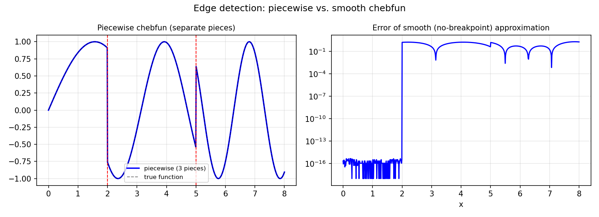

# Edge Detection in Chebfun

*Nick Trefethen, November 2016*

[Original MATLAB Chebfun example](https://www.chebfun.org/examples/approx/EdgeDetection.html)

## Automatic breakpoint detection

Chebfun's `splitting on` mode uses a recursive bisection algorithm (originally by
Rodrigo Platte) to automatically detect where a function has a jump discontinuity
or is merely non-smooth.

```python
from chebfunjax.domain import Domain
import chebfunjax as cj
import jax.numpy as jnp

# With explicit breakpoints at 2 and 5
dom = Domain([0.0, 2.0, 5.0, 8.0])
f = cj.chebfun(lambda x: jnp.sin(x * jnp.where(x < 2.0, 1.0,
               jnp.where(x < 5.0, 2.0, 3.0))), domain=dom)
print(f"Pieces: {len(f.funs)}, lengths: {[len(p) for p in f.funs]}")
```

The accuracy of breakpoint location is related to the smoothness class:
$O(\epsilon^{1/k})$ for $C^k$ functions.



