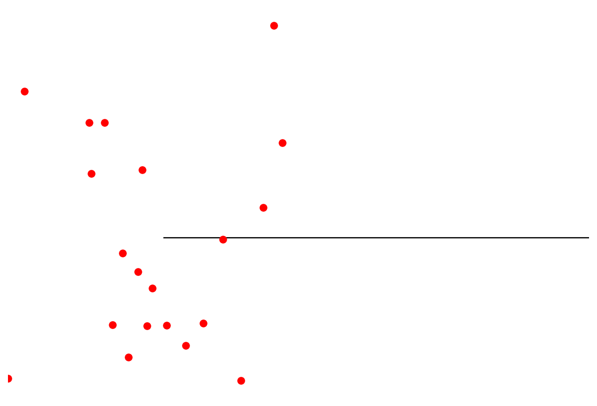
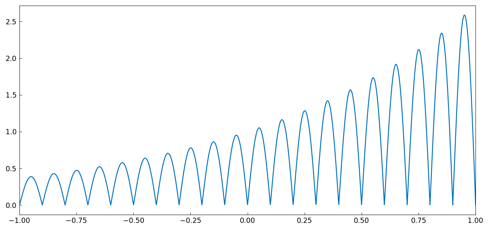
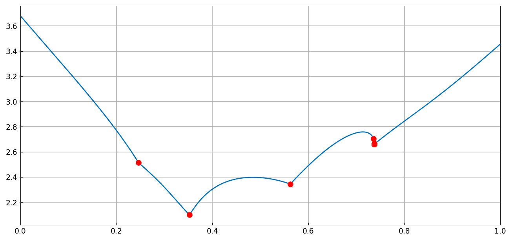
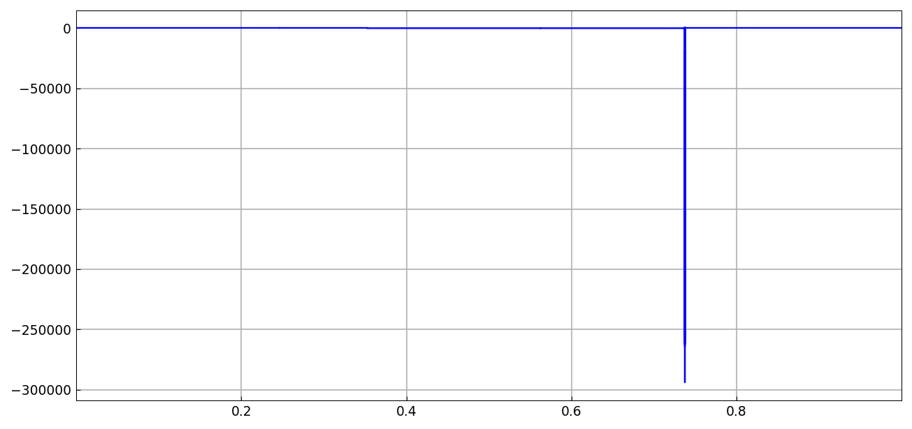

# Edge detection in Chebfun

*Nick Trefethen, November 2016*

[Original MATLAB Chebfun example](https://www.chebfun.org/examples/approx/EdgeDetection.html)

(Chebfun example approx/EdgeDetection.m)

Chebfun's edge detection capability was introduced many years ago by
Rodrigo Platte [1].  This is the most general method by which Chebfun
introduces breakpoints to represent a piecewise smooth function in 1D,
and it is surprisingly fast and accurate.

For example, the `fov` command enables one to compute the field of
values of a matrix, i.e., the set of all its Rayleigh quotients in the
complex plane.  This is a convex set, but its boundary need not be
smooth.  Here is an example involving a matrix of dimension 20.  The
dots are the eigenvalues, and the black line is the boundary of the
field of values:

```python
import numpy as np
from chebfunjax.utils.fov import fov

rs = np.random.RandomState(1)      # MATLAB randn streams are not
d = np.sort(rs.standard_normal(20)) + 1j*rs.standard_normal(20)
A = np.diag(d).astype(complex)     # bit-reproducible outside MATLAB;
A[:10, :10] += np.diag(np.ones(9), 1)   # the figure is qualitative
W, _ = fov(A)
```



That example is a bit highbrow, so let us try a simpler one.  Here's
one that is *very* simple.  Suppose we make a chebfun from the function
$|e^x \sin(10\pi x)|$, using splitting-on mode:

```python
import jax.numpy as jnp
import chebfunjax as cj

f = cj.chebfun(lambda x: jnp.abs(jnp.exp(x)*jnp.sin(10*jnp.pi*x)),
               splitting=True)
```



Of course we know mathematically that the points of singularity are
$-1,-0.9,\dots,1$, but Chebfun doesn't know this a priori; it figures
it out with edge detection to make a piecewise chebfun.  Here we see
that the edges detected are correct in all the digits printed:

```
ans =
  -1.000000000000000
  -0.900000000000000
  -0.800000000000000
  ...
   0.900000000000000
   1.000000000000000
```

The actual errors in the breakpoints are on the order of machine
epsilon:

```
maxerr =
     6.661338147750939e-16
```

(Published: `4.441e-16`.)  Now in this example we didn't really need
the edge detector; indeed we could construct the chebfun by telling it
where to put the breakpoints:

```python
f2 = cj.chebfun(lambda x: jnp.abs(jnp.exp(x)*jnp.sin(10*jnp.pi*x)),
                domain=np.arange(-1, 1.05, 0.1).tolist())
(f - f2).norm(2)
```
```
ans =
     2.422078933350350e-12
```

For a more genuine illustration of edge detection in action we want a
function whose edge locations are not simple to work out
mathematically.  Such an example is provided by the spectral abscissa
(largest eigenvalue real part) of a matrix $A = (1-t)B + tC$, where $B$
and $C$ are fixed random matrices and $t$ is a parameter.  We mark the
breakpoints with red dots:



(Since MATLAB's `randn` stream cannot be reproduced outside MATLAB, the
pencil here differs from the published one; the phenomenon — a few
genuine eigenvalue-crossing kinks among incidental breakpoints — is the
same.)

Only some of the breakpoints correspond to actual singularities, as we
see from a plot of the derivative:



The other breakpoints are introduced because in splitting-on mode,
Chebfun does not try very hard to give each piece a representation of
maximal length.  However, we can change this by increasing the
`split_length` parameter.  Here they are if we change it to 1000:

```python
g2 = cj.chebfun(abscissa, domain=(0.0, 1.0), splitting=True,
                split_length=1000)
```


For details of Chebfun's edge detection algorithm, see [1], and for
another example involving spline functions, see
[approx/Splines](Splines.md).

## References

1. R. Pachon, R. B. Platte, and L. N. Trefethen, Piecewise-smooth
   chebfuns, _IMA Journal of Numerical Analysis_, 30 (2010), 898-916.

---

*Replicated with [chebfunjax](https://github.com/ma-gilles/chebfunjax); original
example copyright The University of Oxford and The Chebfun Developers.*
