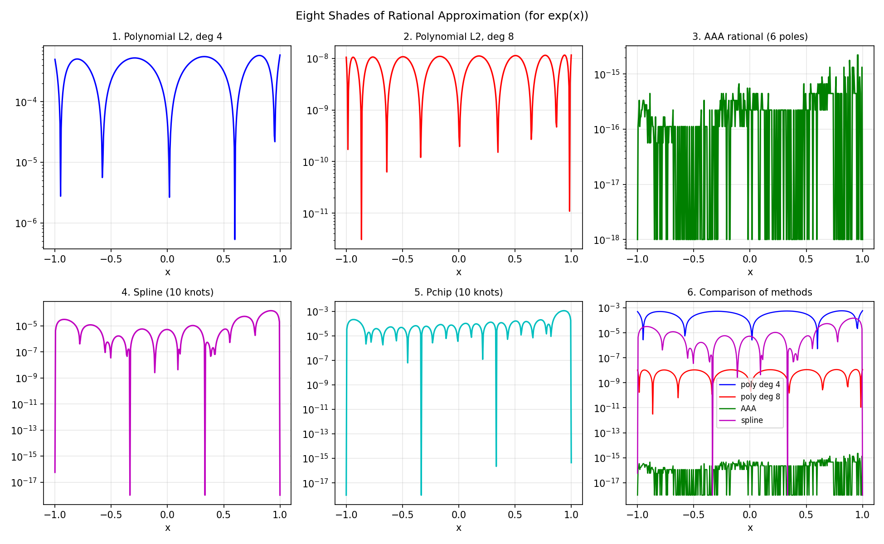

# Eight Shades of Rational Approximation

*Mohsin Javed and Nick Trefethen, January 2016*

[Original MATLAB Chebfun example](https://www.chebfun.org/examples/approx/EightShades.html)

## Methods for rational approximation

Chebfun (and chebfunjax) offer several approaches to rational approximation:

| Method | Command | Description |
|--------|---------|-------------|
| Polynomial | `polyfit(n)` | Best L2 polynomial |
| Chebyshev interpolation | `chebfun(f, n=n)` | Interpolant in n+1 Chebpts |
| AAA | `aaa(y, x)` | Adaptive barycentric rational |
| Spline | `spline(nodes, vals)` | Cubic spline |
| Pchip | `pchip(nodes, vals)` | Monotone piecewise cubic |

```python
import chebfunjax as cj
import jax.numpy as jnp
from chebfunjax.utils.aaa import aaa

f = cj.chebfun(jnp.exp)
p10 = f.polyfit(10)
r_aaa, *_ = aaa(jnp.exp(jnp.linspace(-1,1,300)), jnp.linspace(-1,1,300))
```

The AAA approximant typically achieves machine precision with far fewer
parameters than a polynomial of the same degree.



