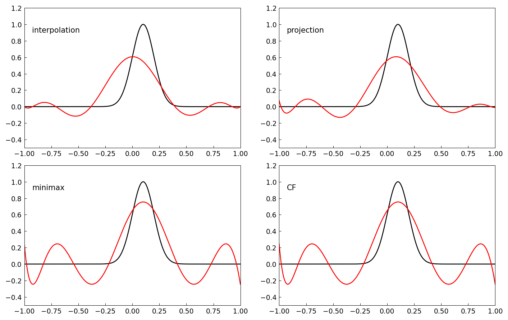
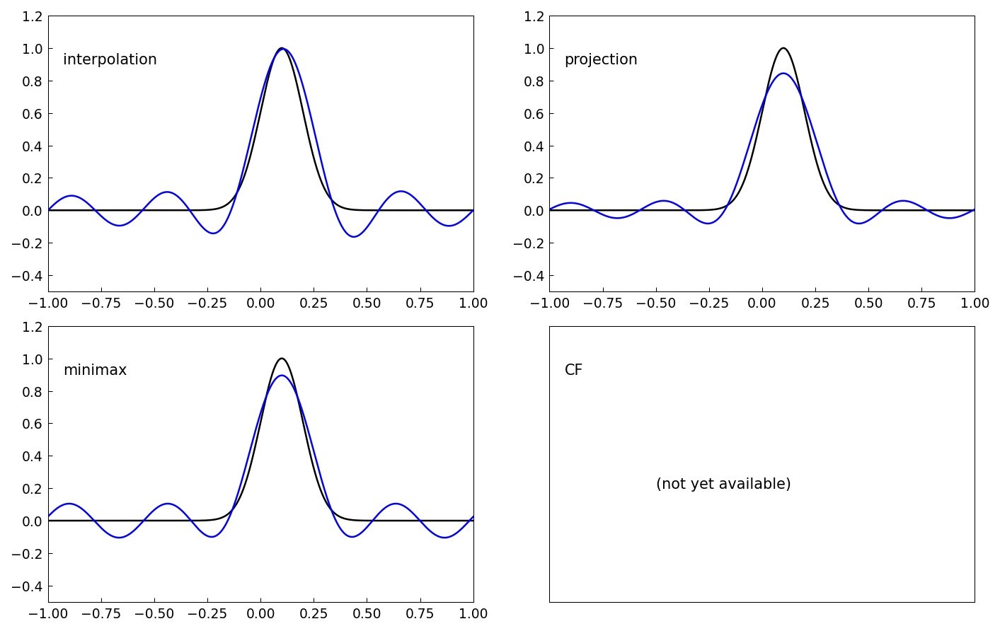
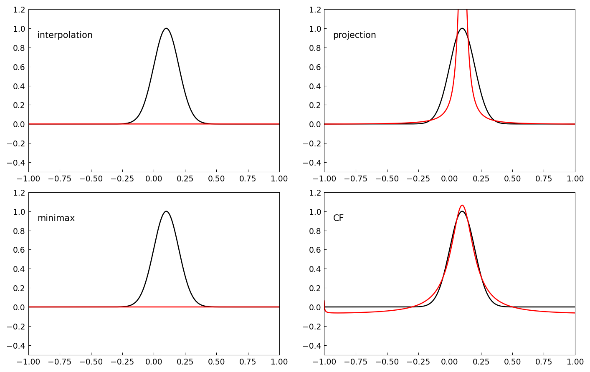
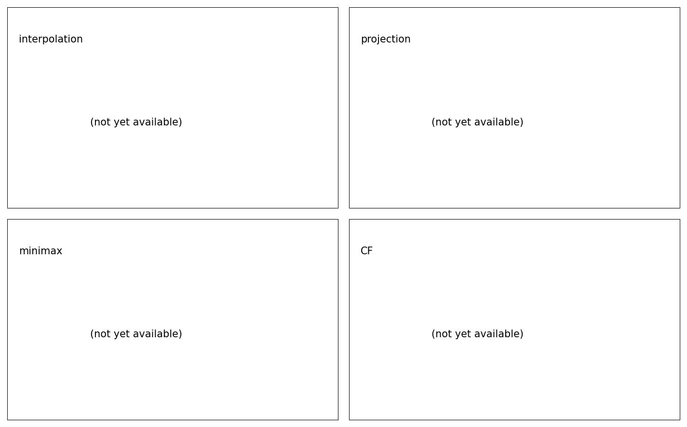

# Eight shades of rational approximation

*Mohsin Javed and Nick Trefethen, January 2016*

[Original MATLAB Chebfun example](https://www.chebfun.org/examples/approx/EightShades.html)

(Chebfun example approx/EightShades.m)

## 1. Introduction

Our aim is to give a broad view of some practical methods of
approximation of functions on an interval.  In a word, the "eight
shades" come about as follows: four types of approximation for
nonperiodic functions (Chebyshev), and their analogues for periodic
functions (trigonometric) — and each of these in polynomial and in
rational form.  The four types are *interpolation* (minimal number of
data points), *projection* (infinitely many data points), *minimax*
(best supremum-norm), and *CF* (Caratheodory-Fejer near-best).

## 2. Polynomial approximation

Here are the four polynomial approximants of degree $m=8$ to a Gaussian
bump $f(x) = e^{-50(x-0.1)^2}$:

```python
import jax.numpy as jnp
import chebfunjax as cj
from chebfunjax.utils.cfpade import cf
from chebfunjax.utils.minimax import minimax

fop = lambda x: jnp.exp(-50*(x - 0.1)**2)
p1 = cj.chebfun(fop, n=9)                        # interpolation
# p2: truncation of the Chebyshev series          projection
p3 = minimax(fop, 8)                             # minimax
p4 = cf(cj.chebfun(fop), 8)                      # CF
```



The CF approximation is extremely close to minimax:

```
CFerror =
     1.140049701846557e-04
```

(Published: `1.140034870100448e-04` — agreeing to five significant
digits.)

## 3. Trigonometric approximation

The same four shades in the periodic world, using trig interpolation,
trig-series truncation, and `trigremez` (periodic CF is not available,
as in the published example):



## 4. Rational approximation

Now the rational versions of type $(3,3)$: `ratinterp`
(interpolation), `chebpade` (projection), rational `minimax`, and
rational `cf`:



## 5. Trigonometric rational approximation

As in the published example, the periodic rational four are marked "not
yet available" (chebfunjax does have `trigpade` and rational
`trigremez` for other uses, but the example's taxonomy panels are kept
faithful):



## References

1. L. N. Trefethen, _Approximation Theory and Approximation Practice_,
   SIAM, 2013.

2. M. Javed, _Algorithms for Trigonometric Polynomial and Rational
   Approximation_, DPhil thesis, University of Oxford, 2016.

---

*Replicated with [chebfunjax](https://github.com/ma-gilles/chebfunjax); original
example copyright The University of Oxford and The Chebfun Developers.*
