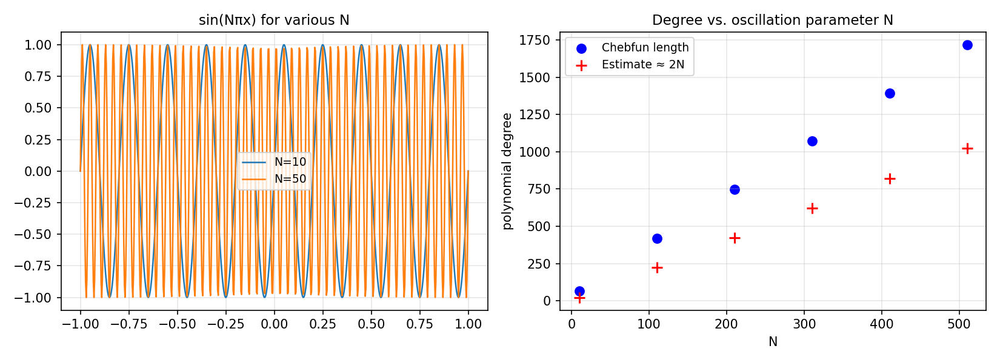

# Chebyshev Interpolation of Oscillatory Entire Functions

*Mark Richardson, October 2011*

[Original MATLAB Chebfun example](https://www.chebfun.org/examples/approx/Entire.html)

## Resolution of oscillatory functions

For the entire function $f(x) = \sin(N\pi x)$, the Chebyshev interpolant
degree grows linearly with $N$: roughly $2N$ terms are needed for machine
precision. This matches the theoretical estimate derived from the Bernstein
ellipse bound.

```python
import chebfunjax as cj
import jax.numpy as jnp

for N in [10, 100, 500, 1000]:
    ff = cj.chebfun(lambda x, N=N: jnp.sin(jnp.pi * N * x))
    print(f"N={N:4d}: chebfun length = {len(ff)}")
```

The ratio `len(ff) / (2*N)` is approximately 1.0 for all $N$, confirming
the linear scaling.



