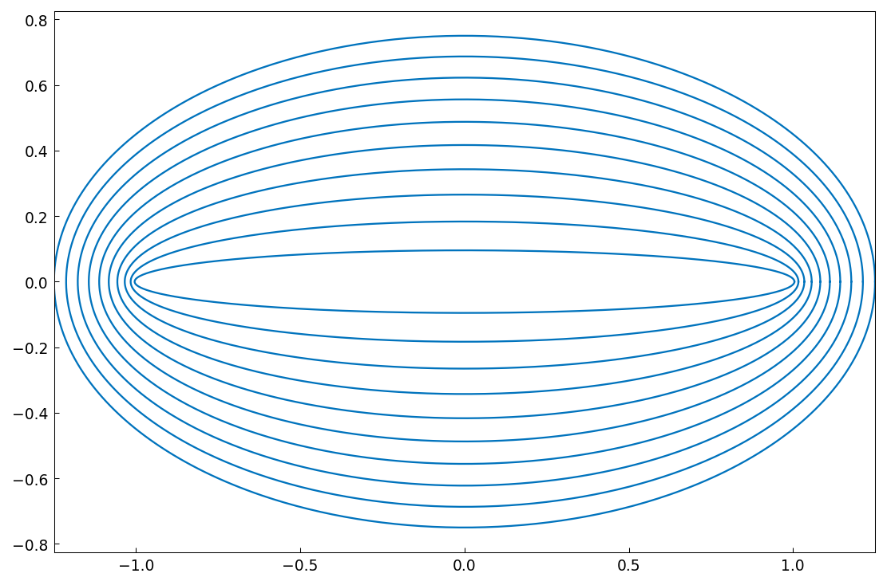
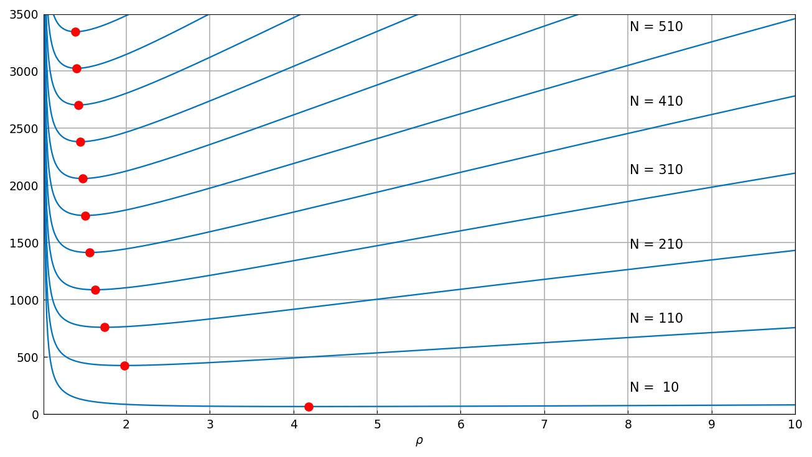

# Chebyshev interpolation of oscillatory entire functions

*Mark Richardson, October 2011*

[Original MATLAB Chebfun example](https://www.chebfun.org/examples/approx/Entire.html)

(Chebfun example approx/Entire.m)

In this example we explore the approximation properties of Chebyshev
interpolation for entire functions, that is, functions that are
analytic everywhere in the complex plane.

## 1. Analytic functions

In the following discussion, it will be helpful to utilise the notion
of a Bernstein $r$-ellipse, which we define as the image of the circle
$|z|=r$ under the mapping $x = (z + z^{-1})/2$.  Here are some such
ellipses, which we denote by $E_r$:

```python
import numpy as np
rr = 1 + np.arange(1, 11)/10
t = np.linspace(0, 2*np.pi, 600)
circ = np.exp(1j*t)
# plot (rho*circ + (rho*circ)**-1)/2 for rho in rr
```



Suppose we have a function $f$ that is analytic on $[-1,1]$ and that
can be analytically continued to the closed $r$-ellipse for some
$r > 1$.  Then [1, Chap. 8], the $\infty$-norm error arising from
interpolating $f$ by a polynomial in $n+1$ Chebyshev points is

$$ \max \| f - p_n \| \leq \frac{4 M}{r^n (r-1)}, $$

where $M$ is the maximum absolute value taken by $f$ on the ellipse
$E_r$.  This is a geometric rate of convergence.  If we require an
accuracy of $0 < \varepsilon < 1$ for our approximations, then it will
suffice to obtain the smallest $n$ satisfying

$$ \frac{\log(4/\varepsilon) - \log(r-1) + \log(M)}{\log(r)} \leq n. $$

## 2. Oscillatory entire functions

When the function $f$ is entire, one may expect the convergence to be
even better than geometric, and this is indeed the case.  Consider for
example, for some positive integer $N$, the entire function
$f(x) = \sin(\pi N x)$.  Because $f$ is analytic in the entire complex
plane, the convergence result above must hold for any value of $r > 1$,
with

$$ M \leq \frac{1}{2} \exp\left(\pi N \frac{r-r^{-1}}{2}\right), $$

so we must find the minimum over all $r>1$ of

$$ \frac{\log(2/\varepsilon) - \log(r-1) + \pi N \frac{r-r^{-1}}{2}}{\log(r)}. $$

For a given oscillation parameter $N$ and precision
$\varepsilon = \varepsilon_{mach}$, this may be accomplished using
Chebfun.  The plot below shows this expression for different values of
$N$; the minimum of each curve — the estimate for the minimum Chebfun
degree — is plotted as a red dot:

```python
import jax.numpy as jnp
import chebfunjax as cj

ee = float(np.finfo(np.float64).eps)
for N in range(10, 1011, 100):
    P = lambda p: (jnp.log(2/ee) - jnp.log(p-1)
                   + N*jnp.pi/2*(p - 1/p))/jnp.log(p)
    PP = cj.chebfun(P, domain=(1.01, 10.0))
    pos, mn = PP.min()
    ff = cj.chebfun(lambda x: jnp.sin(jnp.pi*N*x), max_length=2**13)
```



How do these estimates for the length of the polynomial interpolant
compare with Chebfun lengths resulting from Chebfun's adaptive
construction process?

```
            function        estimate   chebfun length
         sin(   10 pi x)        69            67
         sin(  110 pi x)       427           417
         sin(  210 pi x)       761           747
         sin(  310 pi x)      1090          1071
         sin(  410 pi x)      1415          1413
         sin(  510 pi x)      1739          1717
         sin(  610 pi x)      2062          2037
         sin(  710 pi x)      2384          2357
         sin(  810 pi x)      2705          2677
         sin(  910 pi x)      3025          2997
         sin( 1010 pi x)      3346          3315
```

Very close!  (All eleven estimates match the published MATLAB table
exactly; nine of the eleven adaptive chebfun lengths are identical too,
with the other two differing by 2.)

For more, including the definition of the "Chebfun ellipse" of a
function, see [1].

## References

1. L. N. Trefethen, _Approximation Theory and Approximation Practice,
   Extended Edition_, SIAM, 2019.

---

*Replicated with [chebfunjax](https://github.com/ma-gilles/chebfunjax); original
example copyright The University of Oxford and The Chebfun Developers.*
