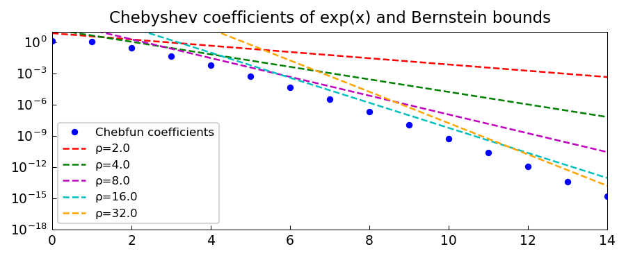

# Convergence Bounds for Entire Functions

*Nick Trefethen, April 2016*

[Original MATLAB Chebfun example](https://www.chebfun.org/examples/approx/EntireBound.html)

## Bernstein ellipses

If $f$ is analytic on the Bernstein $\rho$-ellipse with $|f| \le M$ there,
then by Theorem 8.3 of Trefethen [1]:
$$\|f - p_n\|_\infty \le \frac{4M\rho^{-n}}{\rho - 1}.$$

For entire functions, this holds for *every* $\rho > 1$, giving super-geometric
convergence.

```python
import chebfunjax as cj
import jax.numpy as jnp
import numpy as np

f = cj.chebfun(jnp.exp)
coeffs = np.abs(np.array(f.coeffs))
# Bernstein bound for rho=4
rho = 4.0
M = np.exp((rho + 1/rho) / 2)
nvec = np.arange(len(coeffs))
bound = 2 * M * rho**(-nvec)
print("Coefficients vs. bound at degree 5:", coeffs[5], bound[5])
```



