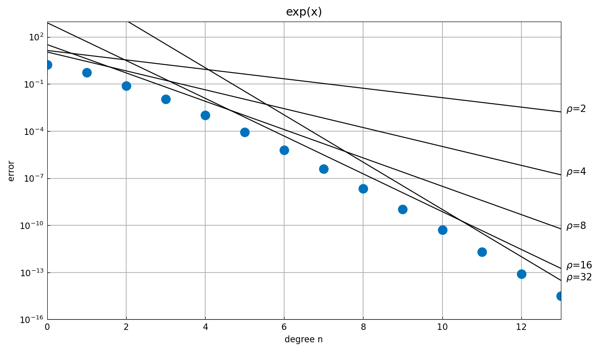
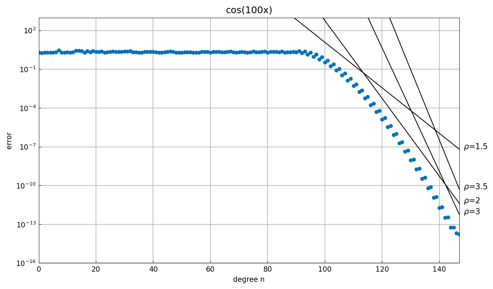

# A bound for entire functions

*Nick Trefethen, April 2017*

[Original MATLAB Chebfun example](https://www.chebfun.org/examples/approx/EntireBound.html)

(Chebfun example approx/EntireBound.m)

If $f$ is analytic in the closed Bernstein $\rho$-ellipse with
$|f|\le M$ there, its degree-$n$ Chebyshev interpolants satisfy

$$ \|f - p_n\| \leq \frac{4M\rho^{-n}}{\rho - 1}. $$

For an *entire* function, this bound holds for every $\rho > 1$
simultaneously, and the lower envelope over $\rho$ tracks the actual
super-geometric convergence.  Here is the experiment for $e^x$ with
$\rho = 2, 4, 8, 16, 32$:

```python
import jax.numpy as jnp
import chebfunjax as cj

fexact = cj.chebfun(lambda x: jnp.exp(x))
for n in range(len(fexact) - 1):
    fn = cj.chebfun(lambda x: jnp.exp(x), n=n+1)
    # err = norm(fn - fexact, inf); bound = 4*M*rho^-n/(rho-1)
```



The dots (interpolation errors) hug the lower envelope of the bound
family.  The same experiment for the oscillatory entire function
$\cos(100x)$, with $\rho = 1.5, 2, 3, 3.5$ and
$M = \cosh(100(\rho-1/\rho)/2)$:



Convergence sets in only around degree $n \approx 100$ (the function
needs about one point per wavelength), after which it is extremely
fast — and again the envelope of the Bernstein bounds explains the
curve.

## References

1. L. N. Trefethen, _Approximation Theory and Approximation Practice,
   Extended Edition_, SIAM, 2019.

---

*Replicated with [chebfunjax](https://github.com/ma-gilles/chebfunjax); original
example copyright The University of Oxford and The Chebfun Developers.*
