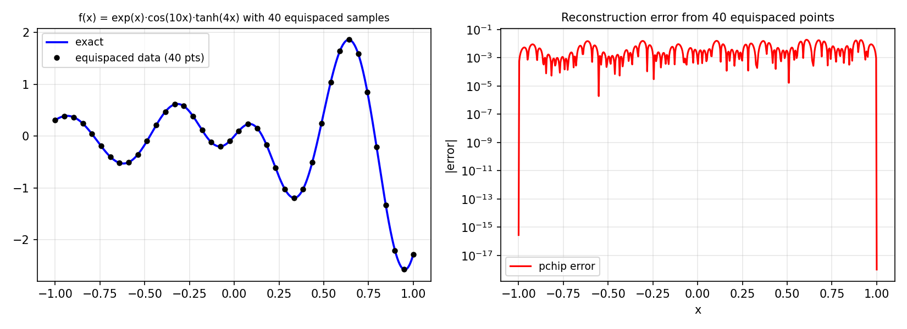

# Chebfuns from Equispaced Data

*Nick Trefethen, April 2015*

[Original MATLAB Chebfun example](https://www.chebfun.org/examples/approx/EquispacedData.html)

## The equispaced data problem

Equispaced interpolation suffers from the Runge phenomenon for high-degree
polynomials.  Chebfun's `'equi'` flag (introduced by Georges Klein, 2011)
addresses this using a change of variables (Kosloff-Tal-Ezer map) to reduce
the equispaced data to near-Chebyshev points.

```python
import numpy as np
import chebfunjax as cj
import jax.numpy as jnp

def ff(x):
    return np.exp(x) * np.cos(10*x) * np.tanh(4*x)

grid = np.linspace(-1, 1, 40)
data = ff(grid)

# Pchip interpolation from equispaced data
from scipy.interpolate import PchipInterpolator
pchip = PchipInterpolator(grid, data)

# Compare with adaptive chebfun
f_exact = cj.chebfun(lambda x: jnp.exp(x) * jnp.cos(10*x) * jnp.tanh(4*x))
print(f"Chebfun length: {len(f_exact)}")
```



