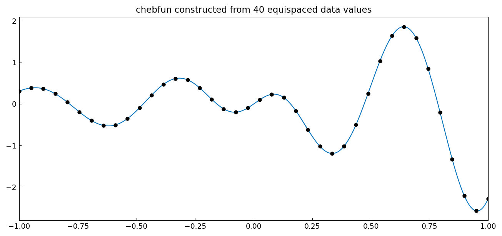
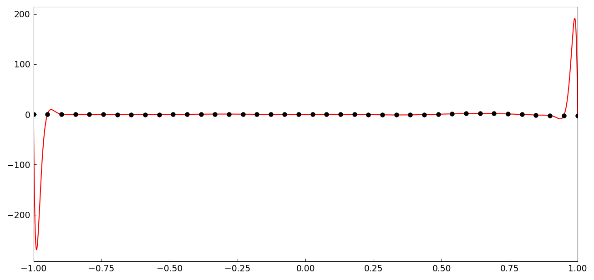
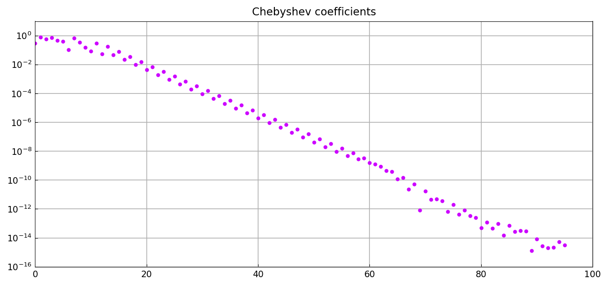
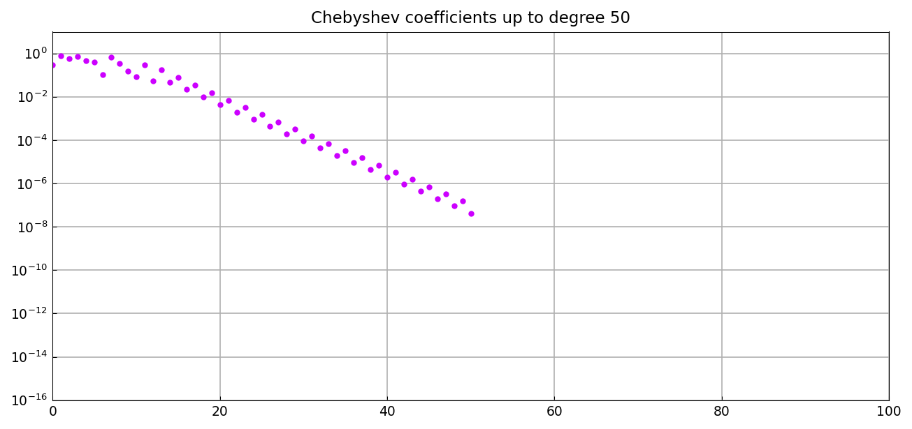
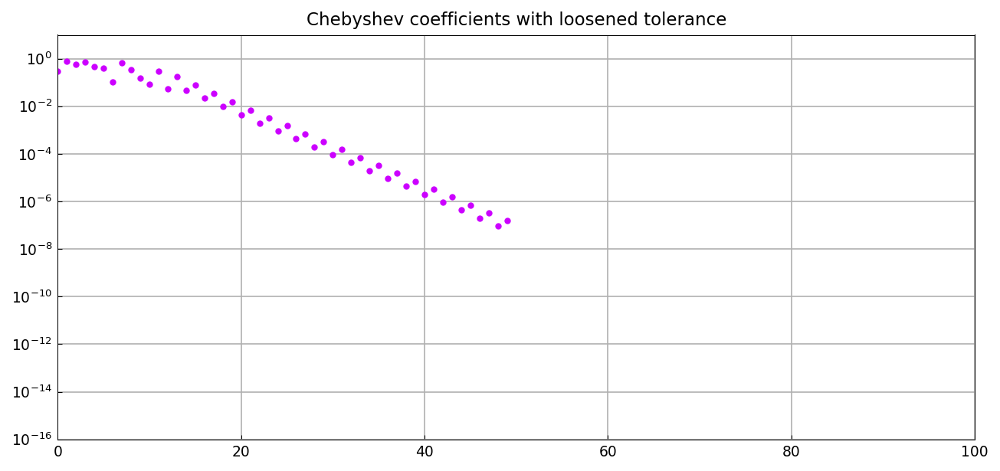
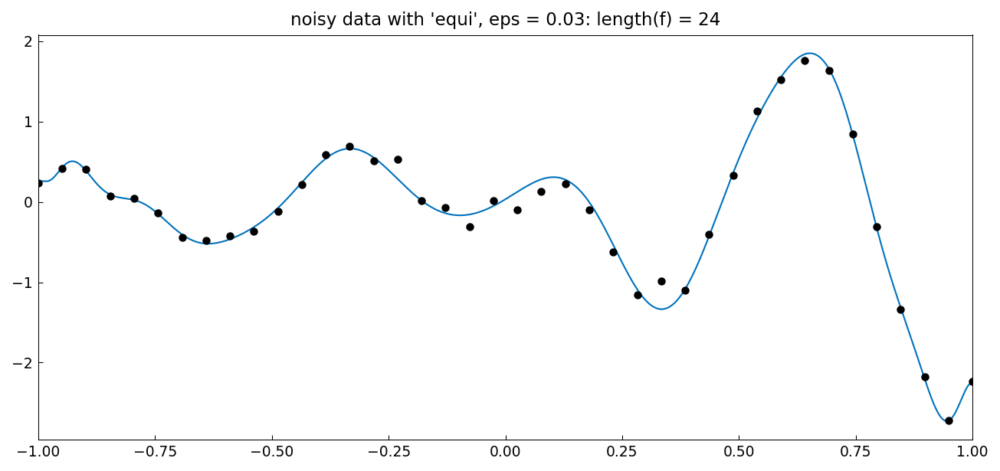

# Chebfuns from equispaced data

*Nick Trefethen, April 2015*

[Original MATLAB Chebfun example](https://www.chebfun.org/examples/approx/EquispacedData.html)

(Chebfun example approx/EquispacedData.m)

## 1. Introduction

For good reasons of approximation theory, Chebfun relies on polynomial
interpolation in Chebyshev points, which are unequally spaced, to
represent nonperiodic functions.  However, many people want to work
with equispaced data.  Chebfun can do a pretty good job with this
thanks to the `'equi'` flag introduced by Georges Klein in 2011.

## 2. Example without noise

Suppose we want to work with the function $e^x\cos(10x)\tanh(4x)$, but
all we know of it is samples at 40 equispaced points in $[-1,1]$.  We
can construct a chebfun from this data as follows:

```python
import numpy as np
import jax.numpy as jnp
import chebfunjax as cj

ff = lambda x: np.exp(x)*np.cos(10*x)*np.tanh(4*x)
grid = np.linspace(-1, 1, 40)
data = ff(grid)
f = cj.chebfun(jnp.asarray(data), equi=True)
```



The plot looks good!  The error is encouragingly small:

```
error =
     3.537098105960607e-06
```

(Published: `3.537098266021654e-06` — matching to 7 significant
digits.)  For comparison, this is what we get with polynomial
interpolation of the same data.  Of course, any Chebfun user knows that
polynomial interpolation in equispaced points is a bad idea (the Runge
phenomenon):



So what is this very nice chebfun obtained with the `'equi'` flag?  The
answer is that it is a polynomial approximant, but not simply the
polynomial interpolant — Chebfun first constructs a Floater-Hormann
rational interpolant [1] with adaptively chosen order, then approximates
it by a polynomial chebfun.  In fact it has a higher degree than 40:

```
f =
   chebfun column (1 smooth piece)
       interval       length     endpoint values
[      -1,       1]       96      0.31     -2.3
vertical scale = 2.6
```

(Published length: 99.)  Here is a plot of its Chebyshev coefficients:



Note that about half of them are below the level of the accuracy of the
approximation.  We could throw them away (`error50 = 3.506e-06`):



Another approach would be to construct the original chebfun with a
loosened value of `eps` (`errorloose = 3.522e-06`):



## 3. Example with noise

What about a function with noise?  Let's add random perturbations of
size $10^{-1}$ to the data (MATLAB's `randn` stream is not reproducible
outside MATLAB, so the noise realization differs).  Here is what we get
with `eps = 1e-2`:


And here is the same experiment but with `eps` three times as large:



## 4. Discussion

What's nice about these `'equi'` approximations is that, as usual with
chebfuns, they are globally smooth functions, and can be
differentiated, for example, without any anomalies arising.  In some
applications this is very appealing.

## References

1. M. S. Floater and K. Hormann, Barycentric rational interpolation
   with no poles and high rates of approximation, _Numer. Math._, 107
   (2007), 315-331.

2. M. Javed and L. N. Trefethen, Euler-Maclaurin and Gregory
   interpolants, _Numer. Math._, 132 (2016), 201-216.

---

*Replicated with [chebfunjax](https://github.com/ma-gilles/chebfunjax); original
example copyright The University of Oxford and The Chebfun Developers.*
