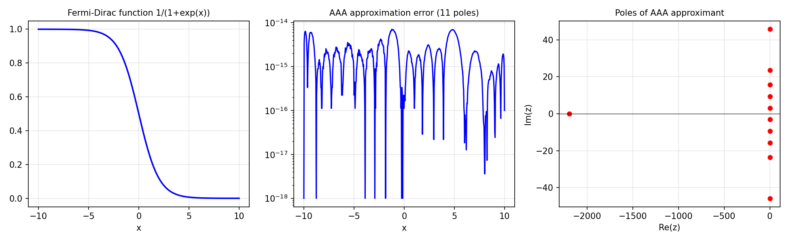

# Rational Approximation of the Fermi-Dirac Function

*Nick Trefethen, July 2019*

[Original MATLAB Chebfun example](https://www.chebfun.org/examples/approx/FermiDirac.html)

## The Fermi-Dirac function

The Fermi-Dirac distribution $f(x) = 1/(1 + e^x)$ arises in quantum mechanics
and electronic structure theory.  It has a smooth but rapid transition near
$x=0$.  Rational approximation is much more efficient than polynomials here:
the poles of $f$ lie at $x = i\pi(2k+1)$ for $k \in \mathbb{Z}$.

```python
from chebfunjax.utils.aaa import aaa
import jax.numpy as jnp

xs = jnp.linspace(-10.0, 10.0, 500)
ys = 1.0 / (1.0 + jnp.exp(xs))
r, pol, res, zer, *_ = aaa(ys, xs)
print(f"AAA type: ({len(pol)-1}, {len(pol)-1}), max err: {float(jnp.max(jnp.abs(ys - jnp.array([float(r(x)) for x in xs])))):.2e}")
```



