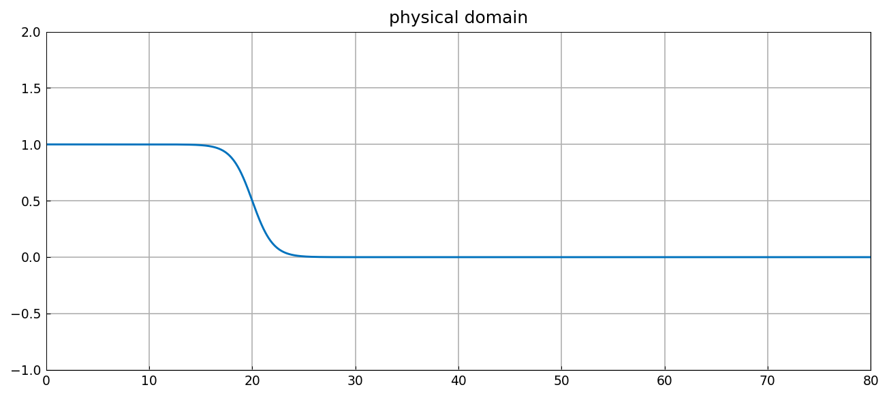
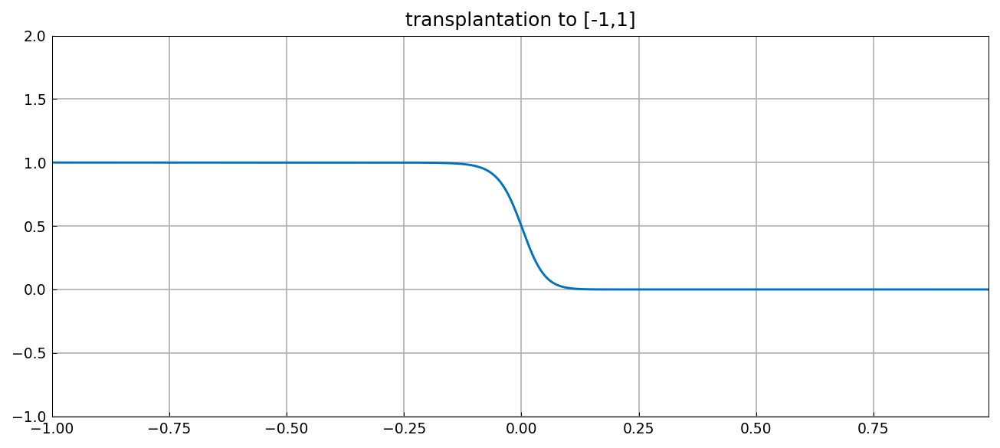
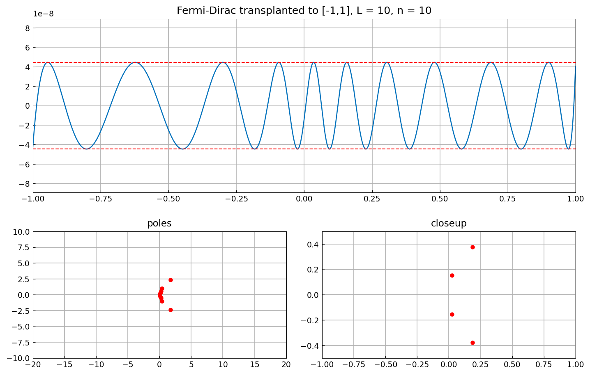
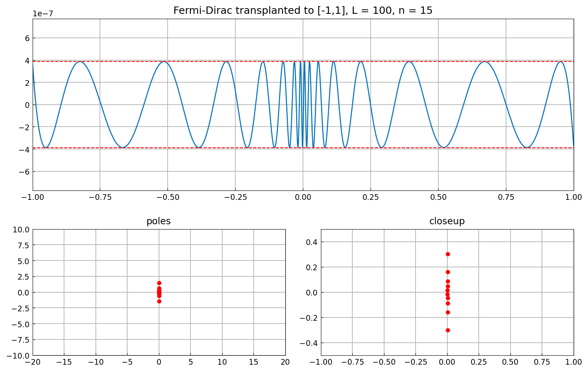
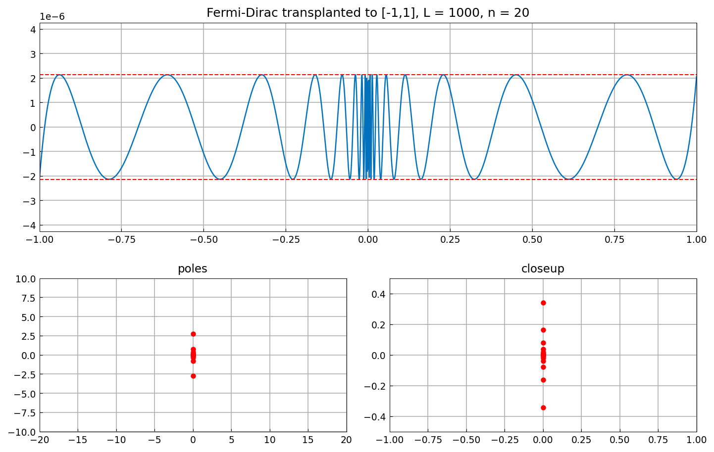
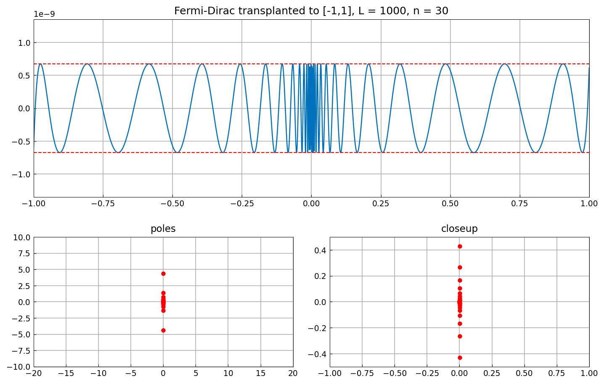

# Rational approximation of the Fermi-Dirac function

*Nick Trefethen, July 2019*

[Original MATLAB Chebfun example](https://www.chebfun.org/examples/approx/FermiDirac.html)

(Chebfun example approx/FermiDirac.m)

The Fermi-Dirac function is important in electronic energy
calculations, for which physicists have had great success with rational
approximations [1].  We won't attempt to discuss the physics or the
algorithms here, but just consider some rational approximations,
motivated in particular by [2].

The function is smooth, but approximates a step (which corresponds to
the limit of zero temperature).  With $L$ as a large parameter, we can
write the function like this:

$$ f(E) = {1 \over 1 + \exp(x-L) }, \quad x\in [0,\infty). $$

Here for example is a plot with $L=20$:



This is essentially a hyperbolic tangent, but with a twist: the
approximation domain we care about extends a finite distance on one
side and an infinite distance on the other.  For a type $(n,n)$
approximant, it is convenient to soften up the problem by a Möbius
transformation to $s\in[-1,1]$, which maps type $(n,n)$ rational
functions to themselves:

```python
import jax.numpy as jnp

def make_g(L):
    return lambda s: 1.0/(1.0 + jnp.exp((s*L + L)/(1 - s) - L))
```

Here for example is the transplanted function above:



Note that despite appearances, this is not symmetric about $s=0$.  For
example, $g(.1)$ and $1-g(-.1)$ are quite different:

```
0.011607316445305   0.025671586349827
```

(Both values match the published output digit-for-digit.)

To approximate $g$ by a rational function of type $(n,n)$, we can use
the `minimax` command.  Here is an easy example with $L=10$
(err $= 4.46\times 10^{-8}$):

```python
from chebfunjax.utils.minimax import minimax
r = minimax(make_g(10), 10, rational=True, denom=10)
```



Here is a harder one with $L=100$ (err $= 3.87\times 10^{-7}$):



The code even works with $L=1000$ (err $= 2.14\times 10^{-6}$):



Here's the same function approximated with a higher value of $n$
(type $(30,30)$, err $= 6.8\times 10^{-10}$; the published MATLAB run
needed its AAA-Lawson re-initialization fallback for these last two
cases — our solver's default AAA-Lawson initialization converges
directly):



## References

1. L. Lin, M. Chen, C. Yang, and L. He, Accelerating atomic orbital-
   based electronic structure calculation via pole expansion and
   selected inversion, _J. Phys. Condens. Matter_, 25 (2013), 295501.

2. K. Cherednichenko and Y. Nakatsukasa, private communication, 2019.

---

*Replicated with [chebfunjax](https://github.com/ma-gilles/chebfunjax); original
example copyright The University of Oxford and The Chebfun Developers.*
