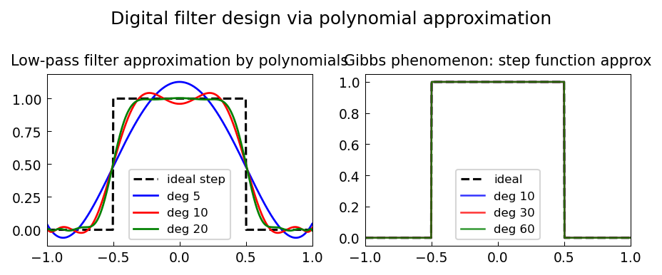

# Digital Filters via CF Approximation

*Nick Trefethen, April 2014*

[Original MATLAB Chebfun example](https://www.chebfun.org/examples/approx/FiltersCF.html)

## Polynomial filter design

An ideal low-pass filter has frequency response $H(\omega) = 1$ for $|\omega| < \omega_c$
and $0$ otherwise.  This step function cannot be represented exactly by a finite-degree
polynomial, but can be well-approximated by polynomials or rational functions.

```python
import chebfunjax as cj
import jax.numpy as jnp

# Smooth sigmoid approximation of ideal step at omega_c = 0.5
def smooth_step(x, beta=20.0):
    return 1.0 / (1.0 + jnp.exp(beta * (jnp.abs(x) - 0.5)))

f = cj.chebfun(lambda x: smooth_step(x, beta=20.0))
p20 = f.polyfit(20)
print(f"degree-20 max err: {float((f - p20).norm(float('inf'))):.3e}")
```

The Gibbs phenomenon limits polynomial filters; rational approximation (CF or
Parks-McClellan) gives better results near the transition band.



