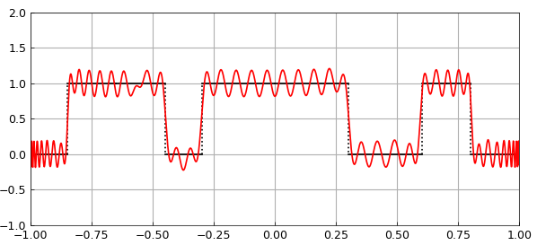
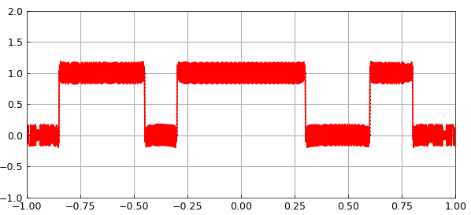
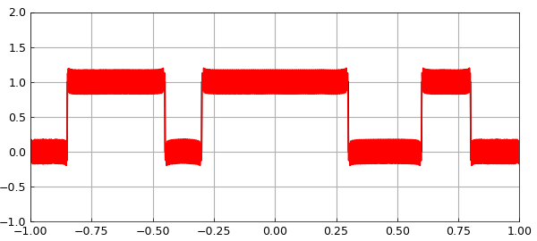
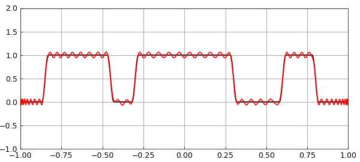
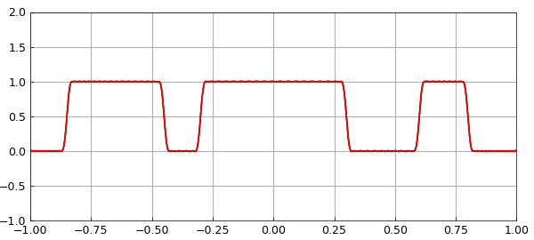

# Digital filters via CF approximation

*Nick Trefethen, April 2014*

[Original MATLAB Chebfun example](https://www.chebfun.org/examples/approx/FiltersCF.html)

Python translation: [`examples/approx/filters_cf.py`](https://github.com/ma-gilles/chebfunjax/blob/main/examples/approx/filters_cf.py)

Digital filtering is one of the most important applications of approximation theory, used in telephones and radios and music players and innumerable other devices in our wired world.

Mathematically, digital filters are polynomial ("FIR" or "finite impulse response") or rational ("IIR" or "infinite impulse response") approximations to prescribed functions. The classic method for computing FIR filters, called the Parks-McLellan method by engineers, is the Remez algorithm, available in the `remez` command of Chebfun [1]. However, complicated filter designs are not always easy by this method, for the Remez algorithm is nonlinear and may fail to converge if there is not a good enough initial guess.

It seems that CF (Caratheodory-Fejer) approximation may be a promising alternative, either for computing the filter itself or at least for generating an initial guess. (For a reference on CF approximations, see Chapter 20 of [2].) Here for example is a function with three "pass bands", together with polynomial approximations of degrees $100$ and $1000$:

```matlab
x = chebfun('x');
LW = 'linewidth';
f = (abs(x)<.3) + (abs(x-.7)<.1) + (abs(x+.65)<.2);
plot(f,'k',LW,1.2), grid on, axis([-1 1 -1 2]), shg

tic
for m = [100 1000]
  p = cf(f,m,0,max(100,2*m));
  plot(f,'k',p,'r',LW,1.2), grid on
  axis([-1 1 -1 2]), snapnow
end
```





It didn't take long to produce these pictures:

```matlab
toc
```

```text
Elapsed time is 0.631572 seconds.
```

In practice, filter specifications usually have "don't care" regions between pass and stop bands. Here to give an idea of the possibilities we make $f$ a little smoother by convolving it with a narrow hat function. Now degrees $100$ and $200$ give good filters:

```matlab
s = chebfun('s', [-.02 .02]);
phi = 50-50^2*abs(s);
f2 = conv(f,phi);
for m = [100 200]
  p = cf(f2,m,0,max(100,2*m));
  plot(f2,'k',p,'r',LW,1.2), grid on
  axis([-1 1 -1 2]), snapnow
end
```





Here's the error:

```matlab
plot(f2-p,LW,1.2), grid on
```



## References

1. T. W. Parks and J. H. McClellan, Chebyshev approximation for nonrecursive digital filters with linear phase, *IEEE Transactions on Circuit Theory*, CT-19 (1972), 189-194.
2. L. N. Trefethen, *Approximation Theory and Approximation Practice*, SIAM, 2013.

---

*Translated with [chebfunjax](https://github.com/ma-gilles/chebfunjax); prose and MATLAB code from the original example, copyright The University of Oxford and The Chebfun Developers.  Printed outputs and figures are chebfunjax's.*
