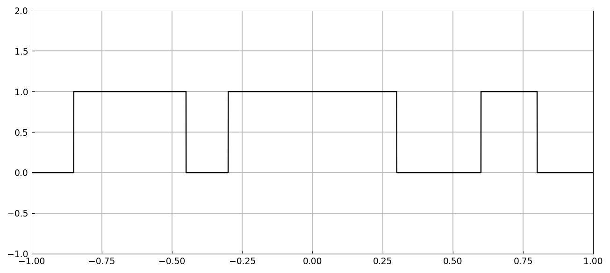
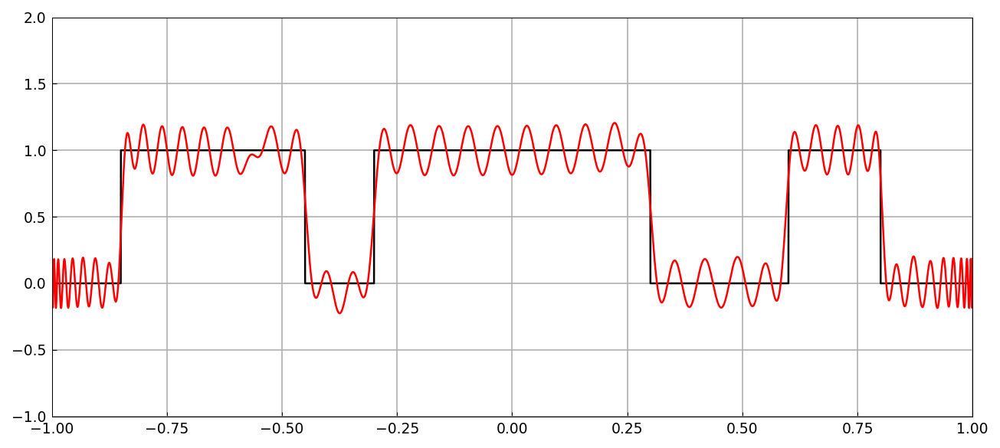
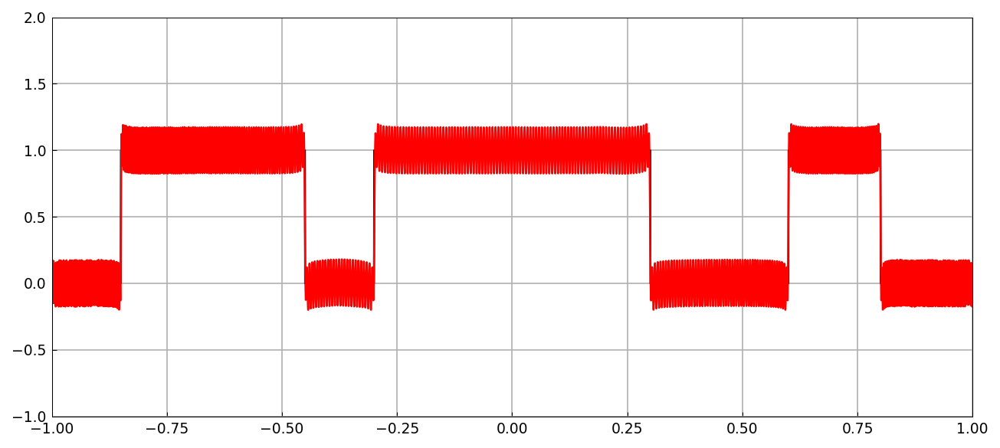
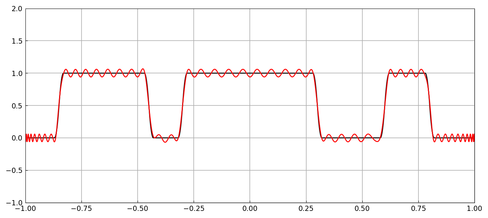
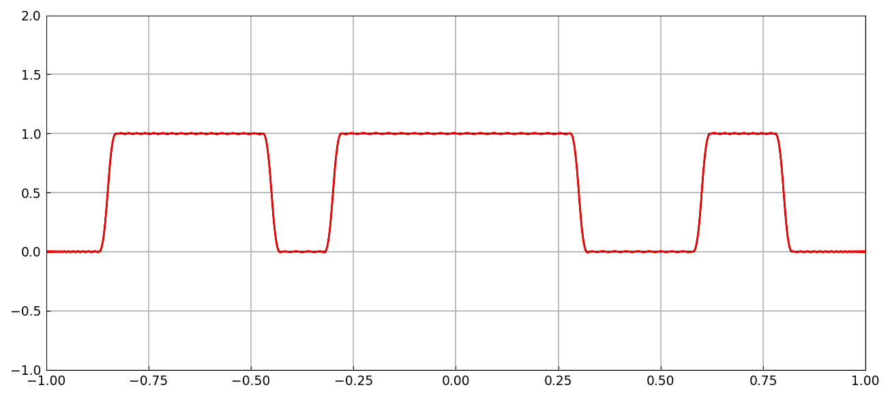
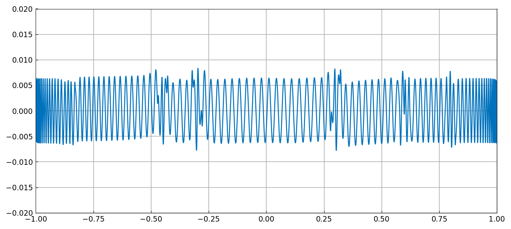

# Digital filters via CF approximation

*Nick Trefethen, April 2014*

[Original MATLAB Chebfun example](https://www.chebfun.org/examples/approx/FiltersCF.html)

(Chebfun example approx/FiltersCF.m)

Digital filtering is one of the most important applications of
approximation theory, used in telephones and radios and music players
and innumerable other devices in our wired world.

Mathematically, digital filters are polynomial ("FIR") or rational
("IIR") approximations to prescribed functions.  The classic method for
computing FIR filters, called the Parks-McClellan method by engineers,
is the Remez algorithm [1].  However, complicated filter designs are
not always easy by this method.  CF (Caratheodory-Fejer) approximation
is a promising alternative.  Here is a function with three "pass
bands":

```python
import jax.numpy as jnp
import chebfunjax as cj
from chebfunjax.utils.cfpade import cf

def fop(x):
    return (jnp.where(jnp.abs(x) < 0.3, 1.0, 0.0)
            + jnp.where(jnp.abs(x - 0.7) < 0.1, 1.0, 0.0)
            + jnp.where(jnp.abs(x + 0.65) < 0.2, 1.0, 0.0))
f = cj.chebfun(fop, domain=[-1, -0.85, -0.45, -0.3, 0.3, 0.6, 0.8, 1])
```



Together with polynomial CF approximations of degrees 100 and 1000:

```python
for m in (100, 1000):
    p, q, rh, s = cf(f, m, 0, max(100, 2*m))
```





It didn't take long to produce these pictures (about 3 seconds).
Because the target is discontinuous, the maximum errors stay near the
Gibbs level at the jumps no matter how high the degree.

In practice, filter specifications usually have "don't care" regions
between pass and stop bands.  To give an idea of the possibilities we
smooth $f$ by (mathematically) convolving it with a narrow triangular
kernel $\varphi = 50 - 2500|s|$ on $[-0.02, 0.02]$, and approximate
the mollified function at degrees 100 and 200:





Now the approximations converge rapidly (max error $8.3\times 10^{-3}$
at $m=200$); the error is concentrated in the transition bands:



## References

1. T. W. Parks and J. H. McClellan, Chebyshev approximation for
   nonrecursive digital filters with linear phase, _IEEE Trans. Circuit
   Theory_, 19 (1972), 189-194.

2. L. N. Trefethen, _Approximation Theory and Approximation Practice_,
   SIAM, 2013.

---

*Replicated with [chebfunjax](https://github.com/ma-gilles/chebfunjax); original
example copyright The University of Oxford and The Chebfun Developers.*
