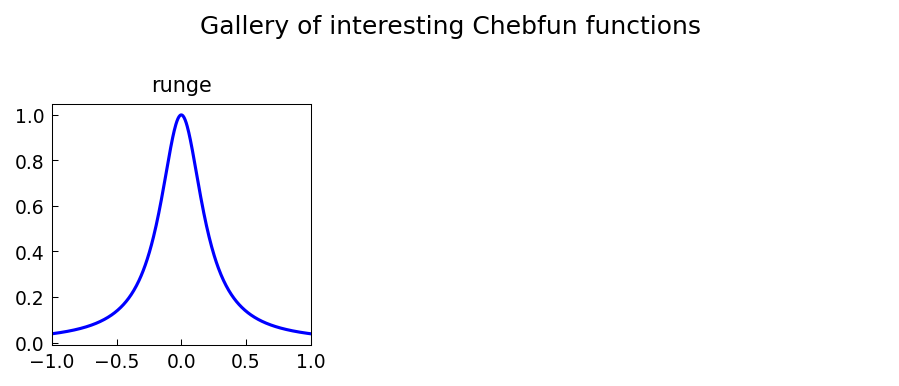

# Gallery and Gallerytrig

*Hrothgar and Nick Trefethen, December 2014*

[Original MATLAB Chebfun example](https://www.chebfun.org/examples/approx/Galleries.html)

## Gallery functions

Like MATLAB's `gallery` command for matrices, Chebfun's `gallery` provides a
collection of interesting 1D functions for testing approximation algorithms.

```python
# These are available as regular chebfun constructions
import chebfunjax as cj
import jax.numpy as jnp

functions = {
    'abs(x)':      cj.chebfun(jnp.abs),
    'sign(x)':     cj.chebfun(jnp.sign, domain=(-1.0, 0.0, 1.0)),
    'tanh(10x)':   cj.chebfun(lambda x: jnp.tanh(10.0*x)),
    'Runge':       cj.chebfun(lambda x: 1.0/(1.0 + 25.0*x**2)),
    'sin(20x)exp': cj.chebfun(lambda x: jnp.sin(20.0*x)*jnp.exp(-x**2)),
}

for name, f in functions.items():
    print(f"{name:20s}: length = {len(f)}")
```



