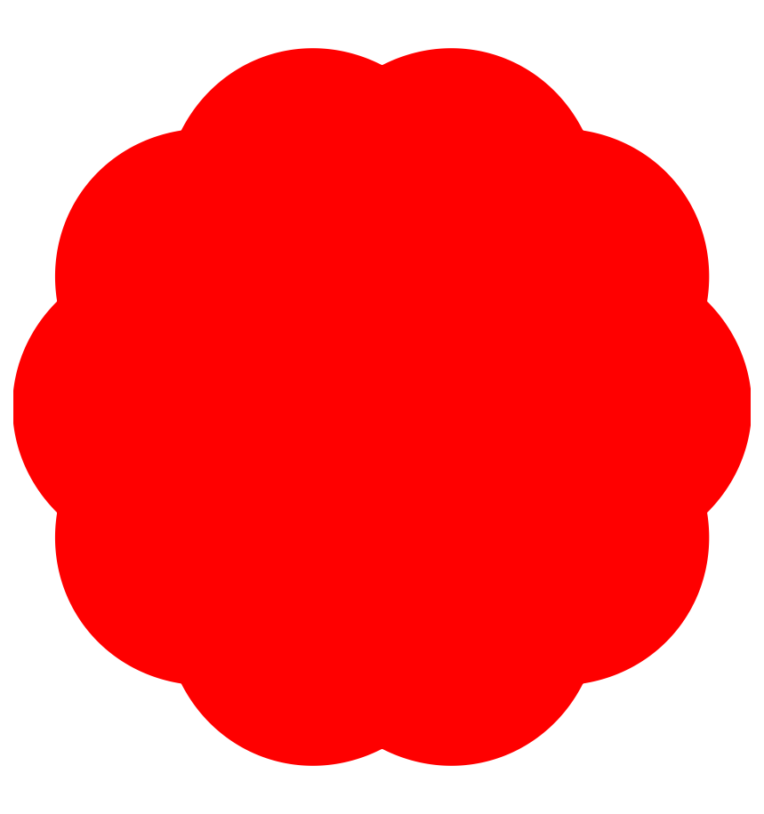
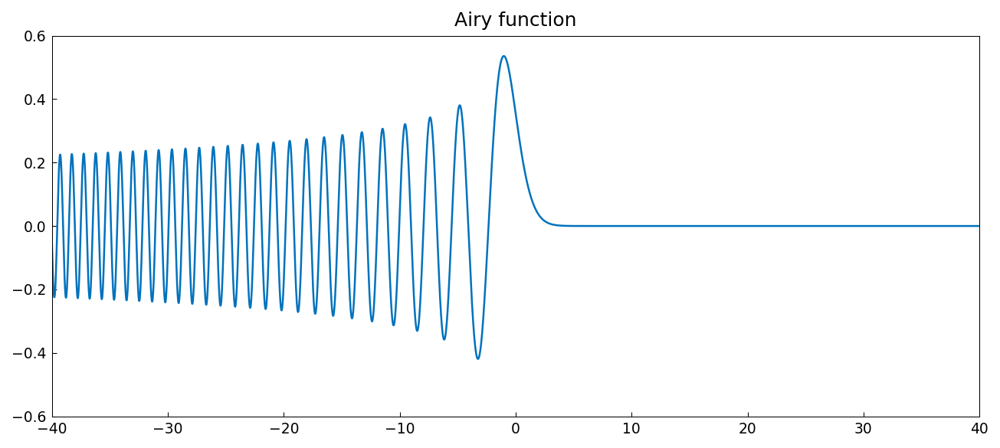
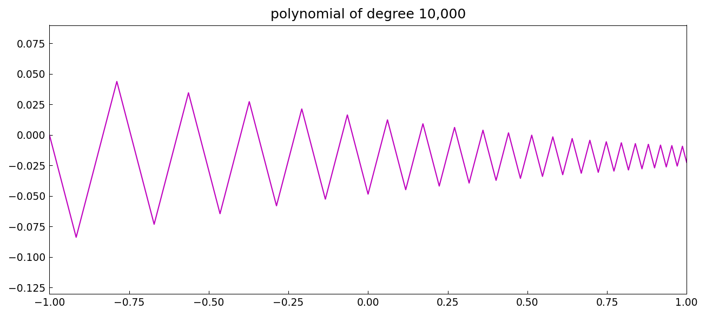
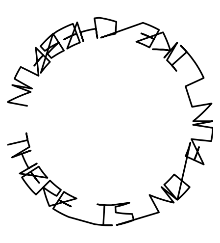
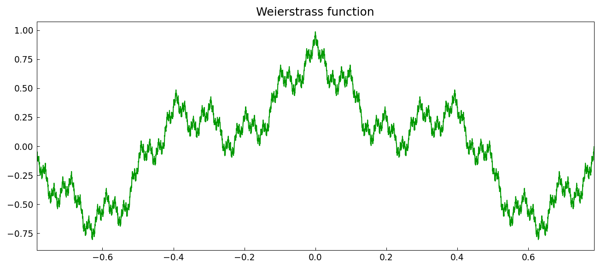
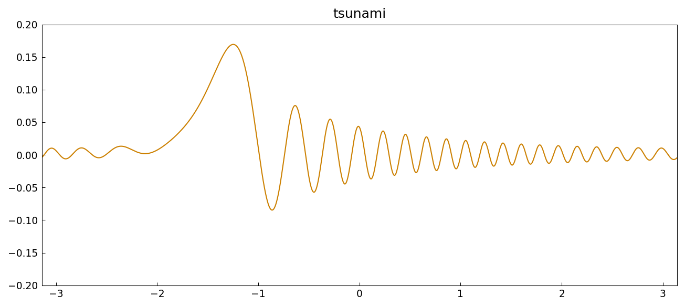

# Gallery and Gallerytrig

*Hrothgar and Nick Trefethen, December 2014*

[Original MATLAB Chebfun example](https://www.chebfun.org/examples/approx/Galleries.html)

(Chebfun example approx/Galleries.m)

For many years MATLAB has had a `gallery` command to construct
interesting matrices.  Chebfun has a gallery command too, which
constructs interesting functions.

Here is a particularly attractive image — a complex chebfun visualized
with `fill`:

```python
from chebfunjax.utils.gallery import gallery
f = gallery("rose")
```



Some gallery examples produce results so simple that a line of obvious
Chebfun code would have had the same effect:



(This is essentially just `chebfun(airy, [-40,40])`.)  Sometimes
however you may know what the function looks like but need a reminder
of how to generate it.  Here is a polynomial of degree 10,000:



The gallery also includes a familiar Chebfun motto:



For periodic functions, there is also `gallerytrig`.  Here is a
Weierstrass-type nowhere-differentiable function,



and a "tsunami":



(Two-dimensional functions and `gallery2` are discussed in a separate
example.)

---

*Replicated with [chebfunjax](https://github.com/ma-gilles/chebfunjax); original
example copyright The University of Oxford and The Chebfun Developers.*
