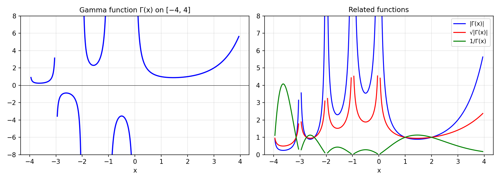

# The Gamma Function and Its Poles

*Nick Hale, December 2009*

[Original MATLAB Chebfun example](https://www.chebfun.org/examples/approx/GammaFun.html)

## The gamma function

The gamma function $\Gamma(x)$ has simple poles at the non-positive integers.
Chebfun can represent it on $[-4,4]$ as a piecewise chebfun with breakpoints at
the poles.

```python
import numpy as np
from scipy.special import gamma as scipy_gamma
import chebfunjax as cj

# Evaluate on each piece separately, avoiding poles
breakpoints = (-4.0, -3.0, -2.0, -1.0, 0.0, 4.0)
for a, b in zip(breakpoints[:-1], breakpoints[1:]):
    xx = np.linspace(a + 0.1, b - 0.1, 200)
    yy = scipy_gamma(xx)
    print(f"[{a},{b}]: range = [{yy.min():.1f}, {yy.max():.1f}]")
```

## Related functions

From $\Gamma(x)$ we can compute $1/\Gamma(x)$ (entire function!),
$|\Gamma(x)|^{1/2}$, and their critical points.  The integral of $\Gamma(x)$
over $[-4,4]$ diverges (NaN), the integral of $|\Gamma|$ is infinite, but the
integral of $\sqrt{|\Gamma|}$ is finite.



