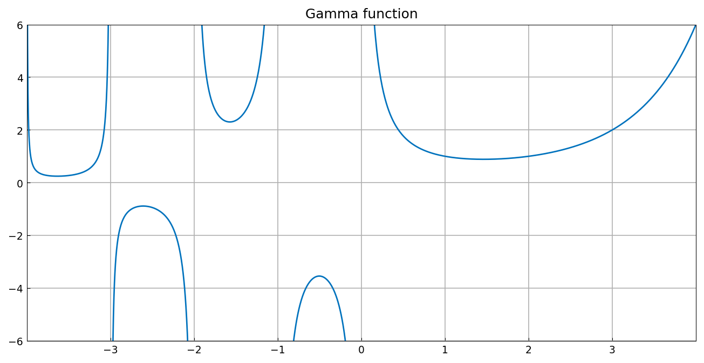
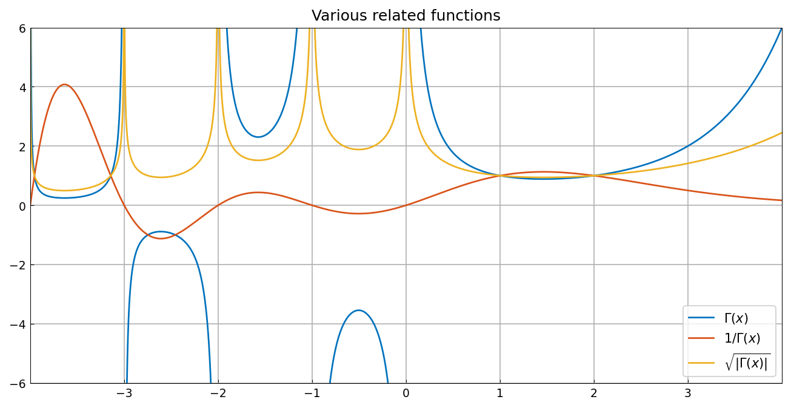
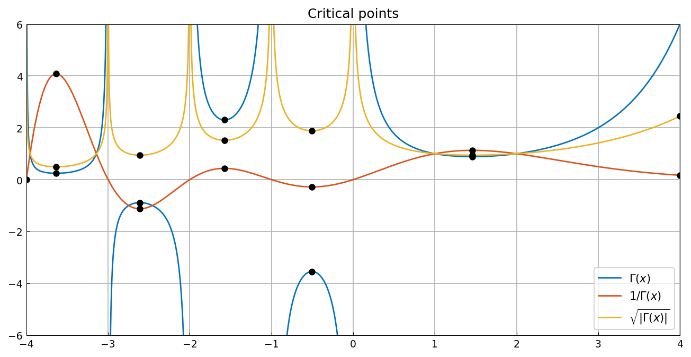

# The gamma function and its poles

*Nick Hale, December 2009 (revised June 2019 by Nick Trefethen)*

[Original MATLAB Chebfun example](https://www.chebfun.org/examples/approx/GammaFun.html)

(Chebfun example approx/GammaFun.m)

This example displays some of Chebfun's capabilities for unbounded
functions by exploring the gamma function $\Gamma(x)$ on the interval
$[-4,4]$.

The gamma function has simple poles at the negative integers and zero.
Chebfun can determine the locations and orders of these poles if it is
called with the `blowup` and `splitting` flags on.  The exponents of the
output indicate that each pole is simple, that is, it has a singularity
of type $x^{-1}$:

```python
import numpy as np
import jax.numpy as jnp
from scipy.special import gamma
import chebfunjax as cj

gam_op = lambda x: jnp.asarray(gamma(np.asarray(x)))
gam = cj.chebfun(gam_op, domain=[-4.0, 4.0], blowup=True, splitting=True)
gam
```
```
gam =
   chebfun column (5 smooth pieces)
       interval       length     endpoint values   endpoint exponents
[      -4,      -3]       19       Inf      Inf         [-1      -1]
[      -3,      -2]       18      -Inf     -Inf         [-1      -1]
[      -2,      -1]       18       Inf      Inf         [-1      -1]
[      -1,-2.2e-308]       18      -Inf     -Inf         [-1      -1]
[-2.2e-308,       4]       36       Inf        6         [-1       0]
vertical scale = Inf    Total length = 109
```

(MATLAB's published display shows the same five pieces with the same
exponents — including the amusing `-2.2e-308` breakpoint from automatic
pole detection — with lengths 20/25/24/20/26.)



Alternatively, and always a better idea when the information is
available, one can instruct Chebfun what poles to put where:

```python
gam = cj.chebfun(gam_op, domain=[-4.0, -3.0, -2.0, -1.0, 0.0, 4.0],
                 exps=[-1, -1, -1, -1, -1, -1, -1, -1, -1, 0])
```
```
gam =
   chebfun column (5 smooth pieces)
       interval       length     endpoint values   endpoint exponents
[      -4,      -3]       19       Inf      Inf         [-1      -1]
[      -3,      -2]       19      -Inf     -Inf         [-1      -1]
[      -2,      -1]       19       Inf      Inf         [-1      -1]
[      -1,       0]       18      -Inf     -Inf         [-1      -1]
[       0,       4]       36       Inf        6         [-1       0]
vertical scale = Inf    Total length = 111
```


We can now treat $\Gamma(x)$ like any other chebfun.  For example, we
can find its reciprocal $1/\Gamma(x)$, compute the square root
$|\Gamma(x)|^{1/2}$, and plot these functions:

```python
gam_i = 1.0/gam
absgam = gam.abs()
sqrtgam = absgam.sqrt().real()
```



Plot the critical points:

```python
r, _ = gam.minandmax('local')      # and likewise for gam_i, sqrtgam
```



Compute some integrals:

```python
gam.sum(), absgam.sum(), sqrtgam.sum()
```
```
ans =
   NaN
ans =
   Inf
ans =
  14.043323986892393
```

(The finite integral matches the published MATLAB value in all 16
digits.)

Do you understand why these results come out not-a-number, infinite,
and finite?

---

*Replicated with [chebfunjax](https://github.com/ma-gilles/chebfunjax); original
example copyright The University of Oxford and The Chebfun Developers.*
