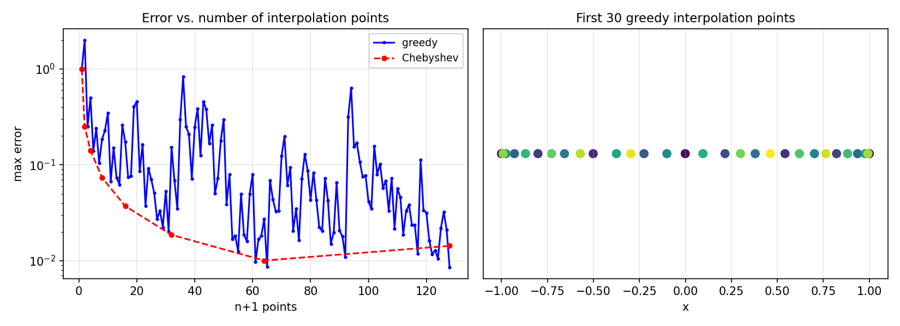

# A Greedy Algorithm for Choosing Interpolation Points

*Nick Trefethen, November 2011*

[Original MATLAB Chebfun example](https://www.chebfun.org/examples/approx/GreedyInterp.html)

## The greedy algorithm

Without any prior knowledge, we can choose effective interpolation points greedily:

1. Start at the point of maximum $|f|$.
2. At each step, place the next point where $|f - p|$ is largest.

This produces **Leja-like** points that cluster near the boundary of $[-1,1]$,
similar to Chebyshev points.

```python
import numpy as np
import chebfunjax as cj
import jax.numpy as jnp

# Greedy interpolation for |x|
xx_dense = np.linspace(-1.0, 1.0, 1000)
f_dense = np.abs(xx_dense)

pts = [xx_dense[np.argmax(f_dense)]]
for _ in range(30):
    y_pts = np.abs(pts)
    coeffs = np.polyfit(pts, y_pts, len(pts)-1)
    p_vals = np.polyval(coeffs, xx_dense)
    err = np.abs(f_dense - p_vals)
    pts.append(xx_dense[np.argmax(err)])
```



