# A greedy algorithm for choosing interpolation points

*Nick Trefethen, November 2011*

[Original MATLAB Chebfun example](https://www.chebfun.org/examples/approx/GreedyInterp.html)

(Chebfun example approx/GreedyInterp.m)

In the theory of polynomial interpolation, an important issue is the
distribution of the interpolation points.  Points that cluster near the
boundary, such as Chebyshev points, are usually much better than
equispaced points.

Suppose we don't know any of the theory and just let an algorithm pick
effective points on the fly.  Specifically, suppose $f$ is a continuous
function on $[-1,1]$.  We could take the first interpolation point
$x_0$ to be a point where $f$ achieves its maximum absolute value and
compute the corresponding interpolant $p_0$ of degree $0$.  Then we
could take the second interpolation point $x_1$ to be a point where
$f-p_0$ achieves its maximum absolute value.  And so on.

Using the `interp1` command, it is easy to try out this idea.  An
interesting choice for $f$ is the absolute value.  Here is a loop to
compute the first few polynomial interpolants and plot their errors:

```python
import numpy as np
import jax.numpy as jnp
from chebfunjax.chebfun1d.chebfun import Chebfun

s, maxpos = [], 1.0
for n in range(0, 129):
    s.append(maxpos)
    p = Chebfun.interp1(jnp.asarray(np.asarray(s)),
                        jnp.asarray(np.abs(np.asarray(s))),
                        domain=(-1.0, 1.0))
    # maxpos <- argmax |(|x| - p)(x)|
```

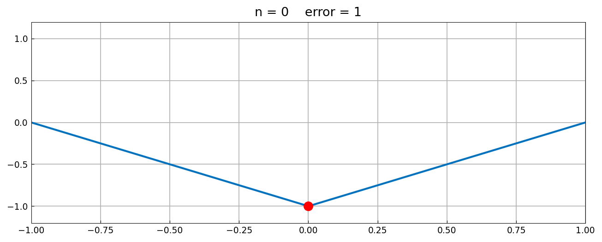
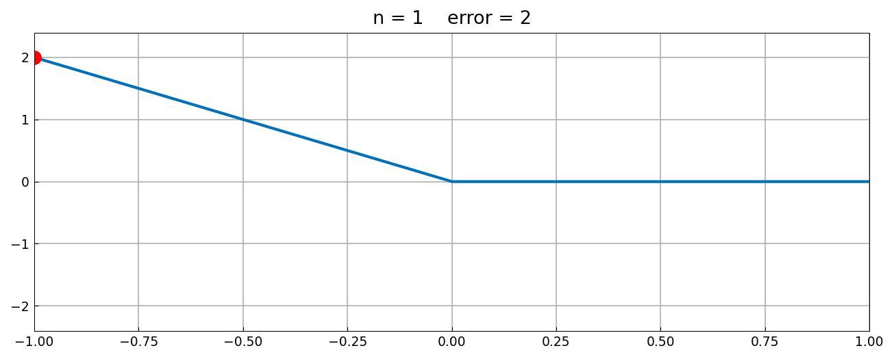
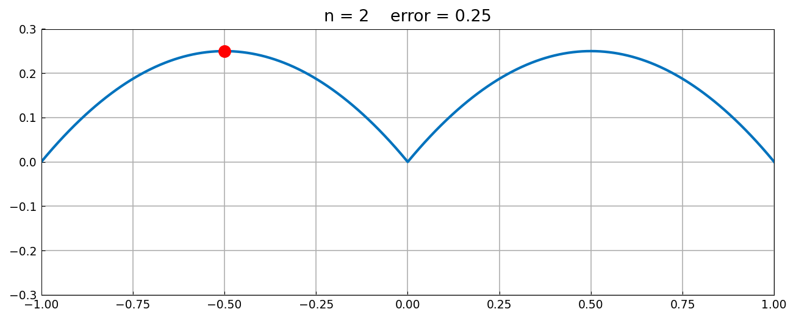
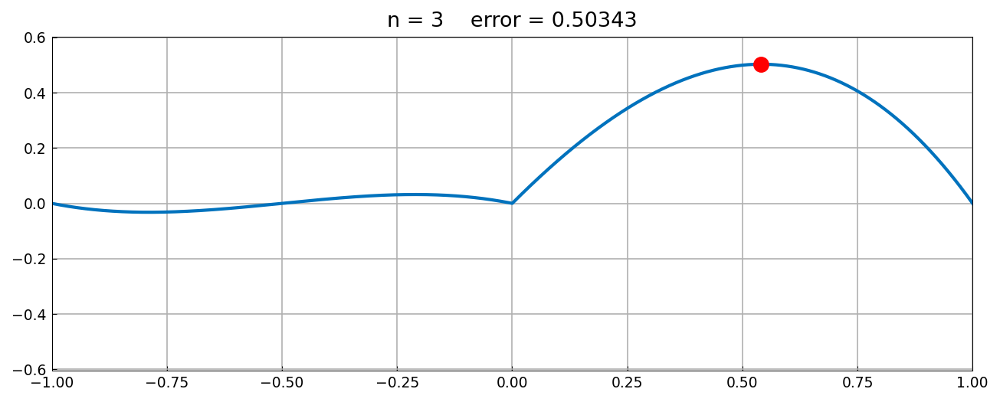
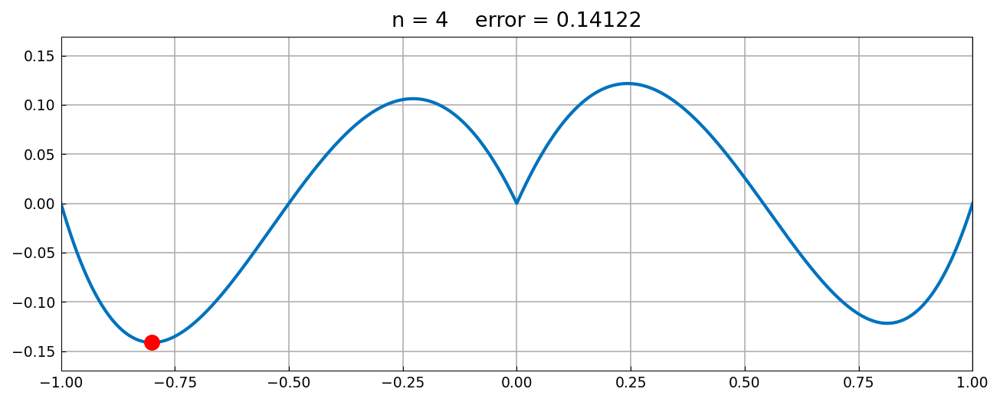

Let's continue to $n = 8, 16, 32, 64, 128$:

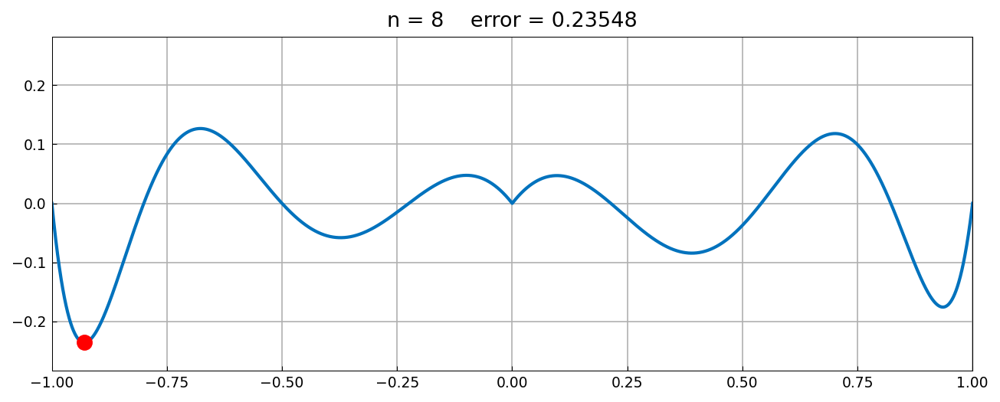
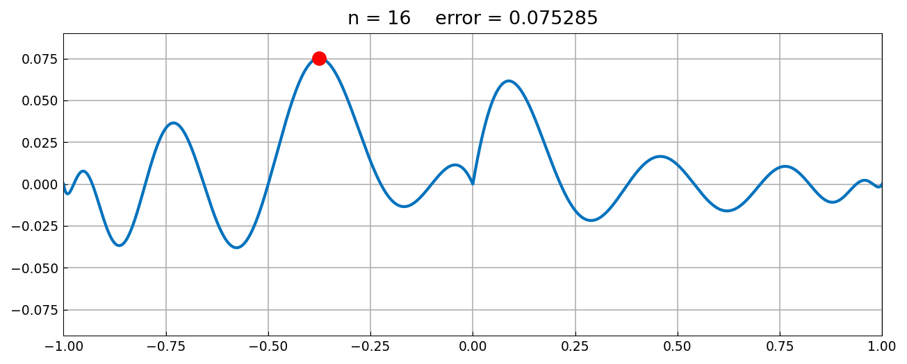
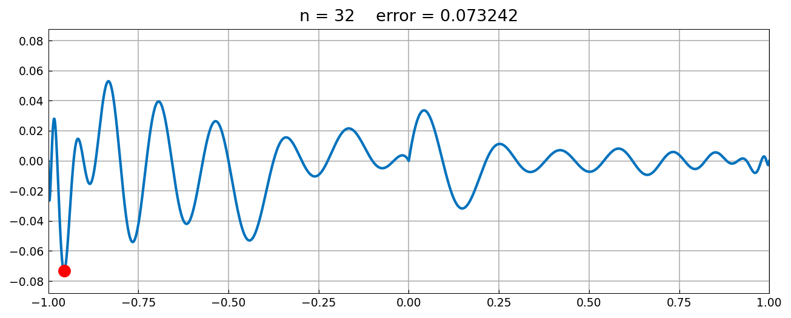
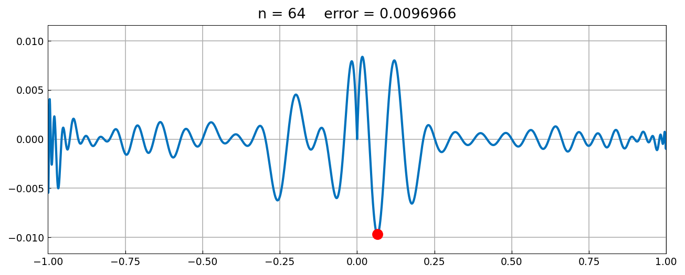
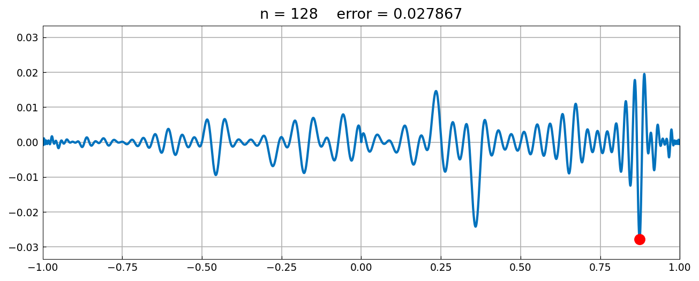

The greedy algorithm has chosen interpolation points that cluster near
the boundary.  Here they are in black, compared with Chebyshev points
in red:

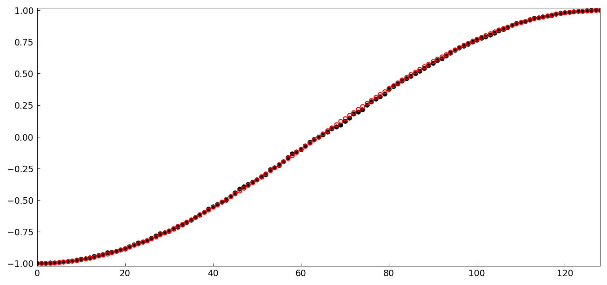

Here is a comparison of the Lebesgue function of the greedy points,
again compared with Chebyshev points in red (max $\approx 51$ vs
$\approx 4$):

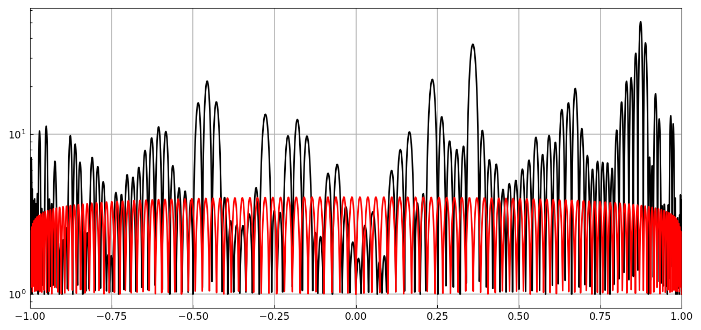

The flavor of this kind of algorithm is reminiscent of the theory of
Leja points [1,2], though the details are different since Leja points
are determined just by the domain of approximation whereas here we are
adaptively working with the function $f$ itself.  For an explanation
related to potential theory of why effective interpolation grids tend
to cluster near boundaries, see Chapter 12 of [3].

## References

1. L. Reichel, Newton interpolation at Leja points, _BIT Numerical
   Mathematics_ 30 (1990), 332-346.

2. R. Taylor and V. Totik, Lebesgue constants for Leja points, _IMA
   Journal of Numerical Analysis_ 30 (2010), 462-486.

3. L. N. Trefethen, _Approximation Theory and Approximation Practice_,
   SIAM, 2013.

---

*Replicated with [chebfunjax](https://github.com/ma-gilles/chebfunjax); original
example copyright The University of Oxford and The Chebfun Developers.*
