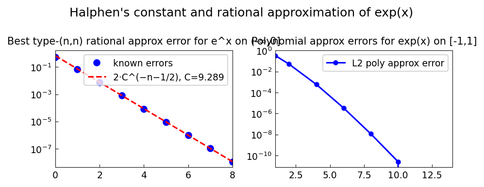

# Halphen's Constant for Approximation of exp(x)

*Nick Trefethen, May 2011*

[Original MATLAB Chebfun example](https://www.chebfun.org/examples/approx/Halphen.html)

## Halphen's constant

The best type $(n,n)$ rational approximation to $e^x$ on $(-\infty,0]$ satisfies
$$\text{error} \sim 2C^{-n-1/2}, \quad C = 9.28902549192\ldots$$
where $C$ is Halphen's constant, related to special functions and elliptic integrals.

```python
HALPHEN = 9.289025491920818918755449435951

# Known errors for small n
errors = [0.500, 0.0668, 0.00736, 0.000799, 0.0000865,
          0.00000934, 0.000001008, 0.0000001087, 0.00000001172]

import numpy as np
ns = np.arange(len(errors))
asymptotic = 2.0 * HALPHEN**(-ns - 0.5)
print("n   error         asymptotic")
for n, e, a in zip(ns, errors, asymptotic):
    print(f"{n}  {e:.4e}   {a:.4e}")
```



