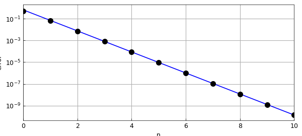
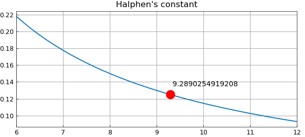

# Halphen's constant for approximation of exp(x)

*Nick Trefethen, May 2011*

[Original MATLAB Chebfun example](https://www.chebfun.org/examples/approx/Halphen.html)

Python translation: [`examples/approx/halphen.py`](https://github.com/ma-gilles/chebfunjax/blob/main/examples/approx/halphen.py)

A well-known problem in approximation theory is, how well can $e^x$ be approximated in the infinity norm on the infinite interval $(-\infty,0]$ by rational functions of type $(n,n)$? To three places, the first few approximation errors are these:

- Type $(0,0)$: error = $0.500$
- Type $(1,1)$: error = $0.0668$
- Type $(2,2)$: error = $0.00736$
- Type $(3,3)$: error = $0.000799$
- Type $(4,4)$: error = $0.0000865$
- Type $(5,5)$: error = $0.00000934$
- Type $(6,6)$: error = $0.000001008$
- Type $(7,7)$: error = $0.0000001087$
- Type $(8,8)$: error = $0.00000001172$

As $n$ increases to infinity, it is known that the asymptotic behavior is

$$ \mathrm{error} \sim 2 C^{-n-1/2}, $$

where $C$ is a number known as Halphen's constant with the following approximate numerical value:

```matlab
halphen_const = 9.289025491920818918755449435951
```

```text
halphen_const =
   9.289025491920819
h =
   9.2890254919208
```

This result comes from a sequence of contributions between 1969 and 2002 by, among others, Cody, Meinardus and Varga; Newman; Trefethen and Gutknecht; Carpenter, Ruttan and Varga; Magnus; Gonchar and Rakhmanov; and Aptekarev. For a discussion, see Chapter 25 of [5].

Here is a plot showing that the asymptotic behavior matches the actual errors very closely even for small $n$:

```matlab
n = 0:10;
err = [.5 .0668 7.36e-3 7.99e-4 8.65e-5 9.35e-6 ...
       1.01e-6 1.09e-7 1.17e-8 1.26e-9 1.36e-10];
model = 2*halphen_const.^(-n-.5);
hold off, semilogy(n,model,'-b')
hold on, semilogy(n,err,'.k','markersize',14), grid on
xlabel n, ylabel error
```



One way to characterize Halphen's constant mathematically is that it is the inverse of the unique positive value of $s$ where the function

$$ \sum_{k=1}^\infty \frac{k s^n}{1-(-s)^n} $$

takes the value $1/8$. This is an easy computation for Chebfun:

```matlab
s = chebfun('s',[1/12,1/6]);
f = 0*s; k = 0; normsk = 999;
while normsk > 1e-16
  k = k+1;
  sk = s^k;
  f = f + k*sk/(1-(-1)^k*sk);
  normsk = norm(sk,inf);
end
hold off, plot(1/s,f), grid on
h = 1/roots(f-1/8);
hold on, plot(h,1/8,'.r','markersize',24)
title('Halphen''s constant')
text(h,.135,sprintf('%16.13f',h))
```



Halphen's constant appears more generally than in approximation of $e^x$. Stahl and Schmelzer generalized it to a number of perturbed exponential functions and Nakatsukasa and Trefethen showed that it also governs the accuracy of rational approximations of $x^n$ on $[-1,1]$ [3]. The latter effect is explored in the Chebfun example "Rational approximation of monomials".

## References

1. A. J. Carpenter, A. Ruttan, and R. S. Varga, Extended numerical computations on the "1/9" conjecture in rational approximation theory, in P. Graves-Morris, E. B. Saff, and R. S. Varga, eds., *Rational Approximation and Interpolation*, Lecture Notes in Mathematics 1105, Springer, 1984.
2. A. A. Gonchar and E. A. Rakhmanov, Equilibrium distributions and degree of rational approximation of analytic functions, *Math. USSR Sbornik*, 62 (1989), 305-348.
3. Y. Nakatsukasa and L. N. Trefethen, Rational approximation of $x^n$, *Proc. AMS*, 146 (2018), 5219-5224.
4. H. Stahl and T. Schmelzer, An extension of the '1/9' problem, J. Comp. Appl. Math., 233 (2009), 821-834.
5. L. N. Trefethen, *Approximation Theory and Approximation Practice, Extended Edition*, SIAM, 2019.

---

*Translated with [chebfunjax](https://github.com/ma-gilles/chebfunjax); prose and MATLAB code from the original example, copyright The University of Oxford and The Chebfun Developers.  Printed outputs and figures are chebfunjax's.*
