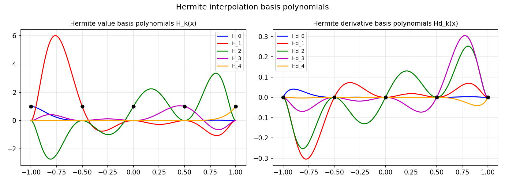

# Polynomial Basis for Hermite Interpolation

*Pedro Gonnet, September 2010*

[Original MATLAB source](https://github.com/chebfun/examples/blob/master/approx/HermiteBasis.m)

## Hermite interpolation

Hermite interpolation matches both function values $f(x_k)$ and derivatives
$f'(x_k)$ at given nodes.  The basis consists of two families:

- $H_k(x) = (1 - 2(x-x_k)\ell_k'(x_k))\ell_k(x)^2$ — matches value 1, derivative 0 at $x_k$
- $\hat{H}_k(x) = (x-x_k)\ell_k(x)^2$ — matches value 0, derivative 1 at $x_k$

where $\ell_k$ is the $k$-th Lagrange basis polynomial.

```python
import numpy as np

nodes = np.array([-1.0, -0.5, 0.0, 0.5, 1.0])
f_vals = np.sin(nodes)
fp_vals = np.cos(nodes)

# Build Hermite interpolant for sin(x)
xx = np.linspace(-1, 1, 400)
p_hermite = sum(f_vals[k]*H_k(k, xx) + fp_vals[k]*Hd_k(k, xx)
                for k in range(len(nodes)))
print(f"Max error: {np.max(np.abs(p_hermite - np.sin(xx))):.2e}")
```



