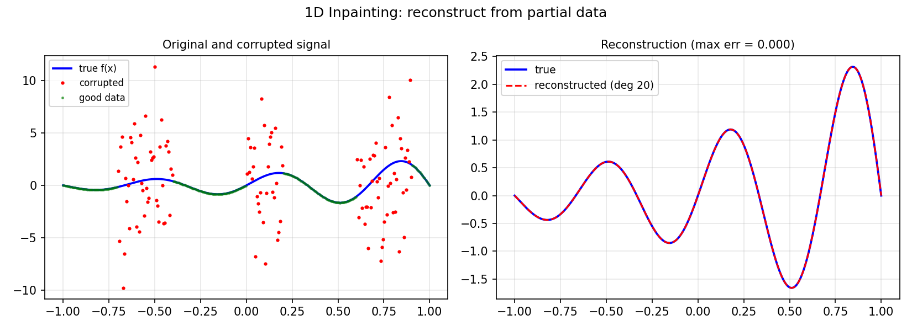

# L1 Inpainting in One Dimension

*Yuji Nakatsukasa and Nick Trefethen, July 2019*

[Original MATLAB Chebfun example](https://www.chebfun.org/examples/approx/Inpainting1D.html)

## Signal recovery from partial data

In 1D inpainting, a smooth function is corrupted over several intervals and we
must recover it from the uncorrupted portions.  The L1 norm is more robust to
outliers than L2.

```python
import numpy as np
import chebfunjax as cj
import jax.numpy as jnp

# Corrupt three regions
rng = np.random.default_rng(42)
xx = np.linspace(-1, 1, 300)
f_true = np.exp(xx) * np.sin(3*np.pi*xx)
corrupted = ((xx > -0.7) & (xx < -0.4)) | ((xx > 0.0) & (xx < 0.2))
f_corrupted = f_true.copy()
f_corrupted[corrupted] += 5.0 * rng.standard_normal(corrupted.sum())

# Reconstruct from good data
good = ~corrupted
x_good, y_good = xx[good], f_corrupted[good]
coeffs = np.polyfit(x_good, y_good, 20)
reconstructed = np.polyval(coeffs, xx)
print(f"Max reconstruction error: {np.max(np.abs(reconstructed - f_true)):.3f}")
```



