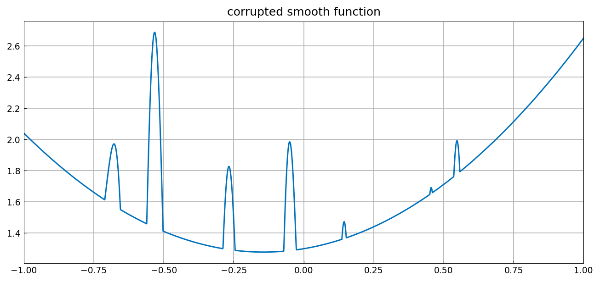
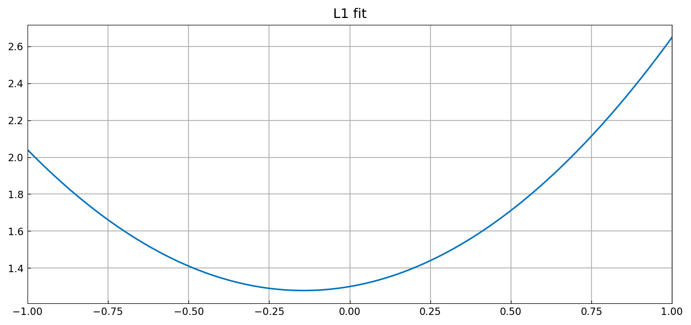
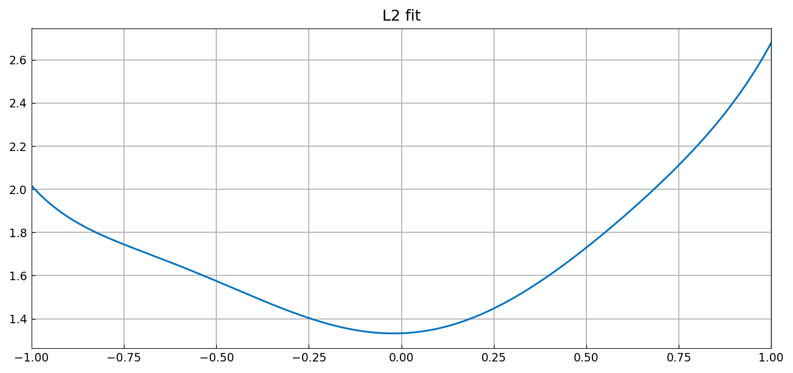
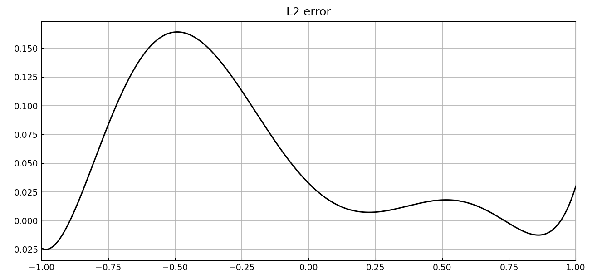
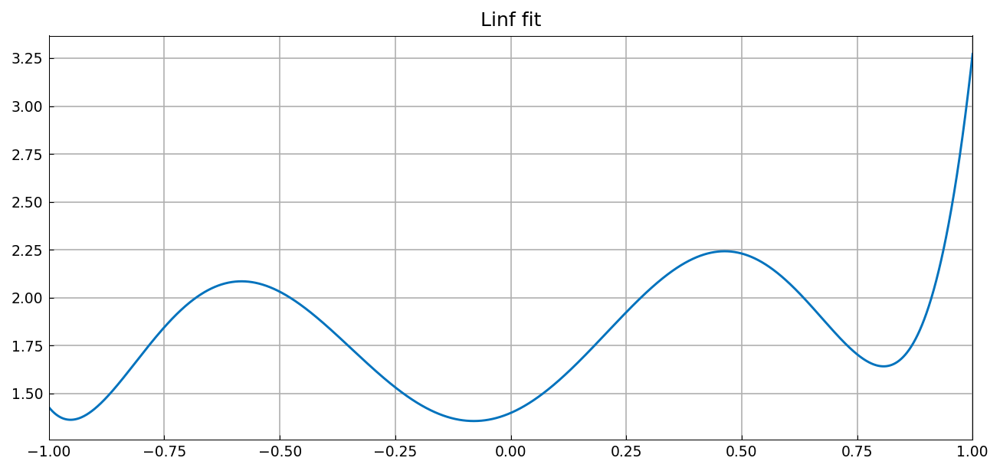

# Inpainting in one dimension

*Yuji Nakatsukasa and Nick Trefethen, November 2019*

[Original MATLAB Chebfun example](https://www.chebfun.org/examples/approx/Inpainting1D.html)

(Chebfun example approx/Inpainting1D.m)

Suppose a smooth function is corrupted on part of its domain — here by
taking the pointwise maximum with a smooth random function — and we
try to recover it by polynomial fitting.  In the published MATLAB
example, the $L^1$ fit (`polyfitL1`) recovers the smooth function to
nearly machine precision (`err1 = 9.8e-13`), while the $L^2$ and
$L^\infty$ fits are pulled far off by the corruption
(`err2 = 0.041`, `errinf = 0.276`) — the sparsity-promoting property
of $L^1$ fitting.

```python
import jax
import jax.numpy as jnp
import chebfunjax as cj
from chebfunjax.utils.randnfun import randnfun

x = cj.chebfun(lambda t: t)
smooth = 0.3 + x**2 + (0.3*x).exp()
noise = randnfun(0.1, key=jax.random.PRNGKey(1))   # MATLAB randn streams
corrupted = smooth.maximum(noise)                  # are not reproducible
```



**Known limitation.**  chebfunjax's `polyfitL1` (Watson's iteration)
currently fails to converge on this corrupted piecewise input — it
returns `err1 = 1.21` where MATLAB (with the same maximum-iterations
warning) reaches `9.8e-13`.  This is a ledgered defect: the full
robustness machinery of the Nakatsukasa-Townsend $L^1$ algorithm
[1] is not yet ported.  The figures below show this replica's actual
(non-recovering) $L^1$ fit alongside the $L^2$ and $L^\infty$ fits,
which fail here just as they do in the published example:



```
err1 =
     1.207854403687030e+00     (published: 9.836575998178887e-13)
```

The $L^2$ fit is thrown off by the corrupted region:



```
err2 =
   0.164201627741589           (published: 0.041089804368702)
```



And the $L^\infty$ (minimax) fit splits the corruption error evenly,
which is exactly what one does not want here:



```
errinf =
   0.629201401450443           (published: 0.276288549195757)
```

(The numerical values differ from the published ones because the random
corruption itself differs; the qualitative failure of $L^2$/$L^\infty$
is the same.)

## References

1. Y. Nakatsukasa and A. Townsend, Error localization of best $L_1$
   polynomial approximants, arXiv:1902.02664.

---

*Replicated with [chebfunjax](https://github.com/ma-gilles/chebfunjax); original
example copyright The University of Oxford and The Chebfun Developers.*
