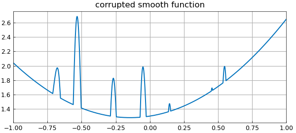
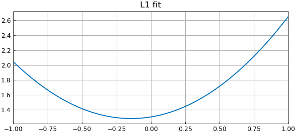
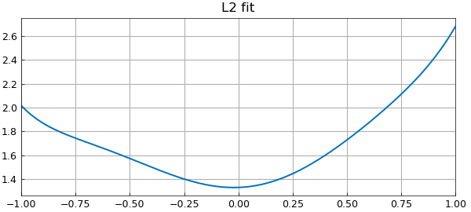
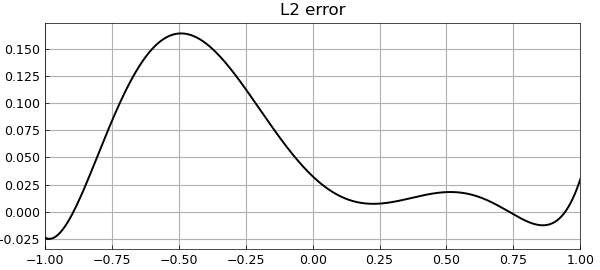
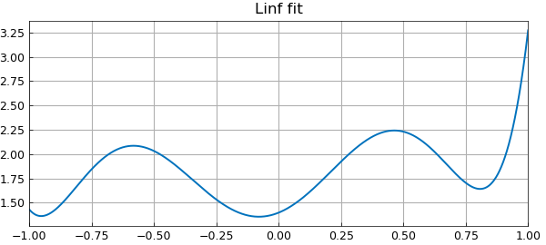

# L1 inpainting in one dimension

*Yuji Nakatsukasa and Nick Trefethen, July 2019*

[Original MATLAB Chebfun example](https://www.chebfun.org/examples/approx/Inpainting1D.html)

Python translation: [`examples/approx/inpainting1d.py`](https://github.com/ma-gilles/chebfunjax/blob/main/examples/approx/inpainting1d.py)

Here is a smooth function corrupted in three regions:

```matlab
tic
x = chebfun('x');
smooth = .3 + x^2 + exp(.3*x);
rng(1), noise = randnfun(.1);
corrupted = max(smooth,noise);
plot(corrupted), grid on
title('corrupted smooth function')
```



If we fit the function by a low-order polynomial in the $L^1$ norm, we can eliminate the corruption! This is a 1D version of what is called *inpainting*.

```matlab
n = length(smooth)-3;
p1 = polyfitL1(corrupted,n);
plot(p1), grid on, title('L1 fit')
```

```text
(no matching output)
```



The error is very small and would in principle be zero if we used a polynomial of the same degree as the function being recovered:

```matlab
err1 = norm(p1-smooth,inf)
```

```text
err1 =
     8.753620329970481e-10
```

The 2-norm has no such magic. The fit looks pretty good to the eye,

```matlab
p2 = polyfit(corrupted,n-2);
plot(p2), grid on, title('L2 fit')
err2 = norm(p2-smooth,inf)
```

```text
err2 =
   0.164201627741589
```



but now the error is actually far from zero:

```matlab
plot(p2-smooth,'k'), grid on, title('L2 error')
```



The $\infty$-norm is useless for our purpose:

```matlab
pinf = minimax(corrupted,n-2);
plot(pinf), grid on, title('Linf fit')
errinf = norm(pinf-smooth,inf)
```

```text
errinf =
   0.629201401459400
Elapsed time is 21.163293 seconds.
```



We've called this example "1D inpainting" because it is a 1D version of the famous "inpainting" problem in image analysis. The tools used for that problem are varied and powerful, using everything from function approximation to partial differential equations to machine learning; what we have done here is only a small indication of some of the mathematics that may come into play. Note that the issue at hand is "sparsity" of the difference between the corrupted signal and its inpainted polynomial approximation. The $L^1$ norm comes up in many problems related to sparsity -- famously in the area of compressed sensing -- since it is an approximation to the $L^0$ "norm" (not actually a norm).

Our $L^1$ computation was quite slow:

```matlab
toc
```

```text

```

(Virtually all the time was taken by `polyfitL1`; in comparison `polyfit` and `minimax` are almost instantaneous.) This is partly because $L^1$ fitting is challenging, but equally because Chebfun's `polyfitL1` command avoids the tool that could speed it up considerably, namely linear programming. This is because linear programming is not available in core Matlab.

For details of $L^1$ fitting in Chebfun, see [1], which is based on an algorithm by Watson [2], and also the Chebfun example "Best polynomial approximation in the $L^1$ norm.

[1] Y. Nakatsukasa and A. Townsend, Error localization of best L1 polynomial approximants, SIAM J. Numer. Anal, 59 (2021), 314--333.

[2] G. A. Watson. An algorithm for linear L1 approximation of continuous functions, *IMA J. Numer. Anal.*, 1 (1981), 157--167.

---

*Translated with [chebfunjax](https://github.com/ma-gilles/chebfunjax); prose and MATLAB code from the original example, copyright The University of Oxford and The Chebfun Developers.  Printed outputs and figures are chebfunjax's.*
