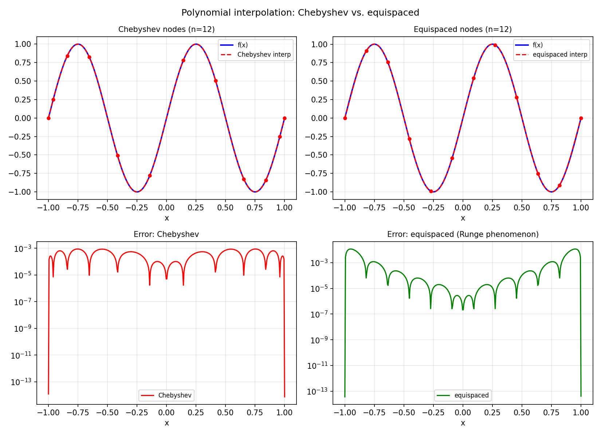

# Interactive Interpolation

*Nick Hale, November 2012*

[Original MATLAB Chebfun example](https://www.chebfun.org/examples/approx/InteractiveInterp.html)

## Choosing interpolation nodes

The key insight: **Chebyshev nodes** cluster near the endpoints, which is why
they avoid the Runge phenomenon and yield small Lebesgue constants.

```python
import numpy as np
import chebfunjax as cj
import jax.numpy as jnp

def f(x): return jnp.sin(2.0 * jnp.pi * x)
n = 12

# Chebyshev nodes
cheb_nodes = np.cos(np.pi * np.arange(n) / (n-1))
# Equispaced nodes
eq_nodes = np.linspace(-1, 1, n)

xx = np.linspace(-1, 1, 400)
y_c = np.sin(2*np.pi*cheb_nodes)
y_e = np.sin(2*np.pi*eq_nodes)

# Polynomial interpolants
p_cheb = np.polyval(np.polyfit(cheb_nodes, y_c, n-1), xx)
p_eq   = np.polyval(np.polyfit(eq_nodes,   y_e, n-1), xx)

f_true = np.sin(2*np.pi*xx)
print(f"Cheb error: {np.max(np.abs(p_cheb-f_true)):.2e}")
print(f"Equi error: {np.max(np.abs(p_eq  -f_true)):.2e}")
```



