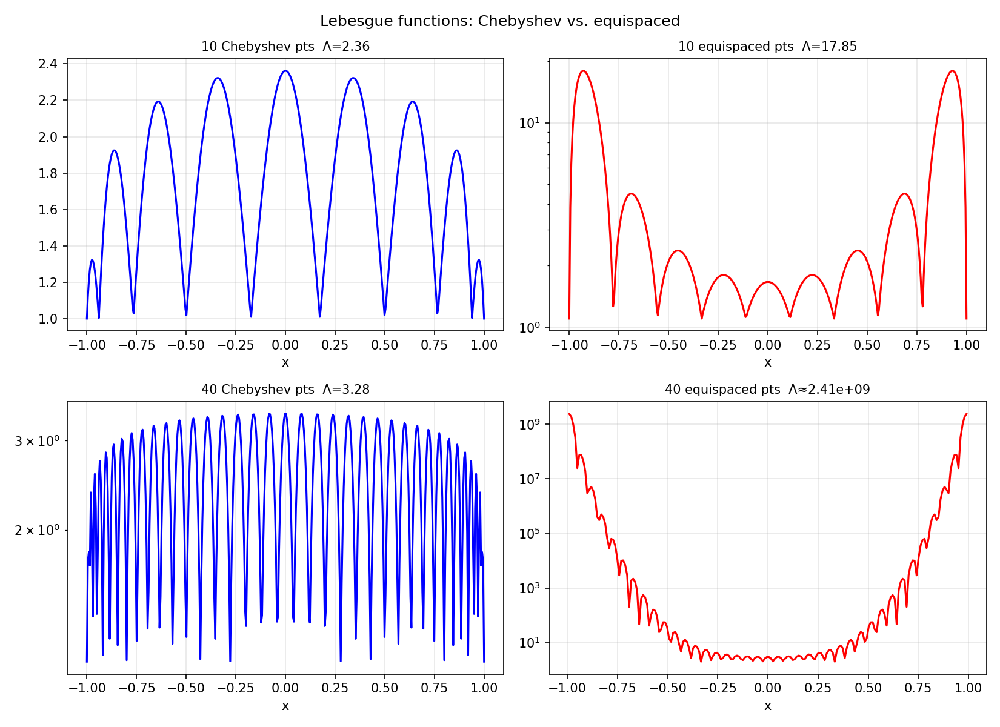

# Lebesgue Functions and Lebesgue Constants

*Nick Trefethen, November 2010*

[Original MATLAB Chebfun example](https://www.chebfun.org/examples/approx/LebesgueConst.html)

## Lebesgue constants

The Lebesgue constant $\Lambda_n$ measures the worst-case amplification of
data errors in polynomial interpolation:
$$\Lambda_n = \max_{x \in [a,b]} \sum_{k=0}^n |\ell_k(x)|.$$

```python
import numpy as np

def lebesgue(nodes, xx):
    n = len(nodes)
    L = np.zeros(len(xx))
    for k in range(n):
        lk = np.ones(len(xx))
        for j in range(n):
            if j != k:
                lk *= (xx - nodes[j]) / (nodes[k] - nodes[j])
        L += np.abs(lk)
    return L, np.max(L)

n = 10
cheb = np.cos(np.pi * np.arange(n) / (n-1))
equi = np.linspace(-1, 1, n)
xx = np.linspace(-1, 1, 400)

_, lam_c = lebesgue(cheb, xx)
_, lam_e = lebesgue(equi, xx)
print(f"Chebyshev Λ = {lam_c:.2f}")
print(f"Equispaced Λ = {lam_e:.2f}")
```

As $n$ increases, Chebyshev constants grow as $O(\log n)$ while equispaced
constants grow exponentially as $O(2^n / (en \log n))$.



