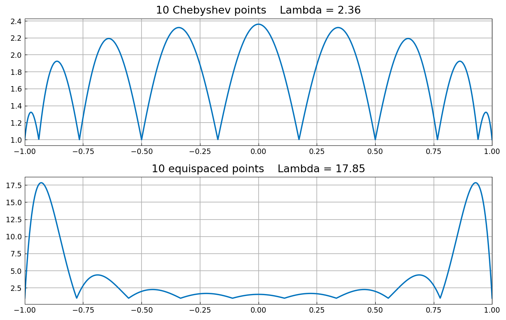
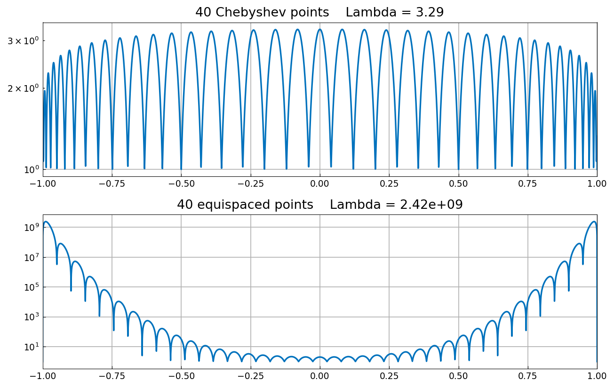
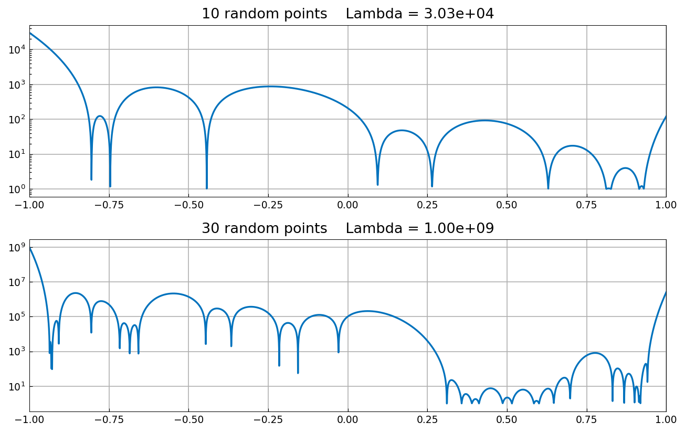

# Lebesgue functions and Lebesgue constants

*Nick Trefethen, November 2010*

[Original MATLAB Chebfun example](https://www.chebfun.org/examples/approx/LebesgueConst.html)

(Chebfun example approx/LebesgueConst.m)

Lebesgue constants are a standard notion of approximation theory.
Suppose we have $n+1$ points $x_j$ in an interval $[a,b]$ with
associated data values $f_j$ with $|f_j| \leq 1$, and we interpolate
this data by a polynomial $p(x)$ of degree $n$.  What's the maximum
possible value of $|p(x)|$ at each point $x$?  This function of $x$ is
called the Lebesgue function for the given grid.  The Lebesgue constant
is the maximum of $L(x)$ over the interval.  Equivalently, it is the
$\infty$-norm of the linear operator mapping data to interpolant on the
given grid and interval.

Chebfun has a command `lebesgue` for working with these notions.  For
example, here are the Lebesgue functions and constants for 10 Chebyshev
points and 10 equispaced points in $[-1,1]$:

```python
import numpy as np
from chebfunjax.utils.lebesgue import lebesgue_function, lebesgue_constant
from chebfunjax.utils.quadrature import chebpts

t, lam = lebesgue_function(np.asarray(chebpts(10)))
Lambda = lebesgue_constant(np.asarray(chebpts(10)))   # 2.36
Lambda_eq = lebesgue_constant(np.linspace(-1, 1, 10)) # 17.85
```



If we increase 10 to 40, we need to switch to a semilogy plot to see
the results:



This picture confirms the well-known fact (the Runge phenomenon) that
polynomial interpolation in equispaced points is terribly
ill-conditioned.  In fact it is known that as $n$ increases to
infinity, the Lebesgue constant for $n$ Chebyshev points is asymptotic
to $(2/\pi)\log(n)$ whereas for $n$ equispaced points it is
$2^n/(e\, n \log(n))$.

Here are results for 10 and 30 random points in $[-1,1]$.  The reason
for shrinking the number from 40 to 30 is that for larger values than
this, difficulties arise caused by rounding errors since the Lebesgue
function is bigger than the inverse of machine epsilon:

```python
rs = np.random.RandomState(5489)   # MATLAB rng(0) = MT default init 5489
nodes10 = 2*rs.random_sample(10) - 1
nodes30 = 2*rs.random_sample(30) - 1
```



(All four deterministic constants match the published figure titles —
2.36, 17.85, 3.29, 2.42e+09 — and with the bit-identical MATLAB random
stream the random-node constants reproduce as well: 3.03e+04 and
1.00e+09.)

## References

1. L. N. Trefethen, _Approximation Theory and Approximation Practice_,
   SIAM, 2013.

---

*Replicated with [chebfunjax](https://github.com/ma-gilles/chebfunjax); original
example copyright The University of Oxford and The Chebfun Developers.*
