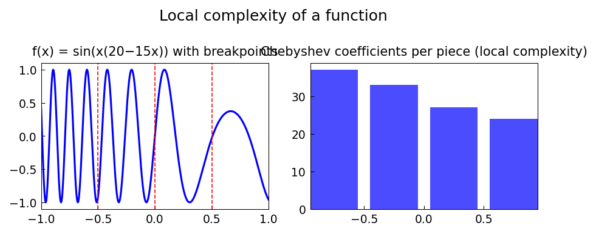

# Local Complexity of a Function

*Nick Trefethen, June 2011*

[Original MATLAB Chebfun example](https://www.chebfun.org/examples/approx/Local.html)

## Local vs. global complexity

A globally smooth function may have much more complexity in some regions than
others. The piecewise Chebfun representation adapts to this by using more
polynomial terms where the function oscillates faster.

```python
from chebfunjax.domain import Domain
import chebfunjax as cj
import jax.numpy as jnp

breakpoints = [-1.0, -0.5, 0.0, 0.5, 1.0]
dom = Domain(breakpoints)

# Increasing frequency from left to right
f = cj.chebfun(lambda x: jnp.sin(x * (20.0 - 15.0*x)), domain=dom)

# Each piece has a different length
for k, piece in enumerate(f.funs):
    print(f"Piece {k}: [{breakpoints[k]:.1f}, {breakpoints[k+1]:.1f}], length = {len(piece)}")
```

The right-hand pieces have higher local frequency and thus more Chebyshev
coefficients — the chebfun adapts locally.



