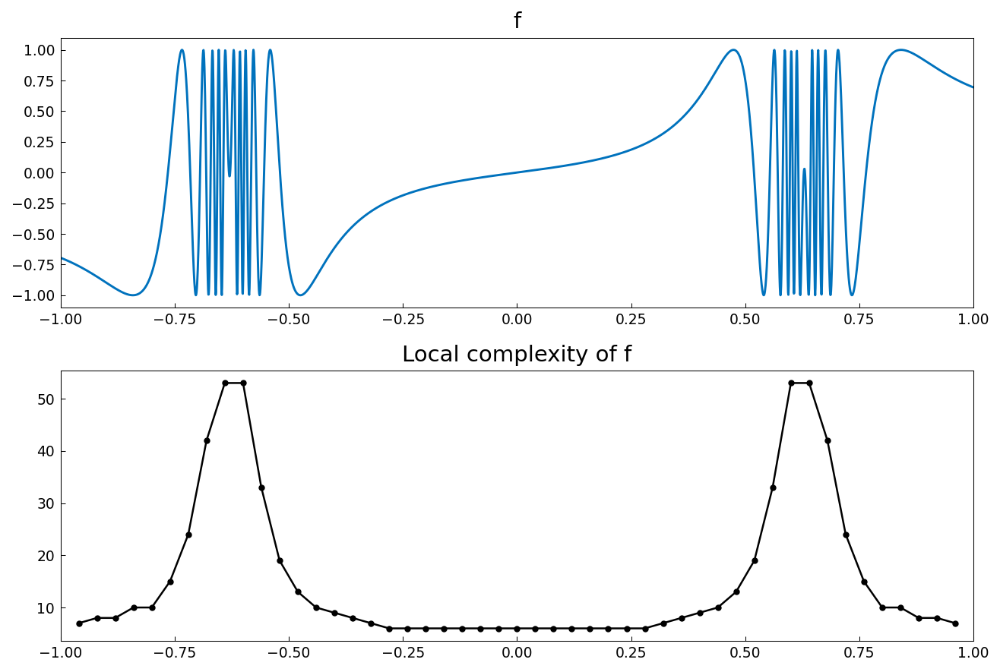
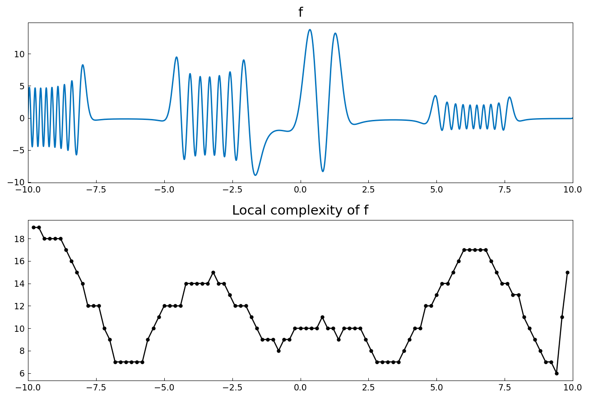
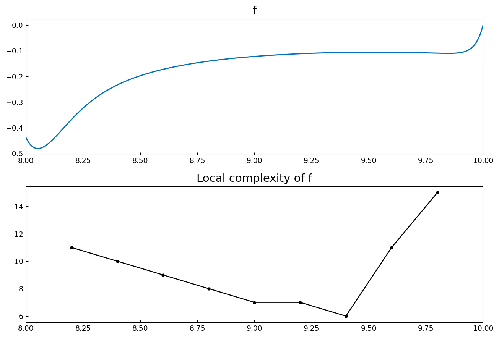

# Local complexity of a function

*Nick Trefethen, June 2011*

[Original MATLAB Chebfun example](https://www.chebfun.org/examples/approx/Local.html)

(Chebfun example approx/Local.m)

Sometimes a function $f$ is more complex in some regions than others.
Maryna Kachanovska of the Max Planck Institute in Leipzig suggests the
following question about a function $f$ defined on an interval: at each
point $x$, how high a degree polynomial do you need to approximate $f$
to a specified accuracy $\varepsilon$ in $[x-d,x+d]$, where $d$ is a
small number?

It is easy to compute an answer to such a question with Chebfun by
constructing restrictions to subintervals at loosened tolerance.  For
example, here's a function that's quite wiggly in two regions:

```python
import numpy as np
import jax.numpy as jnp
import chebfunjax as cj

f = cj.chebfun(lambda x: jnp.sin(x/(1.02 + jnp.cos(5*x))))

# scan: length of chebfun of f on [x-d, x+d] at eps = 1e-6
w = cj.chebfun(lambda t: f(t), domain=(xj - d, xj + d), eps=1e-6)
```



Here is another complicated function — the solution of the oscillatory
boundary-value problem $0.01u'' + x\cos(x)\,u = 1$, $u(\pm 10)=0$ —
and its scan:

```python
from chebfunjax.operators.chebop import Chebop
N = Chebop(lambda x, u: 0.01*u.diff(2) + (x*x.cos())*u,
           domain=(-10.0, 10.0), bc=0.0)
u = N.solve(1.0)
```



This last plot seems surprising — why does the complexity go up at the
right endpoint?  On closer examination we find that the boundary
condition has introduced a blip there:



---

*Replicated with [chebfunjax](https://github.com/ma-gilles/chebfunjax); original
example copyright The University of Oxford and The Chebfun Developers.*
