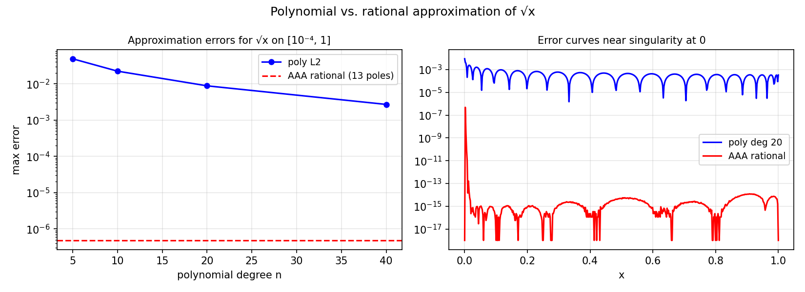

# Approximating the Square Root by Polynomials and Rational Functions

*Yuji Nakatsukasa, May 2019*

[Original MATLAB Chebfun example](https://www.chebfun.org/examples/approx/MinimaxSqrt.html)

## Square root and near-singularities

The square root $\sqrt{x}$ on $[0,1]$ has a branch-point singularity at $x=0$.
Polynomial approximation converges only as $O(n^{-1/2})$ (algebraically), while
rational approximation achieves root-exponential convergence $O(\exp(-C\sqrt{n}))$.

```python
from chebfunjax.utils.aaa import aaa
import jax.numpy as jnp
import numpy as np

delta = 1e-4
xs = jnp.linspace(delta, 1.0, 300)
ys = jnp.sqrt(xs)
r, pol, *_ = aaa(ys, xs)

test_pts = np.linspace(delta, 1.0, 500)
true_vals = np.sqrt(test_pts)
r_vals = np.array([float(r(jnp.array(x))) for x in test_pts])
print(f"AAA err = {np.max(np.abs(r_vals - true_vals)):.2e}, {len(pol)} poles")
```



