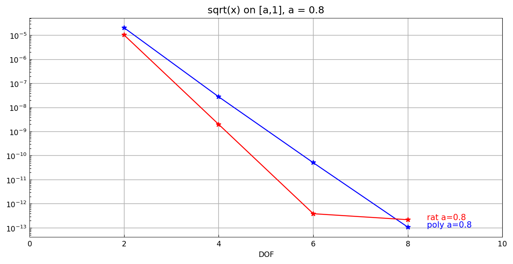
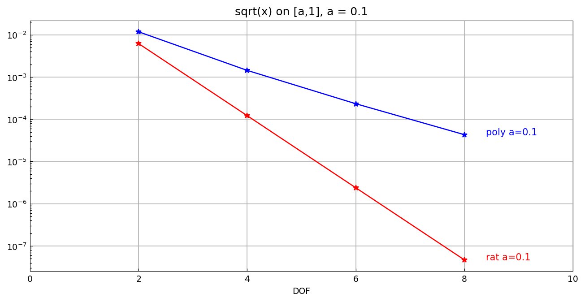
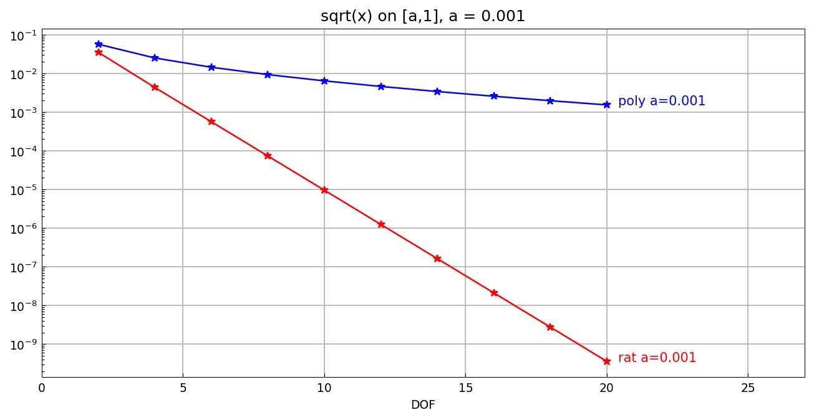
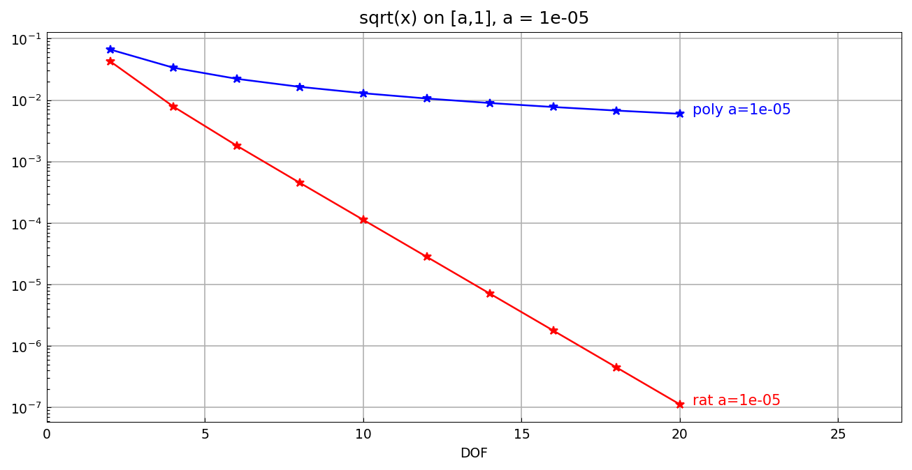
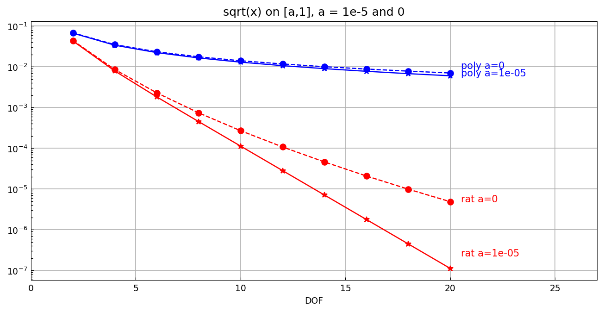
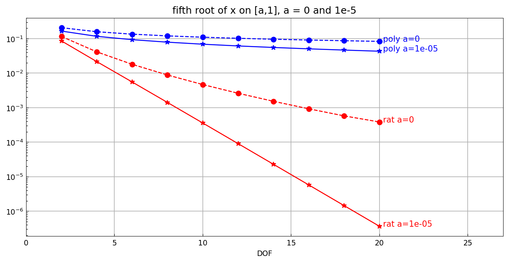

# Approximating the square root by polynomials and rational functions

*Yuji Nakatsukasa, May 2019*

[Original MATLAB Chebfun example](https://www.chebfun.org/examples/approx/MinimaxSqrt.html)

(Chebfun example approx/MinimaxSqrt.m)

Rational functions outperform polynomials for approximating functions
with (near-)singularities.  The absolute value function is a typical
example, for which polynomials converge only algebraically $O(1/n)$
whereas rationals root-exponentially $O(\exp(-\pi\sqrt{n}))$.

A closely related function is the square root.  When we work on the
interval $[a,1]$ for $0<a<1$, $\sqrt{x}$ is analytic on the interval,
so both polynomials and rational functions converge exponentially.
Indeed for $a$ close to $1$ we don't see much difference.  We compute
the best polynomial and rational approximants using `minimax`:

```python
import jax.numpy as jnp
from chebfunjax.utils.minimax import minimax

for n in (2, 4, 6, 8):
    perr = minimax(lambda x: jnp.sqrt(x), n, domain=(a, 1.0)).err
    rerr = minimax(lambda x: jnp.sqrt(x), n//2, rational=True,
                   denom=n//2, domain=(a, 1.0)).err
```



As we shrink $a$, the difference in convergence gets pronounced.  While
the convergence is still exponential in all cases, polynomials struggle
more as $a\rightarrow 0$ as the singularity gets closer to the domain.
We first take $a=0.1$:



Now $a=10^{-3}$:



Finally, $a=10^{-5}$:



We see that the difference is widening: both errors increase as
$a\rightarrow 0$, but polynomials suffer much more.

We now superimpose the plot with $a=0$, taking the whole interval
$[0,1]$.  We recover the algebraic (poly) and root-exponential (rat)
convergence as opposed to exponential (admittedly rational minimax
struggles a bit here: please note that this is a very hard problem!):



Let's now do the same experiment with the $p$th root, with $p=5$.  The
situation is qualitatively the same (regardless of $p$):



(Terminal errors at DOF 20: sqrt — poly 5.98e-03 / rat 1.13e-07 at
$a=10^{-5}$, poly 7.00e-03 / rat 4.88e-06 at $a=0$; fifth root — poly
4.31e-02 / rat 3.64e-07 at $a=10^{-5}$.  As in the published MATLAB
run, some high-degree singular-endpoint Remez iterations do not fully
converge and their warnings are suppressed.)

## References

1. L. N. Trefethen, _Approximation Theory and Approximation Practice,
   Extended Edition_, SIAM, 2019.

---

*Replicated with [chebfunjax](https://github.com/ma-gilles/chebfunjax); original
example copyright The University of Oxford and The Chebfun Developers.*
