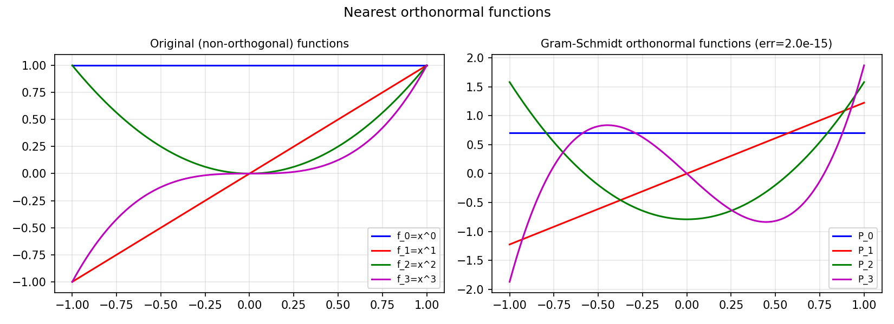

# Nearest Orthonormal Functions

*Behnam Hashemi, December 2014*

[Original MATLAB Chebfun example](https://www.chebfun.org/examples/approx/NearestOrthFun.html)

## Polar decomposition for functions

Given a quasimatrix $A$ (a matrix-valued Chebfun), the nearest orthonormal
quasimatrix $Q$ in the Frobenius norm is $Q = UV^T$, where $A = U\Sigma V^T$
is the SVD. This is the functional analogue of the polar decomposition.

```python
import chebfunjax as cj
import jax.numpy as jnp
import numpy as np

funcs = [cj.chebfun(lambda x, k=k: x**k) for k in range(4)]

# Compute inner product matrix G[i,j] = <f_i, f_j>
n = len(funcs)
G = np.array([[float((funcs[i]*funcs[j]).sum()) for j in range(n)] for i in range(n)])
print("G =\n", G)

# Gram-Schmidt to find orthonormal system
U, _, Vt = np.linalg.svd(G)
print("Q = UV^T =\n", U @ Vt)
```



