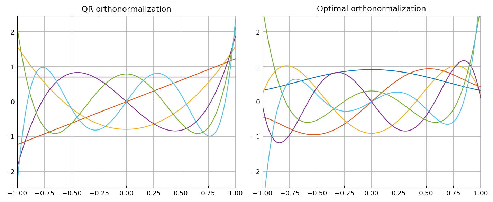
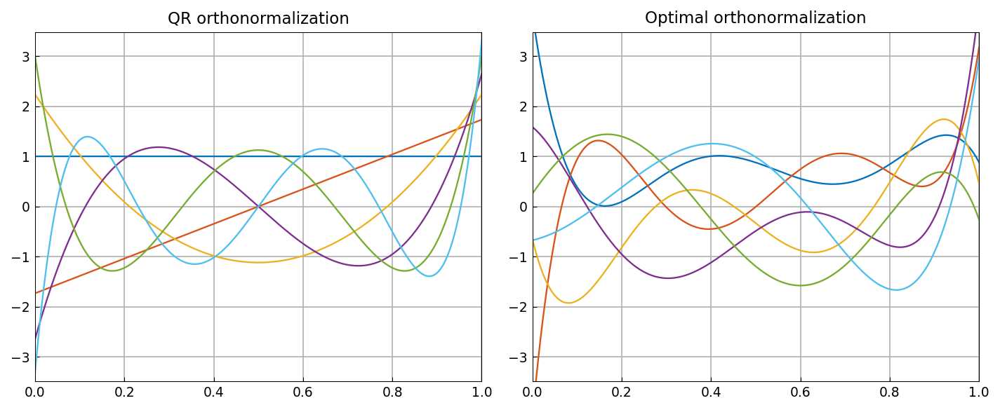
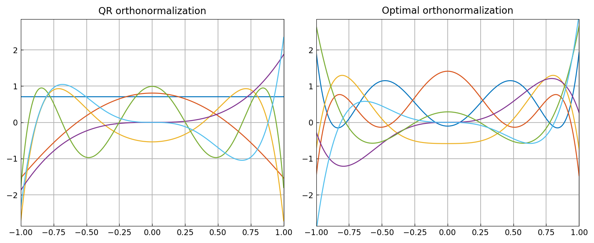
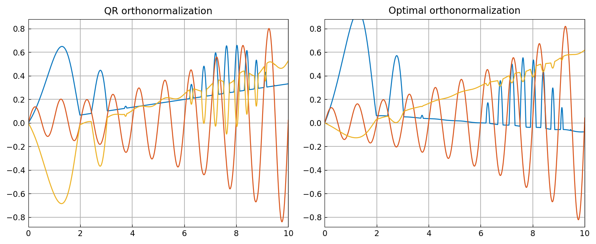

# Nearest orthonormal functions

*Behnam Hashemi, December 2014*

[Original MATLAB Chebfun example](https://www.chebfun.org/examples/approx/NearestOrthFun.html)

(Chebfun example approx/NearestOrthFun.m)

## Introduction

Suppose $A$ is a given matrix.  The problem of finding the orthonormal
matrix $Q$ nearest to $A$ is well-known: if $A = USV^T$ is the singular
value decomposition, then $Q = UV^T$ — the unitary factor of the polar
decomposition — is the nearest matrix with orthonormal columns.

Our goal is to generalize this to the continuous case: given a
quasimatrix of functions, `qr` produces *an* orthonormalization, while
$Q = UV^T$ from the quasimatrix SVD is the *nearest* one.

First, the Vandermonde quasimatrix of monomials $1, x, \dots, x^5$:

```python
import numpy as np
import chebfunjax as cj
from chebfunjax.chebfun1d.linalg import (Quasimatrix, qr_quasimatrix,
                                         svd_quasimatrix)

x = cj.chebfun(lambda t: t)
cols = [x**0, x, x**2, x**3, x**4, x**5]
A = Quasimatrix(cols=cols, domain=...)
U, S, V = svd_quasimatrix(A)
# Q = U V^T; Q2 from qr_quasimatrix(A)
```



```
Departure from orthogonality in the columns of A = 1.35
Departure from orthogonality in the columns of Q = 2.3e-15
Departure from orthogonality in the columns of Q2 = 1.3e-15
The distance between A and Q2 = 1.92
The distance between A and its closest orthonormal quasimatrix = 1.69
```

(Every displayed value matches the published output; the machine-eps
departures differ only in noise.)  The Chebyshev-Vandermonde
quasimatrix $T_0,\dots,T_5$ restricted to $[0,1]$:



```
Departure from orthogonality in the columns of A = 1.00
The distance between A and Q2 = 2.48
The distance between A and its closest orthonormal quasimatrix = 1.62
```

A mixed smooth quasimatrix $[1, \cos x, \sin(x^2), x^3, x^4, x^5]$:



```
Departure from orthogonality in the columns of A = 2.69
The distance between A and Q2 = 2.43
The distance between A and its closest orthonormal quasimatrix = 1.95
```

And three wilder gallery functions (stegosaurus, wiggly, blasius —
remapped here to a common domain, which changes the numbers slightly
from the published 194.38/13.63/13.23):



```
Departure from orthogonality in the columns of A = 195.38
The distance between A and Q2 = 13.48
The distance between A and its closest orthonormal quasimatrix = 13.21
```

In every case the optimal orthonormalization is closer to $A$ than the
QR orthonormalization, as theory requires.

## References

1. B. Hashemi, Nearest orthonormal functions (this example).

2. L. N. Trefethen, _Approximation Theory and Approximation Practice_,
   SIAM, 2013.

3. G. H. Golub and C. F. Van Loan, _Matrix Computations_, 4th ed.,
   Johns Hopkins, 2013.

4. N. J. Higham, Computing the polar decomposition — with
   applications, _SIAM J. Sci. Stat. Comput._, 7 (1986), 1160-1174.

---

*Replicated with [chebfunjax](https://github.com/ma-gilles/chebfunjax); original
example copyright The University of Oxford and The Chebfun Developers.*
