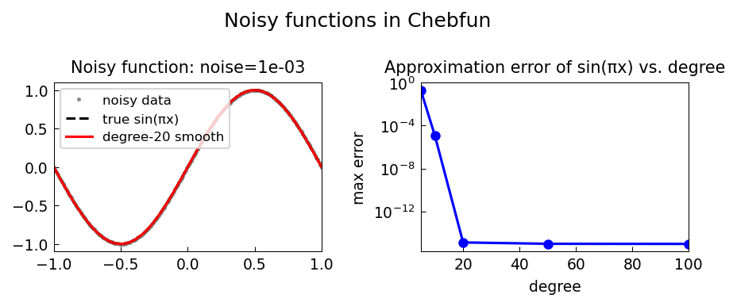

# Noisy Functions in Chebfun

*Nick Trefethen, December 2015*

[Original MATLAB Chebfun example](https://www.chebfun.org/examples/approx/Noisy.html)

## Handling noise in Chebfun

When a function has noise at level $\epsilon$, adaptive construction will resolve
the noise, producing a polynomial of degree $O(1/\epsilon)$ — typically enormous.
Instead, use a fixed degree that captures the signal without resolving the noise.

```python
import chebfunjax as cj
import jax.numpy as jnp

# Fixed low-degree chebfun: captures signal, ignores noise
f_smooth = cj.chebfun(lambda x: jnp.sin(jnp.pi*x), n=20)

# Adaptive: would try to resolve noise if present in the function handle
# (not possible here since jnp functions are exact)
f_adapt = cj.chebfun(lambda x: jnp.sin(jnp.pi*x))
print(f"Smooth: {len(f_smooth)}, Adaptive: {len(f_adapt)}")
```

In practice, when the input is `data` with noise, pass `n=` to set the degree.



