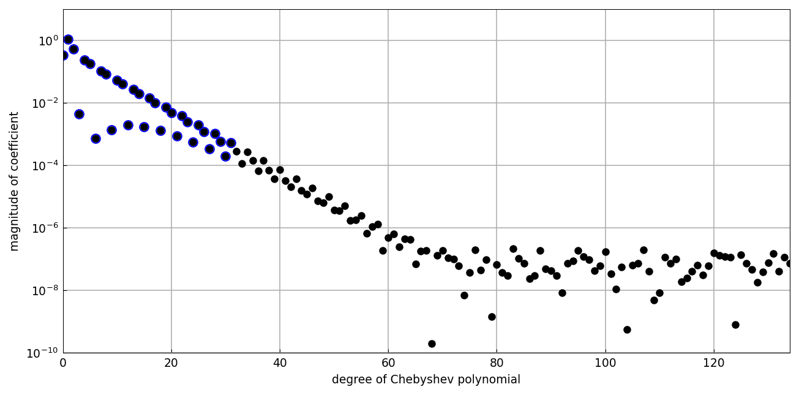
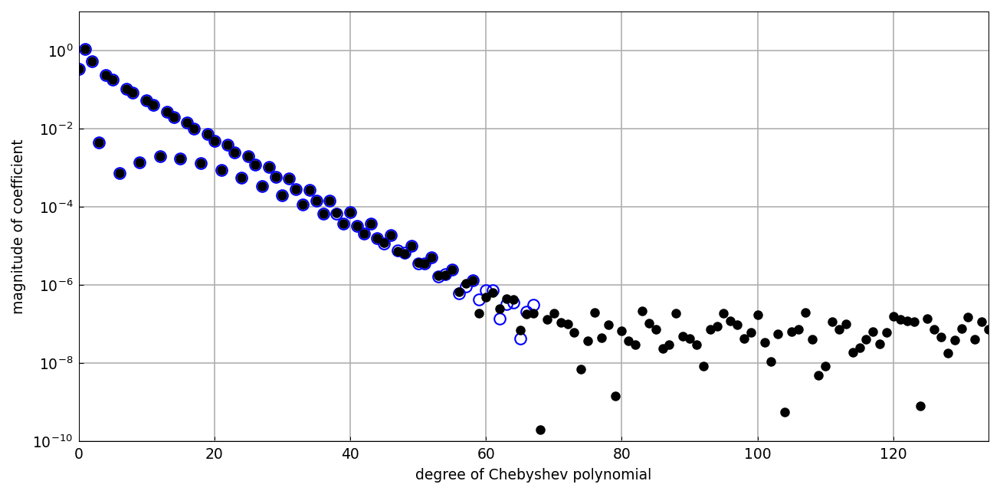
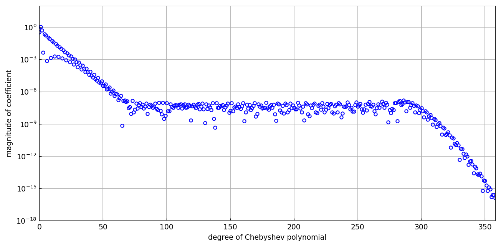
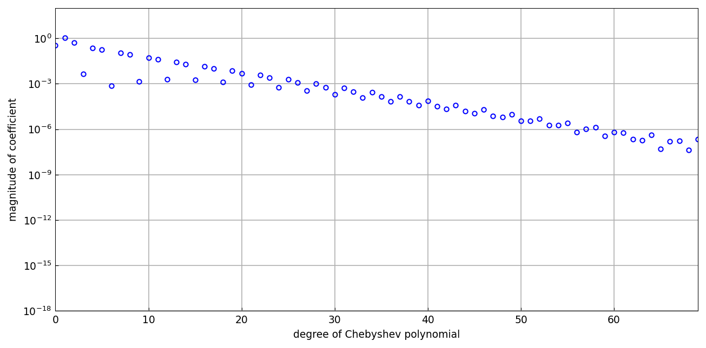
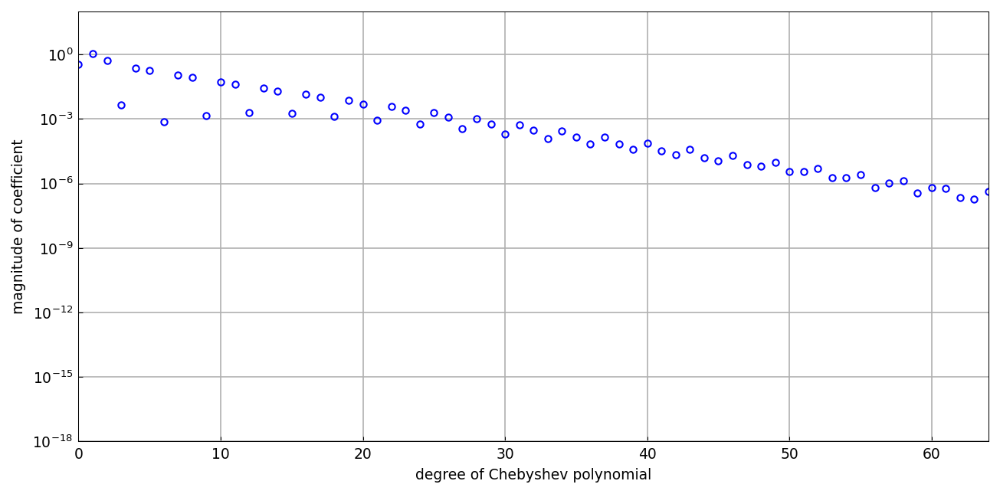
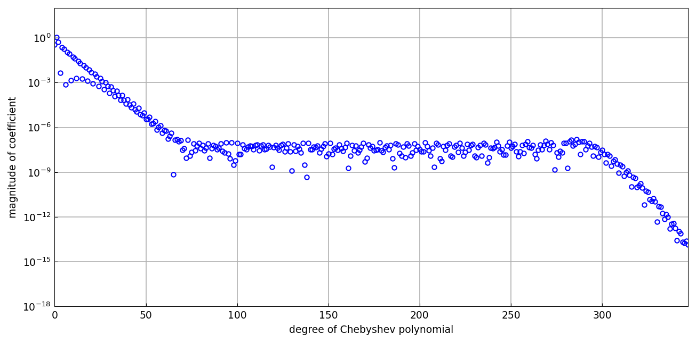

# Chebfuns of noisy functions

*Nick Trefethen, July 2014*

[Original MATLAB Chebfun example](https://www.chebfun.org/examples/approx/Noisy.html)

(Chebfun example approx/Noisy.m)

Suppose we want to work with a function contaminated by noise,

$$ f(x) = \tanh(8(x-\tfrac12)) + 10^{-6} \times \hbox{noise}. $$

We can manufacture such a function in a convenient deterministic way,
with pseudo-noise depending on the sample index:

```python
import jax.numpy as jnp
import chebfunjax as cj

def ff(x):
    idx = jnp.arange(1, x.shape[0] + 1, dtype=jnp.float64)
    return jnp.tanh(8*(x - 0.5)) + 1e-6*jnp.sin(idx**2)
```

If you try to make a chebfun of `ff`, there is no convergence.
However, since we know the scale of the noise, it is easy enough to get
the right effect by adjusting the `eps` parameter:

```python
f = cj.chebfun(ff, eps=1e-6)
```
```
f =
   chebfun column (1 smooth piece)
       interval       length     endpoint values
[      -1,       1]       68        -1        1
vertical scale =   1
```

(Published length: 65.)  How did we do?  One way to see is to construct
a chebfun `f2` of twice this degree.  Here are the Chebyshev
coefficients of that function (black dots) superimposed on those of
`f` (blue circles).  The match is very satisfactory:


Now, how important was it that we got the amplitude of the noise just
right?  Let's repeat the experiment, but with `eps` increased to
$10^{-3}$.  As you'd expect, there is a loss of accuracy (length 32,
matching the published 32):



And here we are with `eps` tightened to $10^{-9}$ — the constructor is
pretty flexible about settling for a bit less accuracy than you hoped
for (length 68; published 65):



Just for fun let's illustrate what Chebfun achieves by being not
completely flexible.  Here is a function that is not random, but again
has a plateau in its Chebyshev series down at the level of $10^{-6}$:

$$ g(x) = \tanh(8(x-\tfrac12)) + 10^{-6} \sin(200\exp(x)). $$

A default construction resolves it fully:



If we construct a chebfun with `eps` equal to $10^{-6}$, the plateau is
treated as noise and chopped off:



With `eps` equal to $10^{-9}$, the plateau is still treated as noise:



With `eps` set to $10^{-12}$, however, Chebfun is unsatisfied with the
short series, looks further, and resolves the smooth "noise" completely
(length 348):



---

*Replicated with [chebfunjax](https://github.com/ma-gilles/chebfunjax); original
example copyright The University of Oxford and The Chebfun Developers.*
