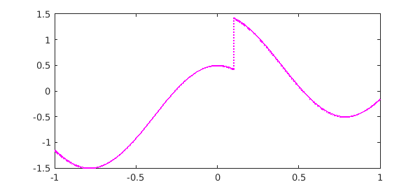
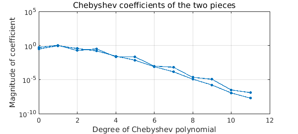
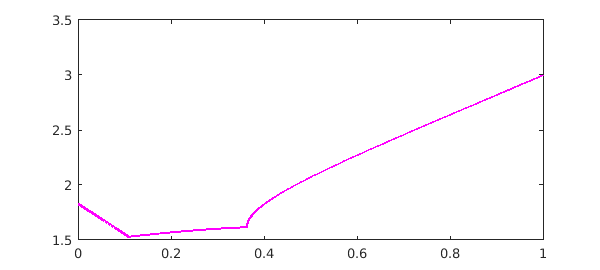
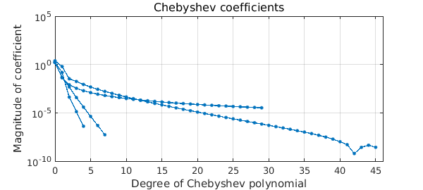

<!-- Generated by scripts/sync_chebfun_examples.py. -->
<!-- Source: https://www.chebfun.org/examples/approx/NoisyNonsmooth.html -->

<h1>Chebfuns of noisy functions with discontinuities</h1>
<h2>Nick Trefethen, July 2014 in <a href='../'>approx</a><a href='/examples/approx/NoisyNonsmooth.m'>download</a>&middot;<a href='//github.com/chebfun/examples/blob/master/approx/NoisyNonsmooth.m'>view on GitHub</a></h2>

Chebfun user Tyler Jones has raised the question of how one can construct a chebfun for a noisy function with discontinuities, so that breakpoints are needed.  Here we illustrate how this can be done.

<h3 id="1-an-elementary-noisy-function-with-a-jump">1. An elementary noisy function with a jump</h3>

First let's take a function we know explicitly:

$$ f(x) = \hbox{sign}(x-0.1)/2+\cos(4x)+\hbox{white noise of scale } 10^{-8}. $$

Here is an anonymous function that samples $f$:

<pre class="mcode-input">rng('default'); rng(0)
ff = @(x) sign(x-0.1)/2 + cos(4*x) + 1e-8*randn(size(x));</pre>

We can make a chebfun like this, with "splitting on":

<pre class="mcode-input">f = chebfun(ff, 'splitting', 'on', 'eps',1e-8);
LW = 'LineWidth'; MS = 'MarkerSize'; FS = 'FontSize';
plot(f, 'm', LW, 1.6)</pre>

The command <code>plotcoeffs</code> shows that each piece has been resolved to about 8 digits:

<pre class="mcode-input">plotcoeffs(f, '.-', LW, 1, MS, 14)
title('Chebyshev coefficients of the two pieces',FS,12)</pre>

The command <code>f.ends</code> shows the breakpoint that has been introduced:

<pre class="mcode-input">f.ends</pre>

<pre class="mcode-output">ans =
  -1.000000000000000   0.100000000000000   1.000000000000000
</pre>

<h3 id="2-a-noisy-function-obtained-from-linear-algebra">2. A noisy function obtained from linear algebra</h3>

Now let's cook up a function that we don't know explicitly, the spectral radius of a linear combination of two matrices $A$ and $B$. Here are the matrices

<pre class="mcode-input">A = [1 2 0; 0 2 1; 1 0 2]
B = [1 1 0; 1 -1 1; -1 1 1]</pre>

<pre class="mcode-output">A =
     1     2     0
     0     2     1
     1     0     2
B =
     1     1     0
     1    -1     1
    -1     1     1
</pre>

Here is the function that computes the spectral radius, with noise:

<pre class="mcode-input">gg = @(t) max(abs(eig(t*A + (1-t)*B))) + 1e-8*randn;</pre>

We can make a chebfun again with "splitting on":

<pre class="mcode-input">g = chebfun(gg, [0 1], 'splitting', 'on', 'eps', 1e-8, 'vectorize');
plot(g, 'm', LW, 1.6)</pre>

The figure leads us to expect two breakpoints, but in fact there are more:

<pre class="mcode-input">g.ends'</pre>

<pre class="mcode-output">ans =
                   0
   0.108127162489656
   0.362698596232864
   0.372656430654245
   1.000000000000000
</pre>

<code>plotcoeffs</code> confirms that there are more than three pieces:

<pre class="mcode-input">plotcoeffs(g, '.-', LW, 1, MS, 10)
title('Chebyshev coefficients',FS,12)</pre>

The explanation is that this function happens to have a square root singularity, and Chebfun has introduced additional breakpoints to resolve it.

