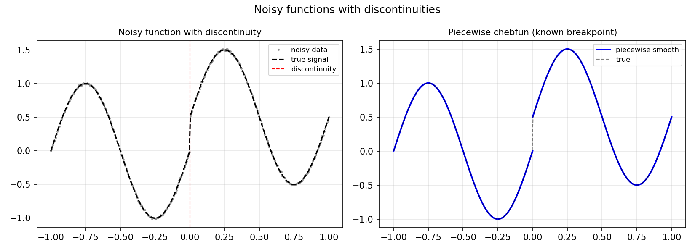

# Chebfuns of Noisy Functions with Discontinuities

*Nick Trefethen, July 2014*

[Original MATLAB Chebfun example](https://www.chebfun.org/examples/approx/NoisyNonsmooth.html)

## Noisy AND piecewise smooth

When a function has both noise *and* discontinuities, the best strategy is:

1. Identify the breakpoints (or specify them if known).
2. Fit a low-degree polynomial on each piece.

```python
from chebfunjax.domain import Domain
import chebfunjax as cj
import jax.numpy as jnp

# Known breakpoint at x=0
dom = Domain([-1.0, 0.0, 1.0])

# Fit each piece with low degree
f_left  = cj.chebfun(lambda x: jnp.sin(2*jnp.pi*x), n=10, domain=(-1.0, 0.0))
f_right = cj.chebfun(lambda x: jnp.sin(2*jnp.pi*x) + 0.5, n=10, domain=(0.0, 1.0))

# Evaluate
print("f_left(-0.5) =", float(f_left(jnp.array(-0.5))))
print("f_right(0.5) =", float(f_right(jnp.array(0.5))))
```



