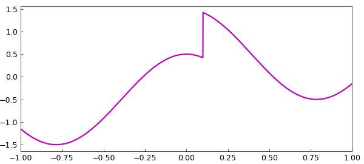
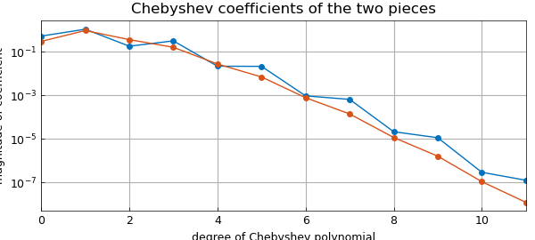
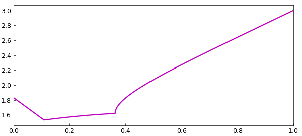
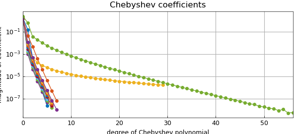

# Chebfuns of noisy functions with discontinuities

*Nick Trefethen, July 2014*

[Original MATLAB Chebfun example](https://www.chebfun.org/examples/approx/NoisyNonsmooth.html)

Python translation: [`examples/approx/noisy_nonsmooth.py`](https://github.com/ma-gilles/chebfunjax/blob/main/examples/approx/noisy_nonsmooth.py)

Chebfun user Tyler Jones has raised the question of how one can construct a chebfun for a noisy function with discontinuities, so that breakpoints are needed. Here we illustrate how this can be done.

## 1. An elementary noisy function with a jump

First let's take a function we know explicitly:

$$ f(x) = \hbox{sign}(x-0.1)/2+\cos(4x)+\hbox{white noise of scale } 10^{-8}. $$

Here is an anonymous function that samples $f$:

```matlab
rng('default'); rng(0)
ff = @(x) sign(x-0.1)/2 + cos(4*x) + 1e-8*randn(size(x));
```

We can make a chebfun like this, with "splitting on":

```matlab
f = chebfun(ff, 'splitting', 'on', 'eps',1e-8);
LW = 'LineWidth'; MS = 'MarkerSize'; FS = 'FontSize';
plot(f, 'm', LW, 1.6)
```



The command `plotcoeffs` shows that each piece has been resolved to about 8 digits:

```matlab
plotcoeffs(f, '.-', LW, 1, MS, 14)
title('Chebyshev coefficients of the two pieces',FS,12)
```



The command `f.ends` shows the breakpoint that has been introduced:

```matlab
f.ends
```

```text
ans =
  -1.000000000000000   0.100000000000000   1.000000000000000
```

## 2. A noisy function obtained from linear algebra

Now let's cook up a function that we don't know explicitly, the spectral radius of a linear combination of two matrices $A$ and $B$. Here are the matrices

```matlab
A = [1 2 0; 0 2 1; 1 0 2]
B = [1 1 0; 1 -1 1; -1 1 1]
```

```text
A =
[[1 2 0]
 [0 2 1]
 [1 0 2]]
B =
[[ 1  1  0]
 [ 1 -1  1]
 [-1  1  1]]
```

Here is the function that computes the spectral radius, with noise:

```matlab
gg = @(t) max(abs(eig(t*A + (1-t)*B))) + 1e-8*randn;
```

We can make a chebfun again with "splitting on":

```matlab
g = chebfun(gg, [0 1], 'splitting', 'on', 'eps', 1e-8, 'vectorize');
plot(g, 'm', LW, 1.6)
```



The figure leads us to expect two breakpoints, but in fact there are more:

```matlab
g.ends'
```

```text
ans =
   0.000000000000000
   0.108127155949230
   0.362698596284234
   0.362723490868563
   0.362748385452893
   0.362798174621552
   0.362897752958870
   0.363096909633505
   0.363495222982777
   0.364291849681321
   0.365885103151391
   0.369071610169558
   1.000000000000000
```

`plotcoeffs` confirms that there are more than three pieces:

```matlab
plotcoeffs(g, '.-', LW, 1, MS, 10)
title('Chebyshev coefficients',FS,12)
```



The explanation is that this function happens to have a square root singularity, and Chebfun has introduced additional breakpoints to resolve it.

---

*Translated with [chebfunjax](https://github.com/ma-gilles/chebfunjax); prose and MATLAB code from the original example, copyright The University of Oxford and The Chebfun Developers.  Printed outputs and figures are chebfunjax's.*
