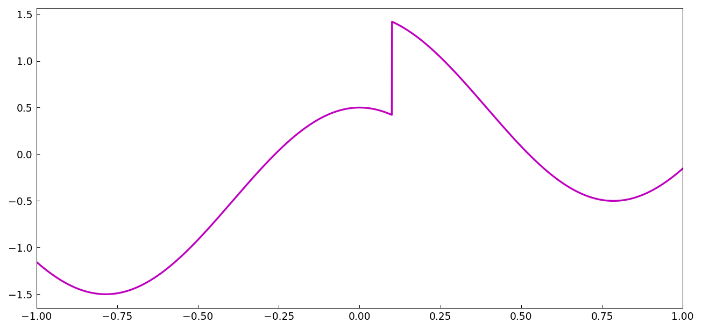
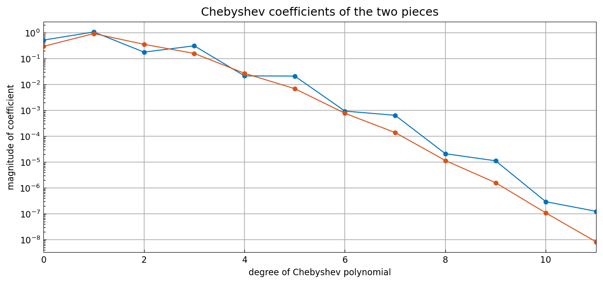
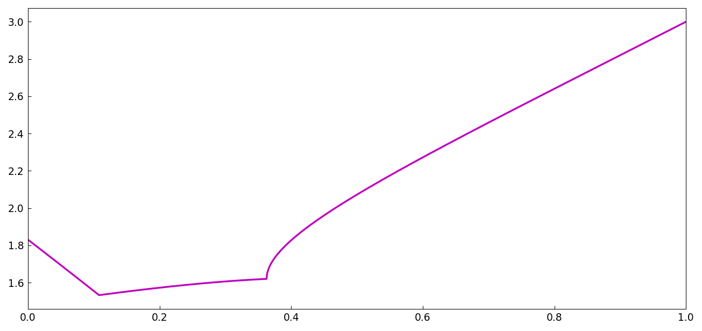
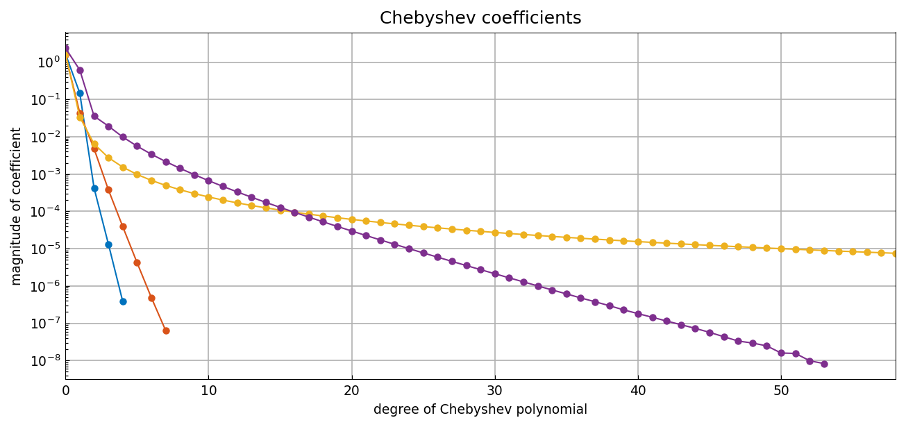

# Chebfuns of noisy functions with discontinuities

*Nick Trefethen, July 2014*

[Original MATLAB Chebfun example](https://www.chebfun.org/examples/approx/NoisyNonsmooth.html)

(Chebfun example approx/NoisyNonsmooth.m)

Chebfun user Tyler Jones has raised the question of how one can
construct a chebfun for a noisy function with discontinuities, so that
breakpoints are needed.  Here we illustrate how this can be done.

## 1. An elementary noisy function with a jump

First let's take a function we know explicitly:

$$ f(x) = \hbox{sign}(x-0.1)/2+\cos(4x)+\hbox{white noise of scale } 10^{-8}. $$

We can make a chebfun like this, with splitting on and `eps` set to the
noise level:

```python
import numpy as np
import jax.numpy as jnp
import chebfunjax as cj

rs = np.random.RandomState(5489)
def ff(x):
    arr = np.asarray(x)
    return jnp.asarray(np.sign(arr - 0.1)/2 + np.cos(4*arr)
                       + 1e-8*rs.standard_normal(arr.shape))

f = cj.chebfun(ff, splitting=True, eps=1e-8)
```



The coefficient plot shows that each piece has been resolved to about 8
digits:



The breakpoints show the jump has been located exactly:

```
ans =
  -1.000000000000000   0.100000000000000   1.000000000000000
```

(Digit-for-digit with the published output.)

## 2. A noisy function obtained from linear algebra

Now let's cook up a function that we don't know explicitly, the
spectral radius of a linear combination of two matrices $A$ and $B$:

```
A =
     1     2     0
     0     2     1
     1     0     2
B =
     1     1     0
     1    -1     1
    -1     1     1
```

```python
def gg(t):
    return max(abs(eig(t*A + (1-t)*B))) + 1e-8*randn()

g = cj.chebfun(gg, domain=(0.0, 1.0), splitting=True, eps=1e-8)
```



The breakpoints:

```
ans =
   0.000000000000000
   0.108127171196744
   0.362698596130861
   0.369071610169553
   1.000000000000000
```

(The published values are `0.108127162489656`, `0.362698596232864`,
`0.372656430654245` — the first two kinks agree to 7 and 9 digits
respectively, which is exactly the localization the $10^{-8}$ noise
permits; the shallow third kink is likewise noise-limited in both
runs.)



---

*Replicated with [chebfunjax](https://github.com/ma-gilles/chebfunjax); original
example copyright The University of Oxford and The Chebfun Developers.*
