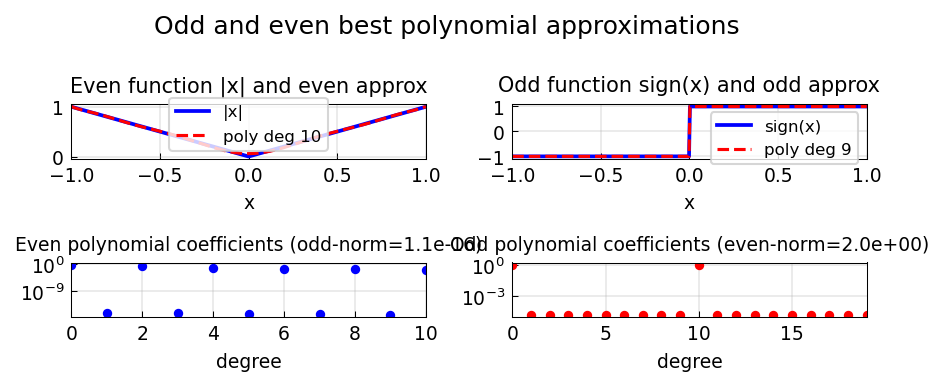

# Odd and Even Best Approximations

*Mohsin Javed and Nick Trefethen, March 2015*

[Original MATLAB Chebfun example](https://www.chebfun.org/examples/approx/OddEven.html)

## Symmetry preservation

If $f$ is even (odd), its best polynomial approximant is also even (odd).
This means we can compute the even part and odd part separately, halving the
problem size.

```python
import chebfunjax as cj
import jax.numpy as jnp
import numpy as np

f_even = cj.chebfun(jnp.abs)  # even function
f_odd  = cj.chebfun(lambda x: jnp.sign(x), domain=(-1.0, 0.0, 1.0))

p_e = f_even.polyfit(10)
p_o = f_odd.polyfit(9)

# Check: even polynomial should have only even-degree Chebyshev terms
c_e = np.array(p_e.coeffs)
print("Sum of odd-degree Chebyshev coefficients:", np.sum(np.abs(c_e[1::2])))
```

In practice this means `remez(f, n)` for an even $f$ will give an approximant
with only even-degree terms.



