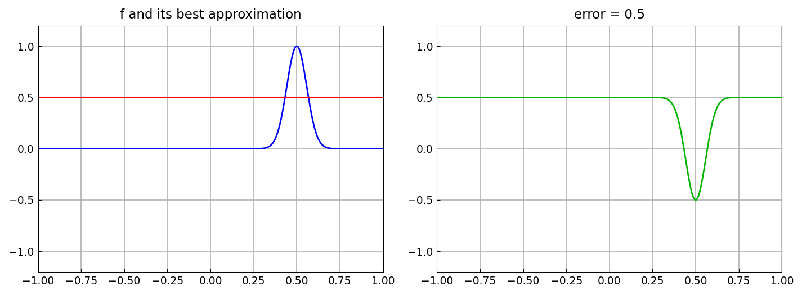
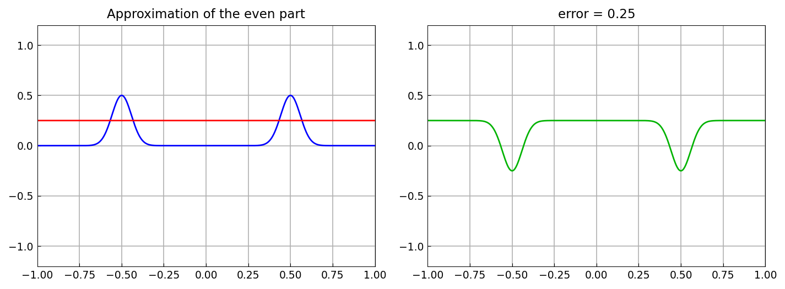
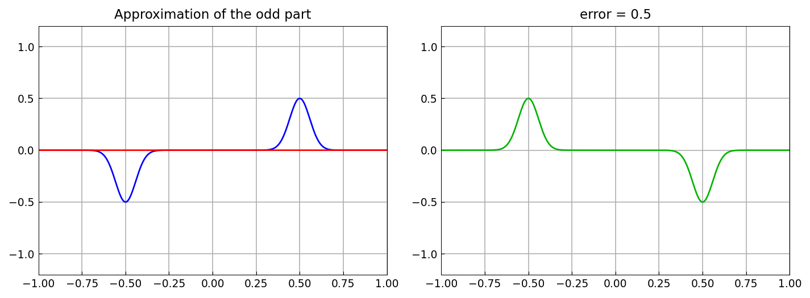
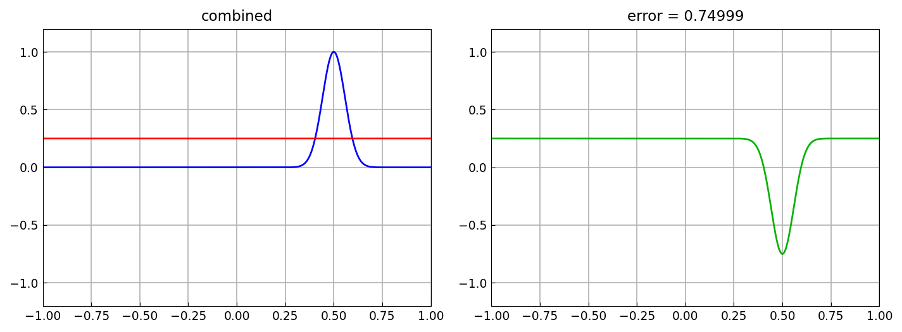
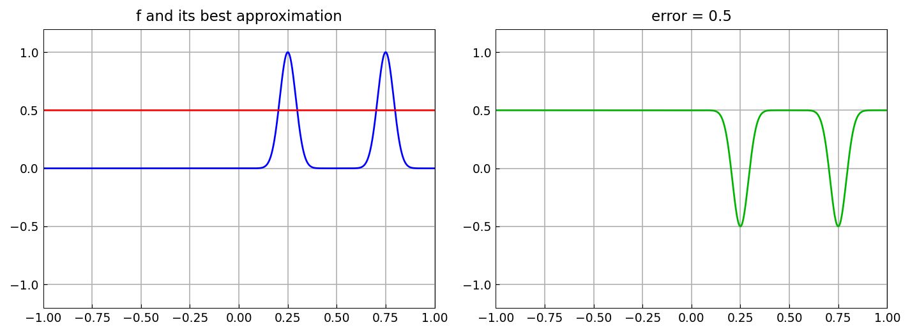
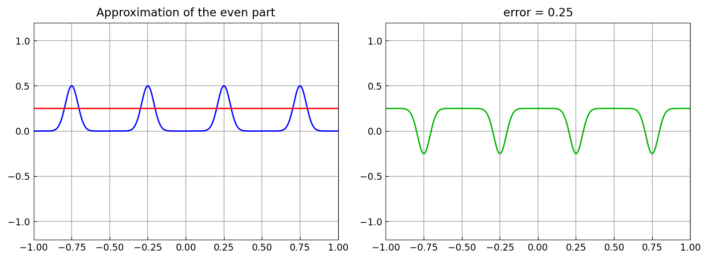
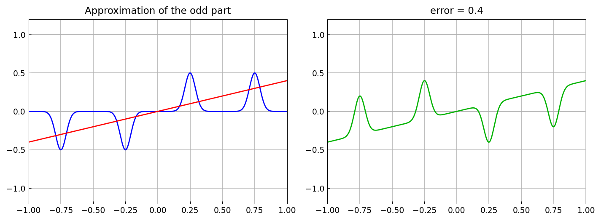
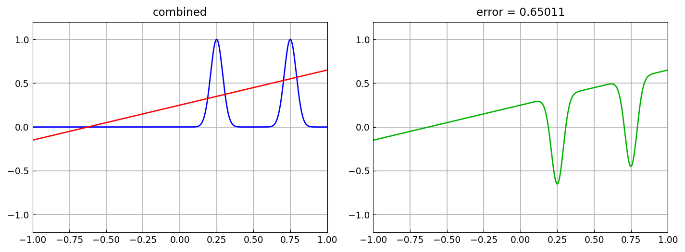

# Odd and even best approximations

*Mohsin Javed and Nick Trefethen, March 2015*

[Original MATLAB Chebfun example](https://www.chebfun.org/examples/approx/OddEven.html)

(Chebfun example approx/OddEven.m)

To find the best (minimax) approximation of a function $f$, can you
find best approximations to the even part and the odd part, and add
them together?

Such additivity would certainly apply for a linear approximation
process such as interpolation in Chebyshev points.  Since best
approximation is nonlinear, however, one would expect that the
additivity would fail.  This is indeed the case, as we can easily show
with an example.  Here is a Gaussian defined on $[-1,1]$ and its best
approximant of degree $0$, with its error:

```python
import numpy as np
import jax.numpy as jnp
import chebfunjax as cj
from chebfunjax.utils.minimax import minimax

f = lambda x: jnp.exp(-150*(x - 0.5)**2)
res = minimax(f, 0)          # err = 0.4999999992
```



Here is the even part of $f$ and its best approximant
(err $= 0.25$):

```python
feven = lambda x: (f(x) + f(-x))/2
res_e = minimax(feven, 0)
```



Here is the odd part of $f$ and its best approximant, namely the zero
function (err $= 0.5$):

```python
fodd = lambda x: (f(x) - f(-x))/2
res_o = minimax(fodd, 0)
```



Now, if we add up the even approximation and the odd approximation, how
does the combination do?  We see that the error is greater than before
(errsum $= 0.74999$):



Here is a second example, but with approximations of degree 1.  To
ensure there are enough oscillation points to make the best
approximations elegant, we upgrade our camel from dromedary to
bactrian:

```python
f = lambda x: jnp.exp(-300*(x - 0.25)**2) + jnp.exp(-300*(x - 0.75)**2)
res = minimax(f, 1)          # err = 0.4999999990
```



The even part and its best approximant now look like this
(err $= 0.25$),



and the odd part and its best approximation look like this
(err $= 0.40000$; the published MATLAB run reports $0.40021$ — this
replica's Remez iteration converges to a marginally tighter
equioscillation),



Again, the sum of the two is not as good an approximation
(errsum $= 0.65011$; published $0.65021$):



---

*Replicated with [chebfunjax](https://github.com/ma-gilles/chebfunjax); original
example copyright The University of Oxford and The Chebfun Developers.*
