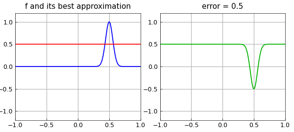
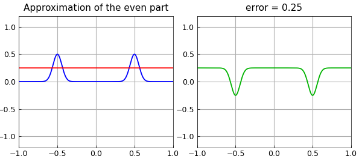
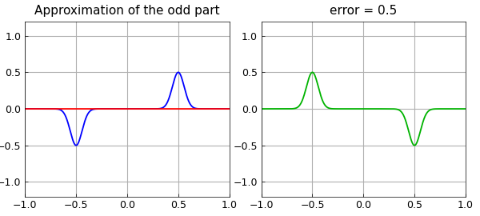
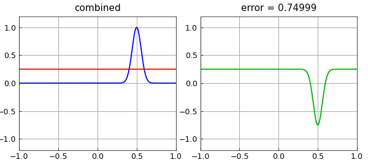
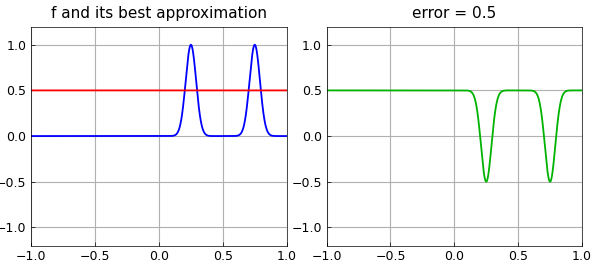
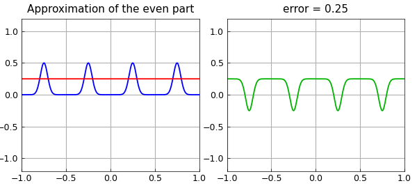
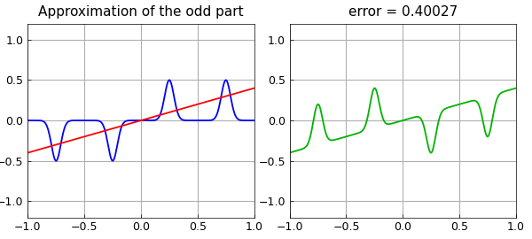
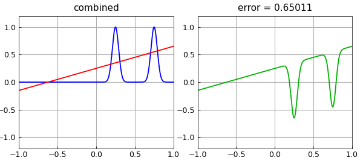
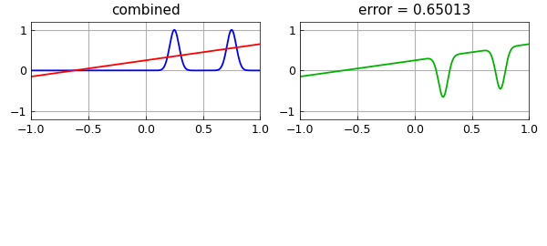

# Odd and even best approximations

*Mohsin Javed and Nick Trefethen, March 2015*

[Original MATLAB Chebfun example](https://www.chebfun.org/examples/approx/OddEven.html)

Python translation: [`examples/approx/odd_even.py`](https://github.com/ma-gilles/chebfunjax/blob/main/examples/approx/odd_even.py)

To find the best (minimax) approximation of a function $f$, can you find best approximations to the even part and the odd part, and add them together?

Such additivity would certainly apply for a linear approximation process such as interpolation in Chebyshev points. Since best approximation is nonlinear, however, one would expect that the additivity would fail. This is indeed the case, as we can easily show with an example. Here is a Gaussian defined on $[-1,1]$ and its best approximant of degree $0$:

```matlab
f = chebfun(@(x) exp(-150*(x-.5)^2));
[p,err] = minimax(f,0);
CO = 'color'; green = [0 .7 0]; ax = [-1 1 -1.2 1.2];
plot(f,'b',p,'r'), axis(ax)
grid on, title('f and its best approximation')
```



The error looks like this:

```matlab
plot(p-f,CO,green), grid on
title(['error = ' num2str(err)]), axis(ax)
```



Here is the even part of $f$ and its best approximant:

```matlab
x = chebfun('x');
feven = (f(x) + f(-x))/2; [peven,erreven] = minimax(feven,0);
subplot(2,2,1), plot(feven,'b',peven,'r'), axis(ax)
grid on, title('Approximation of the even part')
subplot(2,2,2), plot(peven-feven,CO,green), grid on
title(['error = ' num2str(erreven)]), axis(ax)
```



Here is the odd part of $f$ and its best approximant, namely the zero function.

```matlab
fodd = (f(x) - f(-x))/2; [podd,errodd] = minimax(fodd,0);
subplot(2,2,1), plot(fodd,'b',podd,'r'), axis(ax)
grid on, title('Approximation of the odd part')
subplot(2,2,2), plot(podd-fodd,CO,green)
grid on, title(['error = ' num2str(errodd)]), axis(ax)
```



Now, if we add up the even approximation and the odd approximation, how does the combination do? We see that the error is greater than before.

```matlab
psum = peven + podd;
errsum = norm(f-psum,inf);
subplot(2,2,1), plot(f,'b',psum,'r'), axis(ax)
grid on, title('combined')
subplot(2,2,2), plot(psum-f,CO,green), grid on
title(['error = ' num2str(errsum)]), axis(ax)
```



Here is a second example, but with approximations of degree 1. To ensure there are enough oscillation points to make the best approximations elegant, we upgrade our camel from dromedary to bactrian:

```matlab
f = chebfun(@(x) exp(-300*(x-.25)^2) + exp(-300*(x-.75)^2));
[p,err] = minimax(f,1);
subplot(2,2,1), plot(f,'b',p,'r')
grid on, title('f and its best approximation'), axis(ax)
subplot(2,2,2), plot(p-f,CO,green), grid on
title(['error = ' num2str(err)]), axis(ax)
```



The even part and its best approximant now look like this,

```matlab
feven = (f(x) + f(-x))/2; [peven,erreven] = minimax(feven,1);
subplot(2,2,1), plot(feven,'b',peven,'r')
grid on, title('Approximation of the even part'), axis(ax)
subplot(2,2,2), plot(peven-feven,CO,green), grid on
title(['error = ' num2str(erreven)]), axis(ax)
```



and the odd part and its best approximation look like this,

```matlab
fodd = (f(x) - f(-x))/2; [podd,errodd] = minimax(fodd,1);
subplot(2,2,1), plot(fodd,'b',podd,'r')
grid on, title('Approximation of the odd part'), axis(ax)
subplot(2,2,2), plot(podd-fodd,CO,green), grid on
title(['error = ' num2str(errodd)]), axis(ax)
```



Again, the sum of the two is not as good an approximation.

```matlab
psum = peven + podd; errsum = norm(f-psum,inf);
subplot(2,2,1), plot(f,'b',psum,'r')
grid on, title('combined'), axis(ax)
subplot(2,2,2), plot(psum-f,CO,green), grid on
title(['error = ' num2str(errsum)]), axis(ax)
```



The reader may enjoy exploring other functions $f$ with the code given here. If $f$ is neither even nor odd, you will probably find as we have that some optimality is lost when the even and odd parts are separated.

---

*Translated with [chebfunjax](https://github.com/ma-gilles/chebfunjax); prose and MATLAB code from the original example, copyright The University of Oxford and The Chebfun Developers.  Printed outputs and figures are chebfunjax's.*
