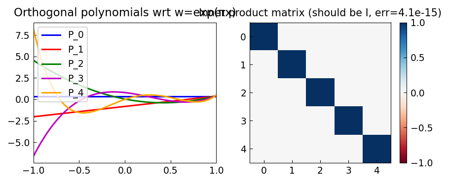

# Orthogonal Polynomials via the Gram-Schmidt Process

*Nick Hale, June 2011*

[Original MATLAB Chebfun example](https://www.chebfun.org/examples/approx/OrthPolys.html)

## Gram-Schmidt orthogonalization

For any weight $w(x) \ge 0$, we can build orthonormal polynomials via:
$$P_{k+1} = x^{k+1} - \sum_{j=0}^k \frac{\langle x^{k+1}, P_j \rangle_w}{\langle P_j, P_j \rangle_w} P_j.$$

```python
import chebfunjax as cj
import jax.numpy as jnp
import numpy as np

def w(x): return jnp.exp(jnp.pi * x)

w_f = cj.chebfun(w)
x_f = cj.chebfun(lambda t: t)
N = 4

# Normalize constant
norm0 = float(jnp.sqrt(jnp.array(float(w_f.sum()))))
polys = [cj.chebfun(lambda t: jnp.ones_like(t)/norm0)]

for k in range(1, N+1):
    xpk = x_f * polys[k-1]
    cand = xpk
    for j in range(k):
        c = float((w_f * xpk * polys[j]).sum())
        cand = cand - c * polys[j]
    norm = float(jnp.sqrt(jnp.array(float((w_f * cand**2).sum()))))
    polys.append(cand * (1.0/norm))

# Verify: inner product matrix should be identity
I = np.array([[float((w_f*polys[i]*polys[j]).sum()) for j in range(N+1)]
              for i in range(N+1)])
print(f"||I - G||_max = {np.max(np.abs(I - np.eye(N+1))):.2e}")
```



