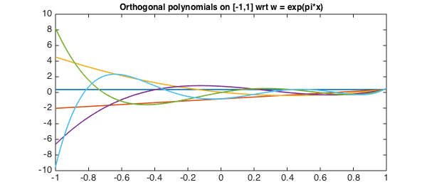
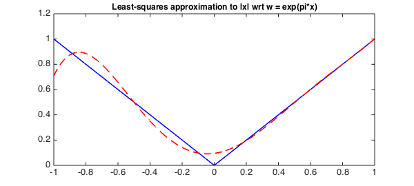

<!-- Generated by scripts/sync_chebfun_examples.py. -->
<!-- Source: https://www.chebfun.org/examples/approx/OrthPolys.html -->

<h1>Orthogonal polynomials via the Gram-Schmidt process</h1>
<h2>Nick Hale, June 2011 in <a href='../'>approx</a><a href='/examples/approx/OrthPolys.m'>download</a>&middot;<a href='//github.com/chebfun/examples/blob/master/approx/OrthPolys.m'>view on GitHub</a></h2>

<pre class="mcode-input">function OrthPolys</pre>

<em>Orthogonal</em> polynomials are, as the name suggests, polynomials which are orthogonal to each other in some weighted $L^2$ inner product, i.e.,

$$ \int_a^b |w(x)P_j(x)P_k(x) dx = \langle P_j, P_k \rangle = 0 $$

for all $j\ne k$. If we normalise so that $\langle P_j, P_j \rangle = 1$, the polynomials are <em>orthonormal</em>.

Chebfun has commands built-in for some of the standard orthogonal polynomials. Here is a table of the polynomial, the weight function, the standard domain $[a,b]$, and the Chebfun routine name.

<pre class="mcode">    Name       |      w(x)      |   domain   | Chebfun routine
----------------------------------------------------------------
   Legendre    |        1       |   [-1 1]   |  legpoly(N)
Chebyshev(1st) |  1/sqrt(1-x^2) |   [-1 1]   |  chebcoeffs(N)
Chebyshev(2nd) |   sqrt(1-x^2)  |   [-1 1]   |  chebcoeffs(N,2)
   Laguerre    |     exp(-x)    |   [0 inf]  |  lagpoly(N)
   Hermite     |    exp(-x^2)   | [-inf inf] |  hermpoly(N)</pre>

For each of these examples, there are readily derived recurrence relations which allow fast computation of the polynomials, and Chebfun exploits these. However, sometimes we wish to construct orthogonal polynomials with non-standard weight functions, and orthogonalisation via the Gram-Schmidt process is one method of doing so.

The process (sometimes referred to as the <em>Stieltjes process</em>) iteratively constructs the next degree polynomial by removing the components in the directions of the previous ones. The formula is

$$ P_{k+1} = x^{k+1}-\sum\langle x^{k+1},P_j\rangle/\langle
P_j,P_j \rangle P_j. $$

In practice one usually replaces $x^{k+1}$ by $x P_k(x)$ or the Chebyshev polynomial $T_{k+1}(x)$ to improve stability.

The short code below demonstrates these ideas by computing the first $5$ orthonormal polynomials with respect to the weight function $w = e^{\pi x}$.

<pre class="mcode-input">x = chebfun('x',[-1 1]);
w = exp(pi*x);
N = 5;
P = OrthPoly(w,N);

    function P = OrthPoly(w,N)
        if isnumeric(w), w = chebfun(w,[-1 1]); end
        d = w.ends;                     % the domain
        x = chebfun('x',d);             % linear chebfun
        P = chebfun(1./sqrt(sum(w)),d); % the constant (normalised)
        for k = 1:N;
            xk = x.*P(:,k);
            P(:,k+1) = xk;
            for j = 1:k       % Subtract out the components
                C = sum(w.*xk.*P(:,j));
                P(:,k+1) = P(:,k+1) - C*P(:,j);
            end
            P(:,k+1) = P(:,k+1)./sqrt(sum(w.*P(:,k+1).^2)); % normalise
        end
    end</pre>

We can now plot these polynomials

<pre class="mcode-input">LW = 'linewidth'; lw = 1.6; FS = 'fontsize';
plot(P,LW,lw)
title('Orthogonal polynomials on [-1,1] wrt w = exp(pi*x)',FS,12);</pre>

and confirm that they are orthogonal

<pre class="mcode-input">W = repmat(w,1,N+1);
I = P'*(W.*P);
err = norm(I-eye(N+1))</pre>

<pre class="mcode-output">err =
     3.897664796306251e-14
</pre>

One useful application of orthogonal polynomials is to find best polynomial approximations in weighted weighted $L^2$ inner-product space associated with $w(x)$, with

$$  P^*_n = \sum \langle f, P_j \rangle P_j . $$

Here we do this with $w$ as above and approximate $f(x) = |x|$.

<pre class="mcode-input">f = abs(x);
alpha = zeros(N+1,1);
for k = 0:N
    alpha(k+1) = sum(w.*P(:,k+1).*f);
end
P_star = P*alpha;

plot(f,'b',P_star,'--r',LW,lw)
title('Least-squares approximation to |x| wrt w = exp(pi*x)',FS,12);</pre>

Notice that the approximation is much closer for larger $x$, as $w(x) = \exp(\pi x)$ gives more weight to the error introduced there.

<pre class="mcode-input">end</pre>

        

    

