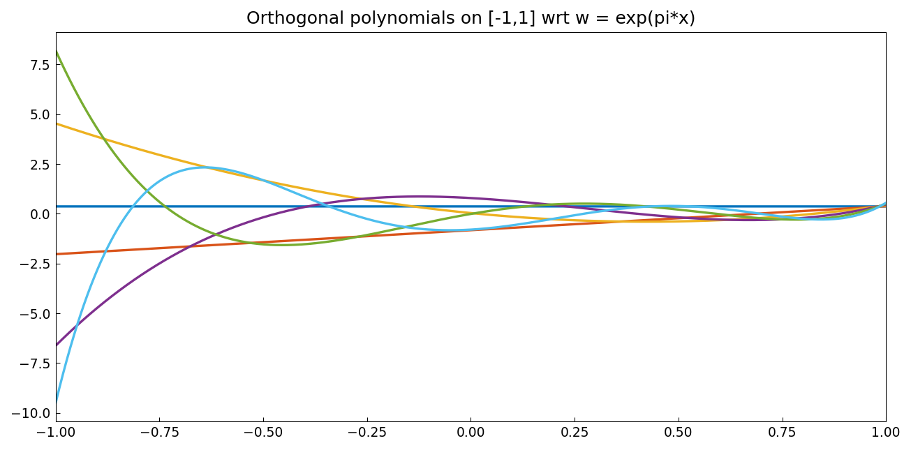
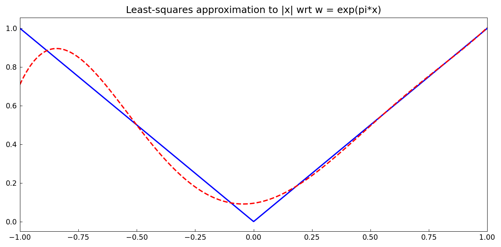

# Orthogonal polynomials via the Gram-Schmidt process

*Nick Hale, June 2011*

[Original MATLAB Chebfun example](https://www.chebfun.org/examples/approx/OrthPolys.html)

(Chebfun example approx/OrthPolys.m)

*Orthogonal* polynomials are, as the name suggests, polynomials which
are orthogonal to each other in some weighted $L^2$ inner product,
i.e.,

$$ \int_a^b w(x)P_j(x)P_k(x)\, dx = \langle P_j, P_k \rangle = 0 $$

for all $j\ne k$.  If we normalise so that
$\langle P_j, P_j \rangle = 1$, the polynomials are *orthonormal*.

Chebfun has commands built-in for some of the standard orthogonal
polynomials (`legpoly`, `chebpoly`, etc.), computed via recurrence
relations.  However, sometimes we wish to construct orthogonal
polynomials with non-standard weight functions, and orthogonalisation
via the Gram-Schmidt (Stieltjes) process is one method of doing so.

Here we construct the first six orthonormal polynomials for the weight
$w = e^{\pi x}$ on $[-1,1]$:

```python
import numpy as np
import jax.numpy as jnp
import chebfunjax as cj

def orth_poly(w, N):
    x = cj.chebfun(lambda t: t)
    P = [cj.chebfun(lambda t: 1.0/np.sqrt(float(w.sum())) + 0*t)]
    for k in range(N):
        pk1 = x * P[k]
        for j in range(k + 1):
            C = float((w * (x * P[k]) * P[j]).sum())
            pk1 = pk1 - C * P[j]
        P.append(pk1 * (1.0/np.sqrt(float((w * pk1**2).sum()))))
    return P

w = cj.chebfun(lambda t: jnp.exp(jnp.pi * t))
P = orth_poly(w, 5)
```



We verify orthonormality by computing the Gram matrix:

```
err =
     2.220645841662927e-14
```

(Published: `3.898e-14`.)

One useful application of orthogonal polynomials is weighted
least-squares approximation: expanding $|x|$ in the new basis gives the
best approximation in the weighted $L^2$ norm, which is drawn toward
the right of the interval where the weight $e^{\pi x}$ is large:

```python
f = cj.chebfun(lambda t: jnp.abs(t), domain=[-1.0, 0.0, 1.0])
alpha = [float((w * p * f).sum()) for p in P]
```



---

*Replicated with [chebfunjax](https://github.com/ma-gilles/chebfunjax); original
example copyright The University of Oxford and The Chebfun Developers.*
