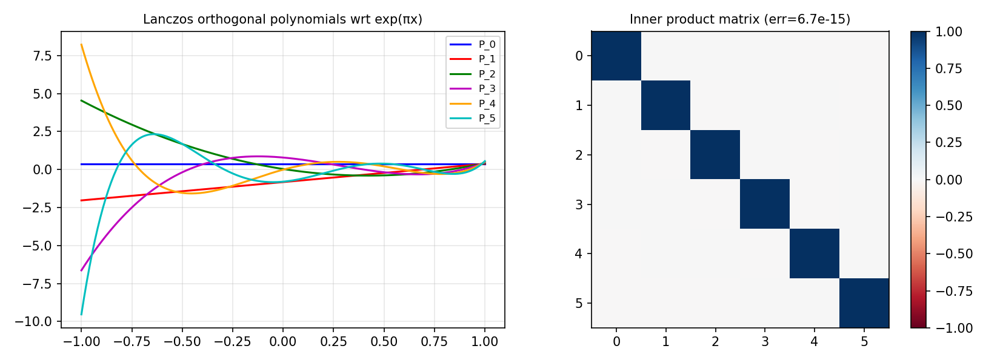

# Orthogonal Polynomials via the Lanczos Process

*Pedro Gonnet, November 2011*

[Original MATLAB source](https://github.com/chebfun/examples/blob/master/approx/OrthPolysLanczos.m)

## The Lanczos (Stieltjes) three-term recurrence

Any set of orthogonal polynomials satisfies a three-term recurrence:
$$p_{k+1}(x) = (x - \alpha_k) p_k(x) - \beta_{k-1} p_{k-1}(x)$$
where $\alpha_k = \langle xp_k, p_k \rangle_w$ and
$\beta_k = \|p_{k+1}\|_w / \|p_k\|_w$.

This is more numerically stable than direct Gram-Schmidt:

```python
import chebfunjax as cj
import jax.numpy as jnp

def w(x): return jnp.exp(jnp.pi * x)

# Lanczos process
w_f = cj.chebfun(w)
x_f = cj.chebfun(lambda t: t)

norm0 = float(jnp.sqrt(jnp.array(float(w_f.sum()))))
p0 = cj.chebfun(lambda t: jnp.ones_like(t) / norm0)

xp0 = x_f * p0
alpha0 = float((w_f * xp0 * p0).sum())
p1_unnorm = xp0 - alpha0 * p0
beta0 = float(jnp.sqrt(jnp.array(float((w_f * p1_unnorm**2).sum()))))
p1 = p1_unnorm * (1.0 / beta0)
print(f"alpha_0 = {alpha0:.4f}, beta_0 = {beta0:.4f}")
```



